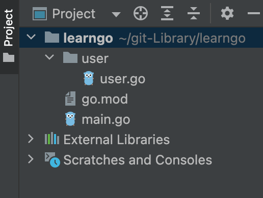
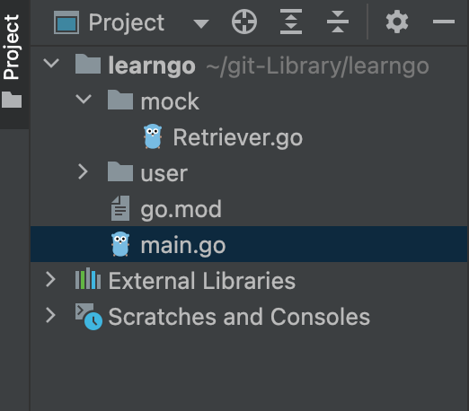

## 一文总结 Go 语言语法


**目录：**

1. 变量定义
2. 常量和枚举
3. 条件语句
4. 循环语句
5. 函数定义
6. 指针
7. 内建容器：array （数组）
8. 内建容易：slice （切片）
9. 内建容器：map
10. Go 面向 “对象”
11. Go 的包
12. Interface 接口
13. Goroutine 并发编程
14. Channel 通道


## 1 变量定义


**变量的初始值**

在 go 语言中，每个变量都有初值，整型变量 a 的初始值是 `0`，字符串变量的初始值是空串 `""`

```go
func variableZeroValue() {
	var a int  // 直接定义一个变量出来
	var s string

	fmt.Printf("variable a: %d \n", a)
	fmt.Printf("variable s: %q \n", s)
}
```

`outputs:`

```
variable a: 0 
variable s: "" 
```


**手动赋值**

```go
func variableInitialValue() {
	var a, b int = 1, 2 // 定义的时候还可以赋初值
	var s string = "hello world."
	fmt.Println(a, b, s)
}
```

`outputs:`

```
1 2 hello world.
```


**类型推断**

```go
func variableInitialValue() {
    var a, b = 1, 2 // 可以省略类型
   	var s = "hello world."
	fmt.Println(a, b, s)
}
```

`outputs:`

```
1 2 hello world.
```


**更简洁的类型推断写法**

```go
func variableShorter() {
	a, b, s := 1, 2, "hello world." // 多个类型的是可以放在一起写的；并且在定义的时候写冒号就可以了 var 都可以省略
	fmt.Println(a, b, s)
    
    b = 666 // 第二次再用它的时候就不用写冒号咯
    fmt.Println(b)
}
```

`outputs:`

```
1 2 hello world.
666
```


**函数体外定义变量（包内变量）**

定义包级别的变量必须使用关键字开始，而不能使用冒号的形式定义变量

```go
var a = 666 // 在函数外面定义变量的时候必须使用 var 来定义，也是可以推断出来的

// 还可以一次定义多个变量
var (
	aa = 111
	bb = 222
	cc = 333
)
```


**内置变量的类型**

`complex` 代表复数

```go
bool, string
(u)int, (u)int8, (u)int16, (u)int32, (u)int64, uintptr
byte, rune
float32, float64, complex64, complex128
```


**类型转换是强制的**

```go
func triangle() {
	var a, b int = 3, 4
	var c int
	c = int(math.Sqrt(float64(a*a + b*b))) // 因为 Sqrt 接收的是浮点数，所以你必须显示的进行转换而不会自动转换

	fmt.Println(a, b, c)
}
```

`outputs:`

```
3 4 5
```


## 2 常量和枚举

**普通常量的定义**

```go
func constant() {
	const filename = "helloworld.txt"
	const a, b = 666, 999
	var c int
	c = int(math.Sqrt(a*a + b*b)) // 常量相当于文本替换
	fmt.Println(filename, c)
    
    // 定义一组常量
    const (
		c1 = 111
		c2 = 222
	)
	fmt.Println(c1, c2)
}

// 也可以定义为包内的常量，则包内部的函数都可以使用

```

`outputs:`

```
helloworld.txt 1200
111 222
```


**枚举类型**

`iota` 代表这个常量列表是自增值，使用下划线代表不使用这个位置的值

```go
func enums() {
	const (
		cpp = iota // iota 代表从 0 开始, 并且后面的都是在 iota 的基础上自增 1 的
		_ // 这里相当于 1，用下划线代表不用这个 1 了
		python // 这里相当于 2
	)

	// b, kb, mb, gb, tb, pb
	const (
		b = 1 << (10 * iota) // 你甚至还可以写成表达式 相当于是：1 << (10 * 0)
		kb // 这里相当于 1 << (10 * 1)
		mb // 这里相当于 1 << (10 * 2)
		gb // 后面以此类推
		tb
		pb
	)
	fmt.Println(cpp, python)
	fmt.Println(b, kb, mb, gb, tb, pb)
}
```

`outputs:`

```
0 2
1 1024 1048576 1073741824 1099511627776 1125899906842624
```


## 3 条件语句


**普通的条件判断**

```go
func bounded(v int) int {
	if v > 100 { // 条件语句不用写圆括号
		return 100
	} else if v < 0 {
		return 0
	} else {
		return v
	}
}
```


**带分号的 if**

先运行前半句，然后才执行 `err` 是否为空的判断，这里的 contents 是属于 `if` 语句这个作用域的

在条件语句中 `||` 表示两个条件之间的或运算，`&&` 表示两个条件之间的与运算

```go
func main() {
	const filename = "hello.txt"
	
    // 这里代表先执行分号前面的语句，然后再判断分号后面的语句是否为 true
    // 并且 contents 和 err 都是if语句局部的量
	if contents, err := os.ReadFile(filename); err != nil {
		fmt.Println(err)
	} else {
		fmt.Printf("%s \n", contents)
	}
}
```

`outputs:`

```
hello
world. 
```


**switch 语句**

每一个 case 后面默认带有 `break` 的功能

```go
func eval(a, b int, op string) int {
	var result int
	
    // op 和某一个 case 后面的值相等 则执行相应的 case 里面的内容
    // 每个 case 执行完成后自动 break 出去
	switch op {
	case "+":
		result = a + b
	case "-":
		result = a - b
	case "*":
		result = a * b
	case "/":
		result = a / b
	}
	return result
}

// switch 语句可以有 default 分支
// panic 用于停止程序的运行
func grade(score int) string {
	g := ""
	switch {
	case score < 0 || score > 100:
		panic(fmt.Sprintf("Wrong score: %d", score))
	case score < 60:
		g = "F"
	case score < 80:
		g = "C"
	case score < 90:
		g = "B"
	case score <= 100:
		g = "A"
	}
	return g
}
```


## 4 循环语句

**for 循环**

```go
func main() {
    
    // 1
	sum := 0

	for i := 1; i <= 100; i++ { // 同理不需要圆括号
		sum += i
	}

	fmt.Println(sum)
	
    // 2
	sum2 := 0

	i := 0
	for ; i <= 100; i++ { // 可以不写 第一个分号前面的内容
		sum2 += i
	}

	fmt.Println(sum2)
	
    // 3
	sum3 := 0

	i = 0
	for i <= 100 { // 这就相当于其他那些常见语言中的 while 循环了
		sum3 += i
		i++
	}
    
    // 4 死循环
    for { // 这个直接代表死循环，相当于常见语言的 while(true)
        // TODO 	
	}

	fmt.Println(sum3)
}
```


## 5 函数定义


**定义函数和返回值**

```go
// 返回值类型写在圆括号后面
// 如果有多个返回值
// 返回值类型要用圆括号包裹起来 (int, int) 代表返回两个 int 类型的返回值
// 一般情况下, golang 中第一个返回数据，第二个返回值一般定义为 error 类型
func eval(a, b int, op string) (int, error) {
	var result int
	
	switch op {
	case "+":
		result = a + b
	case "-":
		result = a - b
	case "*":
		result = a * b
	case "/":
		result = a / b
	default: // switch 语句是可以有 default 的
		return 0, fmt.Errorf("unsupported operation")
	}

	return result, nil
}
```


**函数也是一等公民**

```go
func div(a, b int) int {
	return a / b
}

func apply(op func(int, int) int, a, b int) int {
	p := reflect.ValueOf(op).Pointer()
	opName := runtime.FuncForPC(p).Name()
	fmt.Printf("Calling function %s with args "+"(%d, %d)\n", opName, a, b)
	return op(a, b)
}

func main() {
    // div 这个函数本身也可以被当做参数传递
	res := apply(div, 10, 2)
	fmt.Println(res)
}
```

`oputputs:`

```
Calling function main.div with args (10, 2)
5
```


**匿名函数**

```go
func main() {
    // 定义一个匿名函数传递给刚才的 apply 函数也是可以的
	res := apply(func(a, b int) int {
		return a / b
	}, 10, 2)
	fmt.Println(res)
}
```


**可变参数列表**

```go
// 直接写 ... 就代表你可以传递任意个 int 类型的数值进来
// 我们可以遍历 nums 获取值
func sum(nums ...int) int {
	s := 0
	for i := range nums { // 使用 range 关键字获取索引 i
		s += nums[i] 
	}

	return s
}
```


## 6 指针

```go
// golang 中的指针不能运算
// golang 中只有值传递
func main() {
	var a int = 2
	var pa *int = &a // 用一个 * 号代表 pa 是一个指向 int 数据类型的指针; pa 的值是 a 的地址
	*pa = 3 // 在使用 pa 的时候加上 * 号代表的就是 pa 指向的那个数据本身了
	fmt.Println(pa, *pa)
}
```

`outputs:`

```
0x140000a6018 3
```


**作为参数传递**

```go
func modifyValue(nums *int) {
	*nums = 666
}

// go 语言中只有值传递，我们可以把 nums 的地址传进去
// 通过地址访问 nums 所代表的内存区域本身
func main() {
	nums := 111
	modifyValue(&nums)
	fmt.Println(nums)
}
```

`outputs:`

```
666
```

 

## 7 内建容器：数组

**数组**

```go
func main() {
	var arr1 [5]int // 指定数组长度为 5； 每个元素的类型是 int 类型
	arr2 := [3]int{1, 2, 3} // 还可以赋初值
	arr3 := [...]int{2, 4, 6, 8, 10} // 写 ... 代表这个数组的长度根据你填写的数值个数进行自动生成

	fmt.Println(arr1)
	fmt.Println(arr2)
	fmt.Println(arr3)

	var grid [4][5]int // 一个 4 行 5 列的二维数组
	fmt.Println(grid)
	
    // 使用 len 可以获取数组的长度
	for i := 0; i < len(arr3); i++ {
		fmt.Println(arr3[i])
	}

	fmt.Println("range 1")
    // 只返回数组的索引 i
	for i := range arr3 {
		fmt.Println(arr3[i])
	}

	fmt.Println("range 2")
    // 返回索引 i 的同时返回这个位置的值 v
	for k, v := range arr3 {
		fmt.Println(k, v)
	}
}
```

`outputs:`

```
[0 0 0 0 0]
[1 2 3]
[2 4 6 8 10]
[[0 0 0 0 0] [0 0 0 0 0] [0 0 0 0 0] [0 0 0 0 0]]
2
4
6
8
10
range 1
2
4
6
8
10
range 2
0 2
1 4
2 6
3 8
4 10

```

**数组数值类型**

数组名代表的是数组全部的内容，因此数组的长度不一样代表的是两种不同的数据类型，比如：

`arr1 [5]int` 和 `arr2 [3]int` 是两种不同的数组 并且 从数组到数组的参数传递是基于拷贝的


## 8 内建容器：切片

**切片**

```go
func main() {
	arr := [...]int{0, 1, 2, 3, 4, 5, 6, 7, 8}
	
    // 和 python 里面的切片很像
    // go 中的切片是以一个具体的数组作为载体的
    // 切片是对这个数组的一个 view，仅仅是一个引用
	fmt.Println("arr[2:6] = ", arr[2:6])
	fmt.Println("arr[:6] = ", arr[:6])
	fmt.Println("arr[2:] = ", arr[2:])
	fmt.Println("arr[:] = ", arr[:])
}
```

`outputs:`

```
arr[2:6] =  [2 3 4 5]
arr[:6] =  [0 1 2 3 4 5]
arr[2:] =  [2 3 4 5 6 7 8]
arr[:] =  [0 1 2 3 4 5 6 7 8]
```


**切片是 view**

```go
func updateSplice(s []int) {
	for i, v := range s {
		s[i] = v + 1
	}
}

func main() {
	arr := [...]int{0, 1, 2, 3, 4, 5, 6, 7, 8}

	updateSplice(arr[:])
	fmt.Println(arr)

	updateSplice(arr[:])
	fmt.Println(arr)
}
```

`outputs:`

```
[1 2 3 4 5 6 7 8 9]
[2 3 4 5 6 7 8 9 10]
```


**切片的可扩展性**

```go
func main() {
	arr := [...]int{0, 1, 2, 3, 4, 5, 6, 7}

	s1 := arr[2:6]
	fmt.Println("s1: ", s1)
	fmt.Printf("len(s1) = %d, cap(s1) = %d \n", len(s1), cap(s1))

	s2 := s1[3:5] // 数组本身还在, slice 只是数组的 view
    // 你可以发现，我们竟然能访问这个切片以后的内容；因为这些内容真实存在于底层数组中
	fmt.Println("s2: ", s2)
	fmt.Printf("len(s2) = %d, cap(s2) = %d \n", len(s2), cap(s2))

	// slice 的实现
	// 1. ptr 指向 slice 开始的元素
	// 2. len 代表 slice 的长度
	// 3. cap 代表 ptr 到数组末尾的长度; 因此可向后扩展, 但是不能向前扩展
	// slice[i] 其中 i < len ; slice[s, e] 其中 e <= cap 即可
    // len 仅代表 slice 的长度，而 cap 代表的是这个切片的起始位置到这个底层的数组的结束位置的长度
}
```

`outputs:`

```
s1:  [2 3 4 5]
len(s1) = 4, cap(s1) = 6 
s2:  [5 6]
len(s2) = 2, cap(s2) = 3 
```


**对切片添加元素**

```go
func main() {
	arr := [...]int{0, 1, 2, 3, 4, 5, 6, 7}

	s1 := arr[2:6]
	fmt.Println("s1: ", s1)
	fmt.Printf("len(s1) = %d, cap(s1) = %d \n", len(s1), cap(s1))

	s2 := s1[3:5] // 数组本身还在, slice 只是数组的 view
	fmt.Println("s2: ", s2)
	fmt.Printf("len(s2) = %d, cap(s2) = %d \n", len(s2), cap(s2))

	// slice 的实现
	// 1. ptr 指向 slice 开始的元素
	// 2. len 代表 slice 的长度
	// 3. cap 代表 ptr 到数组末尾的长度; 因此可向后扩展, 但是不能向前扩展
	// slice[i] 其中 i < len ; slice[s, e] 其中 e <= cap 即可

	s3 := append(s2, 111)
	s4 := append(s3, 222)

	fmt.Printf("v = %v, len(s3) = %d, cap(s3) = %d \n", s3, len(s3), cap(s3))
	fmt.Printf("v = %v, len(s4) = %d, cap(s4) = %d \n", s4, len(s4), cap(s4))

	// 添加元素的时候如果超过了底层数组的 cap, 则会重新分配一个底层数组
    // 所以 append 每次都会返回一个新的引用，因为我们可以已经抛弃了原来的那个底层数组
	// 因此在添加元素的时候随时都有可能造成底层数组的改变, 因此必须接收 append 的返回值
	// 从而使用一个新的 切片 来对数组进行 view
	s4[2] = 999 // 此时切片 s3 和 s4 已经不是同一个数组的 view 了, 是 go 重新帮我们分配的数组了
	fmt.Printf("v = %v, len(s3) = %d, cap(s3) = %d \n", s3, len(s3), cap(s3))
	fmt.Printf("v = %v, len(s4) = %d, cap(s4) = %d \n", s4, len(s4), cap(s4))
}
```


**直接创建 切片**

直接创建切片的话，go 会自动为我们创建底层数组，因此，我们创建的切片看上去就好像是那个数组的引用一样

实际上切片中存储的是指向这个数组的指针，我们拷贝切片其实拷贝的是那个指针，因此我们操作这个切片的拷贝，实际上操作的是同一个底层数组

```go
func main() {
	var s []int // 直接定义 slice 类型, 此时 s 的值为 nil

	for i := 0; i < 100; i++ {
        // 观察 cap 的变化
        // 当 cap 产生变化的时候，说明引用的底层数组已经变了
		fmt.Printf("len(s) = %d, cap(s) = %d \n", len(s), cap(s))
		s = append(s, i*2)
	}
}
```

`outputs:`

```go
len(s) = 0, cap(s) = 0 
len(s) = 1, cap(s) = 1 
len(s) = 2, cap(s) = 2 
len(s) = 3, cap(s) = 4 
len(s) = 4, cap(s) = 4 
len(s) = 5, cap(s) = 8 
len(s) = 6, cap(s) = 8 
len(s) = 7, cap(s) = 8 
len(s) = 8, cap(s) = 8 
len(s) = 9, cap(s) = 16 
len(s) = 10, cap(s) = 16 
len(s) = 11, cap(s) = 16 
len(s) = 12, cap(s) = 16 
len(s) = 13, cap(s) = 16 
len(s) = 14, cap(s) = 16 
len(s) = 15, cap(s) = 16 
len(s) = 16, cap(s) = 16 
len(s) = 17, cap(s) = 32 
len(s) = 18, cap(s) = 32 
len(s) = 19, cap(s) = 32 
len(s) = 20, cap(s) = 32 
len(s) = 21, cap(s) = 32 
len(s) = 22, cap(s) = 32 
len(s) = 23, cap(s) = 32 
len(s) = 24, cap(s) = 32 
len(s) = 25, cap(s) = 32 
len(s) = 26, cap(s) = 32 
len(s) = 27, cap(s) = 32 
len(s) = 28, cap(s) = 32 
len(s) = 29, cap(s) = 32 
len(s) = 30, cap(s) = 32 
len(s) = 31, cap(s) = 32 
len(s) = 32, cap(s) = 32 
len(s) = 33, cap(s) = 64 
len(s) = 34, cap(s) = 64 
len(s) = 35, cap(s) = 64 
len(s) = 36, cap(s) = 64 
len(s) = 37, cap(s) = 64 
len(s) = 38, cap(s) = 64 
len(s) = 39, cap(s) = 64 
len(s) = 40, cap(s) = 64 
len(s) = 41, cap(s) = 64 
len(s) = 42, cap(s) = 64 
len(s) = 43, cap(s) = 64 
len(s) = 44, cap(s) = 64 
len(s) = 45, cap(s) = 64 
len(s) = 46, cap(s) = 64 
len(s) = 47, cap(s) = 64 
len(s) = 48, cap(s) = 64 
len(s) = 49, cap(s) = 64 
len(s) = 50, cap(s) = 64 
len(s) = 51, cap(s) = 64 
len(s) = 52, cap(s) = 64 
len(s) = 53, cap(s) = 64 
len(s) = 54, cap(s) = 64 
len(s) = 55, cap(s) = 64 
len(s) = 56, cap(s) = 64 
len(s) = 57, cap(s) = 64 
len(s) = 58, cap(s) = 64 
len(s) = 59, cap(s) = 64 
len(s) = 60, cap(s) = 64 
len(s) = 61, cap(s) = 64 
len(s) = 62, cap(s) = 64 
len(s) = 63, cap(s) = 64 
len(s) = 64, cap(s) = 64 
len(s) = 65, cap(s) = 128 
len(s) = 66, cap(s) = 128 
len(s) = 67, cap(s) = 128 
len(s) = 68, cap(s) = 128 
len(s) = 69, cap(s) = 128 
len(s) = 70, cap(s) = 128 
len(s) = 71, cap(s) = 128 
len(s) = 72, cap(s) = 128 
len(s) = 73, cap(s) = 128 
len(s) = 74, cap(s) = 128 
len(s) = 75, cap(s) = 128 
len(s) = 76, cap(s) = 128 
len(s) = 77, cap(s) = 128 
len(s) = 78, cap(s) = 128 
len(s) = 79, cap(s) = 128 
len(s) = 80, cap(s) = 128 
len(s) = 81, cap(s) = 128 
len(s) = 82, cap(s) = 128 
len(s) = 83, cap(s) = 128 
len(s) = 84, cap(s) = 128 
len(s) = 85, cap(s) = 128 
len(s) = 86, cap(s) = 128 
len(s) = 87, cap(s) = 128 
len(s) = 88, cap(s) = 128 
len(s) = 89, cap(s) = 128 
len(s) = 90, cap(s) = 128 
len(s) = 91, cap(s) = 128 
len(s) = 92, cap(s) = 128 
len(s) = 93, cap(s) = 128 
len(s) = 94, cap(s) = 128 
len(s) = 95, cap(s) = 128 
len(s) = 96, cap(s) = 128 
len(s) = 97, cap(s) = 128 
len(s) = 98, cap(s) = 128 
len(s) = 99, cap(s) = 128
```


**按长度创建切片**

```go
func main() {
	s := make([]int, 18)
	fmt.Printf("len(s) = %d, cap(s) = %d \n", len(s), cap(s))

	ss := make([]int, 20, 32)
	fmt.Printf("len(ss) = %d, cap(ss) = %d \n", len(ss), cap(ss))

	copy(s, ss)  // 只会根据 s 的容量 cap 进行拷贝, 超过容量大小的部分不拷贝
	fmt.Printf("len(s) = %d, cap(s) = %d \n", len(s), cap(s))
}
```

`outputs:`

```
len(s) = 18, cap(s) = 18 
len(ss) = 20, cap(ss) = 32 
len(s) = 18, cap(s) = 18
```


**切片删除元素**

```go
func main() {
	s := make([]int, 16, 32)
	fmt.Printf("len(s) = %d, cap(s) = %d \n", len(s), cap(s))

	// 删除中间某个元素
	ss := append(s[:3], s[4:]...)
	fmt.Printf("len(ss) = %d, cap(ss) = %d \n", len(ss), cap(ss))

	s[0] = 111
	fmt.Println(ss)

	// 删除头元素
	ss = ss[1:]
	fmt.Println(ss)

	// 删除尾元素
	ss = ss[:len(ss)-1]
	fmt.Println(ss)
}
```

`outputs:`

```
len(s) = 16, cap(s) = 32 
len(ss) = 15, cap(ss) = 32 
[111 0 0 0 0 0 0 0 0 0 0 0 0 0 0]
[0 0 0 0 0 0 0 0 0 0 0 0 0 0]
[0 0 0 0 0 0 0 0 0 0 0 0 0]
```


## 9 内建容器：map

```go
func main() {
	// map 是无序的
    // 除了 slice, map, function 的内建类型都可以作为 key
    // 创建一个 k 和 v 都是 string 类型的 map
	m := map[string]string{
		"name":    "blueberry",
		"address": "China",
	}

	fmt.Println(m)

	m2 := make(map[string]string) // empty map
	var m3 map[string]string      // nil: 同样可以参与运算

	fmt.Println(m2)
	fmt.Println(m3)

	height, ok := m["height"]
	fmt.Println("height: ", height) // 拿到的是空串
	fmt.Println("ok: ", ok)

	// 一般情况下可以这样写,
	if height2, okk := m["height"]; okk {
		fmt.Println("ok height: ", height2)
	}

	for k, v := range m {
		fmt.Println(k, v)
	}

	// 删除元素
	delete(m, "name")
	fmt.Println("delete name: ", m)

	// 创建复合 map
	mm := make(map[string]map[string]string)
	fmt.Println(mm)

	mm["blueberry"] = make(map[string]string)
	mm["blueberry"]["name"] = "111"
	mm["blueberry"]["height"] = "222"

	fmt.Println(mm["blueberry"])
}
```

`outputs:`

```
map[address:China name:blueberry]
map[]
map[]
height:  
ok:  false
name blueberry
address China
delete name:  map[address:China]
map[]
map[height:222 name:111]
```


## 10 golang 的面向对象

golang 仅支持封装，不支持继承和多态；可以面向接口编程


**结构体**

```go
package main

import (
	"fmt"
)

// type 代表 User 是一个数据类型
// struct 代表 User 是一个 struct 类型的数据类型
// 然后在花括号内定义具体的内容
type User struct {
	name    string
	address string
	height  int
}

func createUser(name, address string, height int) *User {
	return &User{name: name, address: address, height: height}
}

func main() {
	// 1. 直接创建
	var user1 User

	// 2. 赋初值
	user2 := User{
		name:    "blueberry",
		address: "China",
		height:  999,
	}

	// 3. 创建 User 并返回它的指针
	user3 := new(User)
	user3.height = 111
	user3.name = "blueberry3"
	user3.address = "US"

	// 4. 所谓构造函数
	user4 := createUser("blueberry", "China and US", 999)

	// 看看内容
	fmt.Println(user1)
	fmt.Println(user2)
	fmt.Println(user2.name)
	fmt.Println(user3)
	fmt.Println(user4)
}

```

`outputs:`

```
{  0}
{blueberry China 999}
blueberry
&{blueberry3 US 111}
&{blueberry China and US 999}
```


**为结构定义方法**

```go
package main

import (
	"fmt"
)

type User struct {
	name    string
	address string
	height  int
}

func createUser(name, address string, height int) *User {
	return &User{name: name, address: address, height: height}
}

// 使用指针接受者定义的方法
// 当使用指针接收者的时候，不会每次在调用 print 的时候都把 User 的内容拷贝一次
// 而是传递 User 实例的指针给 user 这个变量，这时候你可以通过 user 改变它的内容对外界产生影响
// 当然，你可以把 * 号去掉，一旦去掉，就会拷贝 User 里面的内容给 user 变量，你所作出的改变对外界没有影响
func (user *User) print() {
	fmt.Println("name: ", user.name)
	fmt.Println("address: ", user.address)
	fmt.Println("height: ", user.height)
}

func main() {
	user := createUser("blueberry", "China and US", 999)
	user.print()
}
```

`outputs:`

```
name:  blueberry
address:  China and US
height:  999 
```


## 11 go 的包



**user.go**

```go
package user

import "fmt"

// 大写开头代表的是在其他包内也可以访问
// 小写开头的话只能在当前的包内访问
// type 指明 User 是一个数据结构
type User struct {
	Name    string
	Address string
	Height  int
}

func CreateUser(name, address string, height int) *User {
	return &User{Name: name, Address: address, Height: height}
}

func (user *User) Print() {
	fmt.Println("name: ", user.Name)
	fmt.Println("address: ", user.Address)
	fmt.Println("height: ", user.Height)
}
```

**main.go**

```go
package main

import (
	"fmt"
	"learngo/user"
)

func main() {
	blueberry := user.CreateUser("blueberry", "China and US", 999)
	blueberry.Print()

	fmt.Println(blueberry.Name)
}
```

`outputs:`

```
name:  blueberry
address:  China and US
height:  999
blueberry
```


**type 关键字**

```go
// 还可以使用 type 为 []int 起一个别名
type Queue []int
```


## 12 接口 Interface




**Retriever.go**

定义结构体

```go
package mock

type Retriever struct {
	Contents string
}

func (r *Retriever) Get(url string) string {
	return r.Contents
}
```


**main.go**

定义结构并使用接口接收 `Retriever` 结构体的实例；使用接口接收结构体的实例就可以完成不同的结构体之间使用同一个类型的变量进行引用了，就像 `Python` 中一样灵活，甚至使用一个接口类型的数组可以让每个元素引用多个不同类型的结构体实例，遍历这个数组并且调用同一个方法！

接口变量中包含两个内容：

1. 实现者的类型 `%T`
2. 实现者的拷贝 或者 指向实现者的指针 `%v`

使用接口的时候，为接口赋值分为两种情况：

1. 指针接收者：若结构体绑定的方法使用的是指针接收者，则为接口赋值的时候要取地址
2. 值接收者：若结构体绑定的方法使用的是值接收者，则为接口赋值的时候可以取地址也可以不取地址，如果是以取地址的方式进行复制，那么接口变量中包含的就是指向结构体实例的指针，如果不取地址则接口变量中包含一份结构体实例的拷贝

```go
package main

import (
	"fmt"
	"learngo/mock"
)

type Retriever interface {
	Get(url string) string
}

func download(r Retriever) string {
	return r.Get("www.baidu.com")
}

func main() {
	var r Retriever
	r = &mock.Retriever{Contents: "hello world."} // 指针接收者
	fmt.Println(download(r))
}
```

`outputs:`

```
hello world.
```


**一般类型**

`interface {}` 代表的是任意类型，当 `interface` 中不写任何方法的时候则代表不用实现任何方法的类型都可以被该接口接收，所以就是代表任意类型咯； 在某些情况下这样做产生的代价就是可能只有在运行的时候才能知道会报错


**接口组合**

```go
type Retriever interface {
	Get(url string) string
}

type Poster interface {
	Post(url string) string
}

// 组合后：RetrieverPoster 可以调用 Get 和 Post
type RetrieverPoster interface {
	Retriever
	Poster
	Connect(host string) string
}
```


**Reader Writer 接口**

```go
// 使用 io.Reader 接口的例子
func printFileContents(reader io.Reader) {
	scanner := bufio.NewScanner(reader)

	for scanner.Scan() {
		fmt.Println(scanner.Text())
	}
}

func main() {
	file, err := os.Open("hello.txt")

	if err == nil {
		printFileContents(file)
	} else {
		fmt.Println(err)
	}

	ss := "I \nam \nblueberry \ngo on"

	printFileContents(strings.NewReader(ss))

}
```

`outputs:`

```go
hello
world
1
2
3
4
5
I 
am 
blueberry 
go on
```


**stringer 接口**

```go
// 实现 stringer 接口 ==> 用于格式化为字符串
type User struct {
	name string
	age  int
}

func (u User) String() string {
	return fmt.Sprintf("name is %s, age is %d", u.name, u.age)
}

func main() {
	var user User
	user.name = "blueberry"
	user.age = 999

	fmt.Printf("the user contents: %s\n", user)
	fmt.Println("the user contents:", user)
}
```

`outputs:`

```
the user contents:name is blueberry, age is 999
the user contents: name is blueberry, age is 999
```


**type**

到这里可以搜索一下类型断言 `type assertion` 和 `type switch` 相关的内容，这里就不展开写了


## 13 Goroutine 并发编程


**go 关键字：创建 goroutine**

1. goroutine 是轻量级的线程，类似于协程

2. 非抢占式多任务处理，由协程主动交出控制权：碰到 io 操作的时候会主动交出控制权

```go
func main() {

	for i := 0; i < 10; i++ {
        // 在调用函数的时候使用 go 关键字，就相当于让该函数相对于调用它的那个执行流而言并发了
		go func(num int) {
			for {
				fmt.Println("Hello World from goroutine:", num) // 碰到这行 io 操作会主动拐交出控制权
				runtime.Gosched()                               // 主动交出控制权
			}
		}(i)
	}

	time.Sleep(time.Millisecond)
}
```

`outputs:`

```
Hello World from goroutine: 2
Hello World from goroutine: 4
Hello World from goroutine: 4
Hello World from goroutine: 1
Hello World from goroutine: 1
Hello World from goroutine: 1
Hello World from goroutine: 7
Hello World from goroutine: 7
Hello World from goroutine: 2
Hello World from goroutine: 2
Hello World from goroutine: 2
Hello World from goroutine: 0
Hello World from goroutine: 0
Hello World from goroutine: 0
Hello World from goroutine: 0
Hello World from goroutine: 0
Hello World from goroutine: 0
Hello World from goroutine: 0
Hello World from goroutine: 0
Hello World from goroutine: 0
Hello World from goroutine: 0
Hello World from goroutine: 0
Hello World from goroutine: 0
Hello World from goroutine: 0
Hello World from goroutine: 0
Hello World from goroutine: 0
Hello World from goroutine: 0
Hello World from goroutine: 0
Hello World from goroutine: 0
Hello World from goroutine: 0
Hello World from goroutine: 0
Hello World from goroutine: 0
Hello World from goroutine: 8
```


**go 语言调度器**

go 语言会根据需要开一定数量的线程；goroutine 是放在线程中运行的，至于放在哪个线程中被操作系统调度进而运行要看 go 语言自己进行调度；调度器会在合适的位置进行自动切换

1. I/O 或者 select 
2. channel
3. 等待锁的时候
4. 有时在函数调用的时候进行切换
5. runtime.Gosched()

某些其他的地方也可能会切换；本质还是非抢占式的


## 14 Channel 通道

协程之间通信的机制 Channel

**创建 channel**

```go
package main

import (
	"fmt"
	"time"
)

func worker(ch chan int) {
	for {
		n := <-ch
		fmt.Println(n)
	}
}

func generator() {
	var c chan int // 此时的 c 是 nil
	//c = make(chan int) 通过这种方式创建的 channel 是没有缓存的; 发送后若接收方没有收完，发送方会阻塞
	c = make(chan int, 10) // 需要 make 出来; 创建一个能够缓存 10 个 int 类型数据的 channel

	go worker(c)

	for i := 0; i < 10; i++ {
		c <- i
	}
    close(c) // 当关闭 channel 后，接收方还是可以收数据的，收到的是具体类型的零值

	time.Sleep(time.Millisecond * 2)
}

func main() {
	generator()
}
```

`outputs:`

```
0
1
2
3
4
5
6
7
8
9
```


**接收方判断 channel 是否关闭**

```go
func worker(ch chan int) {
	for {
        // 我们可以在接受数据的时候这样做
        // ok 中是一个布尔值
		n, ok := <-ch
		if !ok {
			break
		}
		fmt.Println(n)
	}
}
```


**使用 range**

```go
func worker(ch chan int) {
	for n := range ch {
        // 使用这样的方法遍历，如果 channel 不被 close
        // 那么当 channel 空了之后会一直等待
        // 直到程序运行结束
        // 如果 channel 被 close 了，那么该过程也就结束了
		fmt.Println(n)
	}
}
```


**等待 goroutine 完成的方法**

```go
func worker(ch chan int, done chan bool) {
	for n := range ch {
		fmt.Println(n)
	}
	done <- true // 如果这里不往通道内输入一个值，那么 generator 那里就要一直等待下去了
}

func generator() {
	c := make(chan int, 10)
	done := make(chan bool)

	go worker(c, done)

	for i := 0; i < 10; i++ {
		c <- i
	}

	close(c)
	<-done // 用好 channel 阻塞的特性，使用一个 channel 进行等待
}

func main() {
	generator()
}
```


**使用 WaitGroup**

```go
func worker(ch chan int, wg *sync.WaitGroup) {
	for n := range ch {
		fmt.Println(n)
	}
	wg.Done()
}

func generator() {
	c := make(chan int, 10)
	var wg sync.WaitGroup
	wg.Add(1) // 代表执行 1 次 Done 之后就算完成等待了

	go worker(c, &wg)

	for i := 0; i < 10; i++ {
		c <- i
	}

	close(c)
	wg.Wait() // 直到使用 wg 执行 1 次 Done 操作后，这里才会通过
    // 具体是 wg 执行几次 Done 操作才会通过这要看在使用 wg.Add 的时候那个值添加的是几
}

func main() {
	generator()
}
```


**select 调度**

```go
func generator(c chan int) {
	for i := 0; i < 1000; i++ {
		c <- i
	}
}

func main() {
	var c1 chan int
	var c2 chan int
	c1 = make(chan int)
	c2 = make(chan int)

	go generator(c1)
	go generator(c2)

	// 当达到 5 秒后会自动向 tm 中发送一个数据
	tm := time.After(5 * time.Second)
	
    // 写个死循环不停的使用 select 
	for {
		// select 会选择一个不会阻塞的 case 执行
        // 如果都阻塞的话，那就等着就行了，或者是如果都阻塞但是有 default 那么就会执行 default 里面的内容
		// Note: 若对一个值为 nil 的通道进行操作，则一定阻塞
		select {
		case n := <-c1: // c1 产生数据的时候走这里
			fmt.Println("reveived from c1:", n)
		case n := <-c2: // c2 产生数据的时候走这里
			fmt.Println("reveived from c2:", n)
		case <-tm: // 当达到 5 秒的时候，这里可以收数据
			fmt.Println("done!")
			return
		default: // 当都无法收或发数据的时候走这个分支
			fmt.Println("wait")
			time.Sleep(time.Millisecond * 100)
		}
	}
}
```

`outputs:`

```
// 省略 ...
reveived from c2: 65
reveived from c1: 64
wait
reveived from c1: 65
reveived from c2: 66
wait
reveived from c2: 67
reveived from c1: 66
wait
reveived from c2: 68
reveived from c1: 67
wait
reveived from c1: 68
done!
```


**传统的同步机制**

```go
type atomicInt struct {
	value int
	lock  sync.Mutex // 这是一把锁
}

func (a *atomicInt) increment() {
	// TODO: before lock
	func() {
		// 使用匿名函数在一块儿代码区里锁定资源
		a.lock.Lock()
		defer a.lock.Unlock()

		a.value++
	}()
	//TODO: after unlock
}

func (a *atomicInt) get() int {
	a.lock.Lock() // 上锁
	defer a.lock.Unlock() // 解锁
    // 使用 defer 关键字就是代表在函数 return 之前才执行 defer 后面的语句

	return a.value
}

func main() {
	var nums atomicInt
	go func() {
		for {
			nums.increment()
		}
	}()

	time.Sleep(time.Millisecond)

	fmt.Println(nums.get())
}
```

