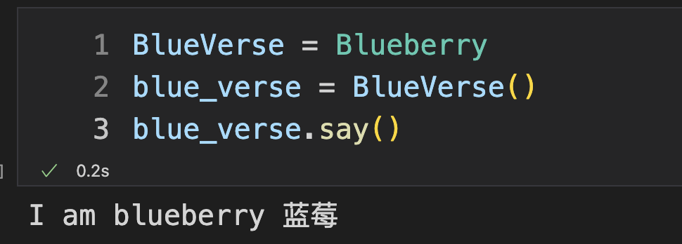

## Python 天生支持多态

哈喽 ~ 

你好啊，我是蓝莓 ：）

Python 是一个天生支持多态的编程语言，如果你曾经学过 `Java` 或 `C++` ，那么你一定知道，如果想让一个变量既可以指向一个类的父类也能指向这个类本身，那么就要把这个变量定义成这个类的父类的类型才可以。但是，在 `Python` 中就简单多了，`Python` 是一门动态编程语言，不需要声明变量的类型就可以直接为它赋值，而这个变量是什么类型取决于你为它赋了一个什么样类型的值。


## 1 给类起个新名字

在  `Python`  中的变量可以理解为一个便利贴（标签），当你把一个值赋给一个变量的时候，就相当于你为这个值起了一个新的名字，你想对这个值的操作都可以用这个 `名字` 来表示。

这时候，你可以类比一下 `人`，当每个人出生到这个世界的时候是没有 `代号` 的，如果一个人没有代号，我们就不知道该怎么用语言来描述了，比如有一个婴儿刚出生在我们的面前。我们可以说让 `他` 喝牛奶。如果语言中都不存在代词这种东西的话，我们甚至无法来描述如何让这个刚出生的婴儿喝牛奶。这时候，我们可以为这个婴儿贴上几个标签，比如第一个标签是 `蓝莓` ，第二个标签是 `蓝宇`，第三个标签是 'blueberry'，这时候，这些标签的作用都是完全一样的。

1. 让 `蓝莓` 喝牛奶
2. 让 `蓝宇` 喝牛奶
3. 让 `blueberry` 喝牛奶

这三句话表达的意思都是一样的，那么类比到 `Python` 中也是完全等同的，比如这个婴儿已经有了 `蓝莓` 这个标签，那么当我执行这样一个语句:

```python
蓝宇 = 蓝莓
```

执行完这条语句之后，我就为这个刚出生的婴儿起了一个新的名字，这个新名字叫 `蓝宇`，一定不要有任何偏见，虽然我们是用 `蓝莓` 这个标签赋值给了 `蓝宇`。但是要知道 `蓝莓` 对于这个婴儿而言也是一个普通的标签而已，只不过一开始我们就有了 `蓝莓` 这个标签，所以后续的操作都需要通过它来表达。可，现在情况不一样了，这个婴儿又多出来一个叫 `蓝宇` 的标签，现在这两个标签的同等级别的，没有什么高低之分，这两个标签都贴在了这个婴儿身上成为了这个婴儿的代号。

**看看编程中是什么情况**

比如当我创建一个名字叫 `Blueberry` 的类：

```python
class Blueberry:
    def say(self):
        print('I am blueberry 蓝莓')
```

这里的类名 `Blueberry` 就是这个客观存在的类的一个标签（名字），如果在这个类诞生的那一刻起就没有名字的话，我们甚至不知道该如何去操作它，所以在定义类的时候就先给它贴上这么一个标签 `Blueberry`。

好啦，这时候我再给它贴上一个新的标签 `BlueVerse`：

```python
BlueVerse = Blueberry
```


**Blueberry**

对于刚诞生的这个客观存在的类而言，它拥有了两个标签，现在执行下边这段代码：

你可以看到它正常的输出了 `I am blueberry 蓝莓`

```python
blueberry = Blueberry()
blueberry.say()
```


**BlueVerse**

接着我们再执行这段代码：

你会发现，他们输出了同样的内容，不必多说，相信聪明的你看到这里一定就明白啦！

```python
BlueVerse = Blueberry
blue_verse = BlueVerse()
blue_verse.say()
```




## 2 更有趣的玩儿法

那么，看到了上边的内容后，就可以有很多的想象空间了，比如我们可以像下边这样玩儿一下：

其实，我特别喜欢 《名侦探柯南》 里边的黑帮大佬：琴酒（Gin），也特别喜欢 灰原哀（Haibara Ai）。在这里定义了三个类，分别是 `Blueberry` , `HaibaraAi`, `Gin`，这三个类中都包含着一个名字相同的 `成员函数`

```
class Blueberry:
    def say(self):
        print('I am blueberry 蓝莓')

class HaibaraAi:
    def say(self):
        print('I am Haibara Ai 灰原哀')
        
class Gin:
    def say(self):
        print('I am Gin 琴酒')
```

接着我给这三个类分别起个别名：

```python
members = [Blueberry, HaibaraAi, Gin]
```

你看到了嘛，这里用的是列表给他们起别名，其实都是一样的，比如 `members[0]` 也是一个变量嘛，`members[0]` 就是 `Blueberry` 的别名。

接着再执行这段代码：

遍历每一个类，然后实例化它，再调用实例对象的 `say` 方法，不必多说，相信聪明的你也明白这里啦！

```python
for member in members:
    obj = member()
    obj.say()
```


今天就分享这么多啦 ~ 

如果你看到了这里 ~ 

给我点个赞叭 ~ 谢谢你的支持哇 ~ 


