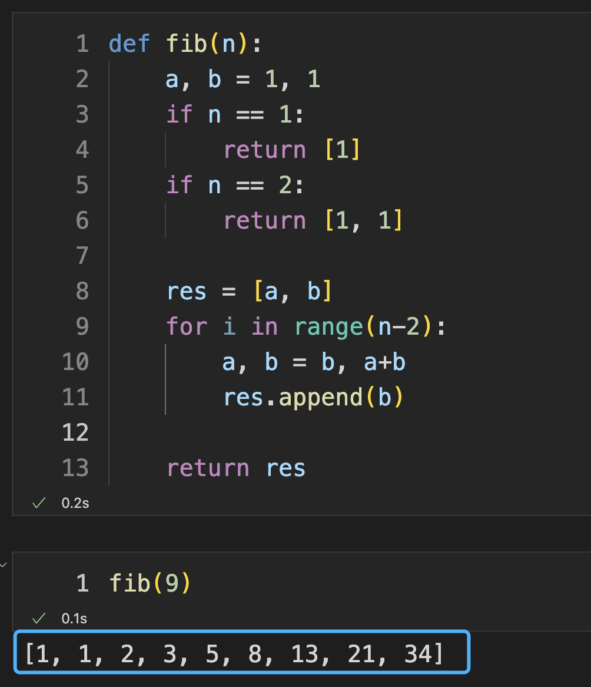
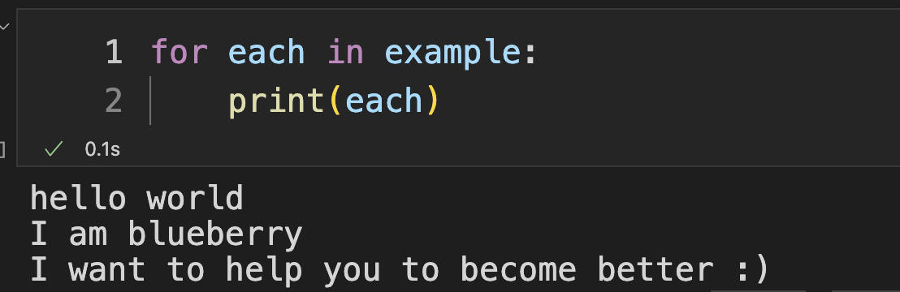
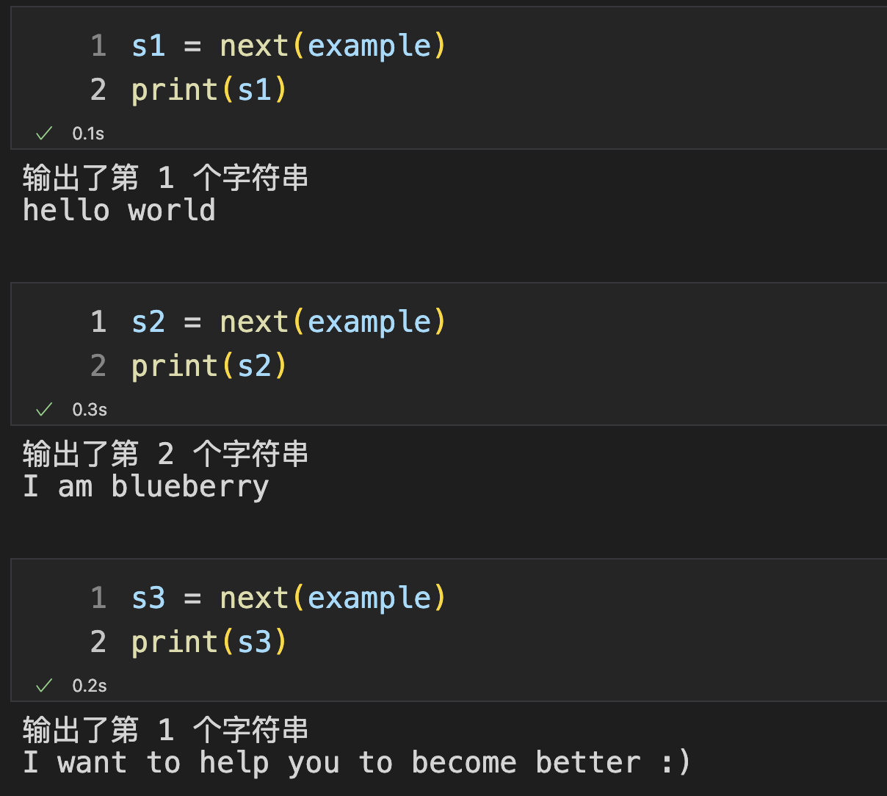
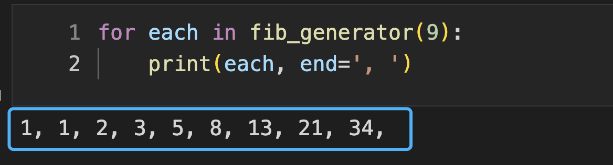

## Python 生成器函数

一张图片.jpg


在很多编程语言中的函数都是被调用之后就一气呵成的执行到底，知道这个函数执行 `return` 之后，它的使命也就结束了，然而 `Python` 中的函数有一个更有趣的特性，与其说是函数，不如把它叫做 `生成器`

## 普通的函数

定义一个函数，这个函数的功能就是返回 `斐波那契` 数列的前 $n$ 个元素的值，那么我选择使用一个列表返回这些元素，对于这个函数而言有一个缺点就是，如果 $n$ 的值非常大的话，那就需要等待这个函数把所有的前 $n$ 个值全部计算完成后才能返回

```python
def fib(n):
    a, b = 1, 1
    if n == 1:
        return [1]
    if n == 2:
        return [1, 1]

    res = [a, b]
    for i in range(n-2):
        a, b = b, a+b
        res.append(b)
    
    return res
```

在这儿看一下这个函数的使用效果，你可以看到这个函数能够函数好的完成这个任务，如果我在做一件事情的时候并不需要它把所有的数据都计算出来一起返回给我，而是我使用一个它就计算一个出来，待我需要使用下一个的时候，它再把下一个数值返回给我，这样就能够同时兼顾生产数据和消费数据了。




## 生成器函数

那么，生成器函数应运而生，顾名思义 `生成器` 就是生产者，是用来生产数据的

创建生成器函数关键在于使用 `yield` 关键字替换 `return` ，其中 `yield` 的作用与 `return` 十分相似，但是也有一些区别

创建一个最简单的生成器函数，通过下边这段代码，我就创建了一个名字叫做 `example` 的生成器对象。现在你发现了，使用函数的方式竟然就像使用 `类` 一样，`generator_example()` 不再是简简单单的调用函数并执行里边的代码，而是通过 `generator_example()` 创建了一个生成器 `对象`。

```python
def generator_example():
    yield 'hello world'
    yield 'I am blueberry'
    yield 'I want to help you to become better :)'
    
example = generator_example()
```

生成器对象 `example` 是可以被迭代的，是可以被遍历的，那么就让我们使用 `for` 语句来遍历一下：

```python
for each in example:
    print(each)
```



你看到，这三个字符串都被输出出来了！

那么如何来证明，这个生成器是一次计算一个数值而不是把所有的数值都计算出来的呢？

我对上边的生成器函数做一个简单的修改：

```python
def generator_example():
    print('输出了第 1 个字符串')
    yield 'hello world'
    
    print('输出了第 2 个字符串')
    yield 'I am blueberry'
    
    print('输出了第 1 个字符串')
    yield 'I want to help you to become better :)'

example = generator_example()
```

这时，我通过 `next` 函数来遍历生成器的内容，如果你不理解 `next` 函数的话。联想下 `for` 语句遍历数据，在你使用 `for` 遍历一个可迭代类型对象的时候，你不能让它遍历到一个数值后停下来，一旦停下来这一轮的遍历就结束了。

如果你使用 `next` 的话，可以一次只遍历出来一个值，下一次的时候接着上一个值进行迭代

在生成器 `generator_example` 中我放了几个 `print` 语句，通过下边的输出，你可以发现，`yield` 出去 `s1` 后并没有执行这条 `yield` 语句下边的 `print` 语句，这就说明了此时生成器被暂停下来了！



是不是很有趣 ？

最后再使用生成器实现一下斐波那契数列：

**生成器实现斐波那契**

```python
def fib_generator(n):
    assert n >= 3, 'n 应大于等于 3'
    
    yield 1
    yield 1

    a, b = 1, 1
    for i in range(3, n+1):
        a, b = b, a+b
        yield b
```

```
for each in fib_generator(9):
    print(each, end=', ')
```



