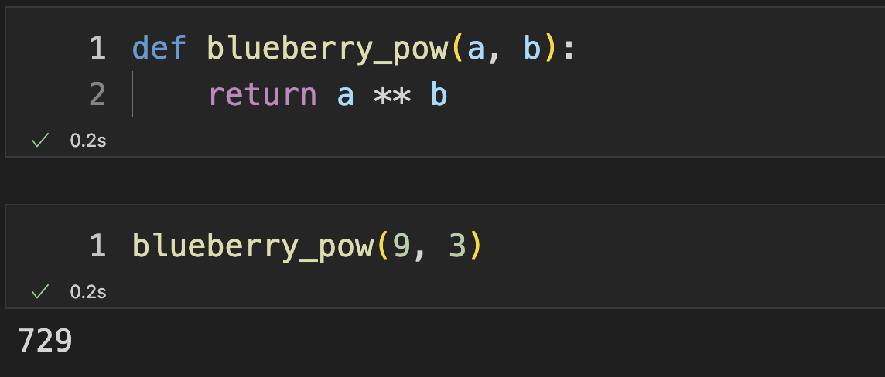
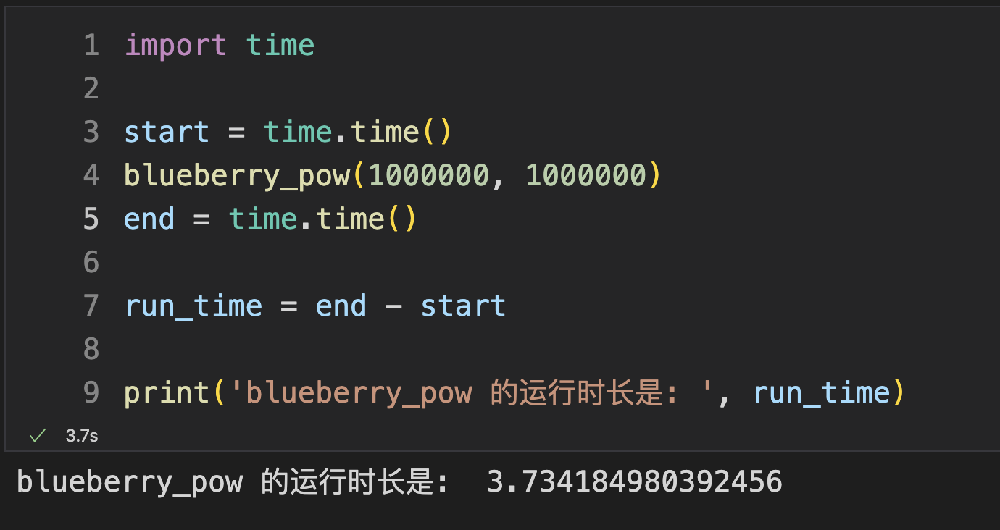
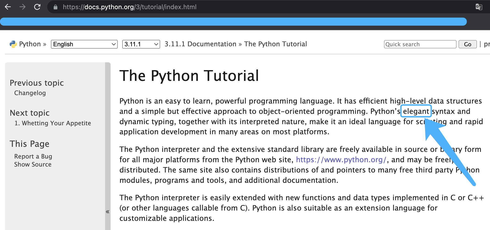
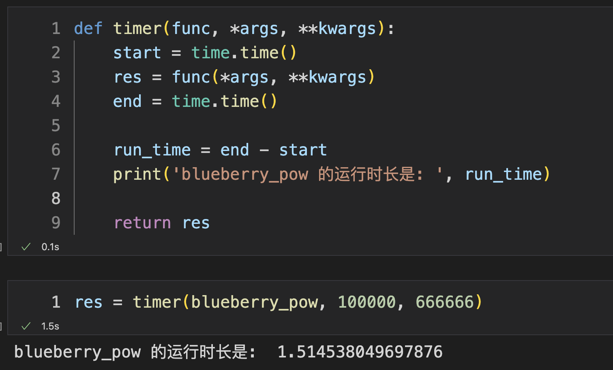
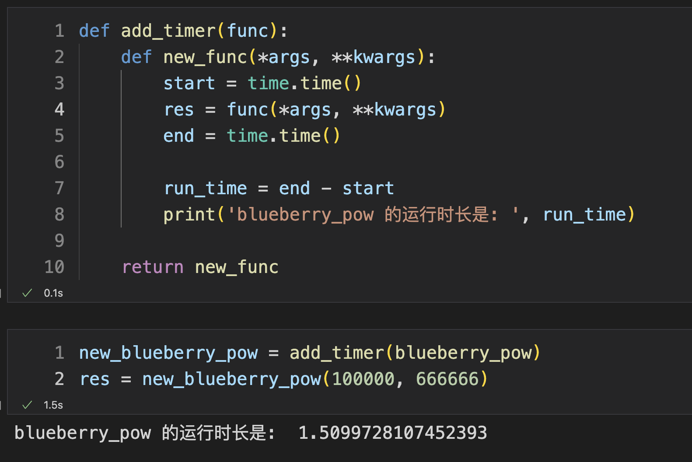
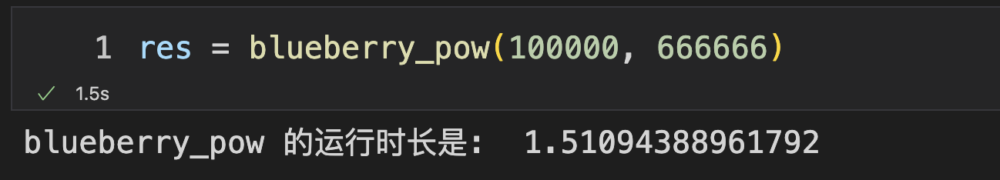

## 彻底理解 Python 装饰器

在 Python 中有一个很有趣的语言特性是装饰器。

假象这样一个场景：你写了一个函数，当你完成了这个函数的功能后，你希望这个函数在每次运行的时候都能记录下来自己的调用时间或者运行时间到一个指定的地方存储下来，或者就是非常简单的，在每次运行完成一个函数后把自己的运行时间给输出出来。

相信聪明的你，一定知道了应该如何完成这个操作，我们先来看看用最简单的方法要怎么来完成。

## 1 先随便写个函数吧

就写一个最简单的函数好啦，乘方运算。

计算 `a` 的 `b` 次方。

```python
def blueberry_pow(a, b):
    return a ** b
```

让我运行一下：




## 2 计算函数运行时长

可以直接这样写，使用 `time.time()` 分别记录 `blueberry_pow` 函数运行前的时间点 `start` 和运行结束后的时间点 `end`。最后用结束时间 `end` 减去 开始时间 `start` 就是 `blueberry_pow` 函数的运行时长 `run_time` 了。

```python
import time

start = time.time()
blueberry_pow(1000000, 1000000)
end = time.time()

run_time = end - start

print('blueberry_pow 的运行时长是: ', run_time)
```




## 3 浅包装一下

聪明的你一定会觉得这个方法真是太简单了！可是 `Python` 这门编程语言一直都非常讲究 `优雅` 二字，毕竟人家的官方文档介绍中都说自己非常的 `elegant` 呢！这怕是最 自恋的 编程语言了吧！



我们知道在 `Python` 中一切皆对象，那么函数本身也是个对象，我们可以直接把函数 `blueberry_pow` 赋值给变量，甚至当做参数进行传递。

那么，第一种写法就有了，我们专门写一个记时用的函数，然后把 `blueberry_pow` 当做参数传递给这个记时函数，在这里边运行。

第 1 个参数 `func` 是传递了需要被记录时间的函数，其后的第 2 个参数 `args` 和 第 3 个参数 `kwargs` 如果你学习过函数的参数传递方式相关的内容的话，一定见过这样的写法。在这里就不展开细聊这种参数传递方法了。总之，你知道的我们传递给 `timer` 的第 2 个参数开始的值都被我们按照同样的方式传递给了 `func` 所代表的函数就好啦。

```python
def timer(func, *args, **kwargs):
    start = time.time()
    res = func(*args, **kwargs)
    end = time.time()

    run_time = end - start
    print('blueberry_pow 的运行时长是: ', run_time)
    
    return res
```

```python
res = timer(blueberry_pow, 100000, 666666)
```


接着让我们来使用 `timer` 函数对`blueberry_pow` 函数记个时，你会发现，同样可以完成这个人物。




## 4 再进一步包装

有了第 3 部分的方法后，可以使用 `timer` 工具函数对它进行记时。

我们能不能直接在 `blueberry_pow` 的基础上创造一个新的函数，让这个新的函数增加上一个记录时间的功能呢？

当然啦，我们可以这样来写。

顾名思义 `add_timer` 就是要为 `func` 函数添加一个 `timer` 的功能。让我们来看看在 `add_timer` 中做了什么呢？

你可以发现，我们在函数的内部定义了一个函数 `new_func` 然后我们在 `new_func` 函数中不仅运行了 `func` 函数，而且还运行了一些我们希望添加的记时功能。最后我们把定义好的 `new_func` 函数作为 `add_timer` 函数的返回值返回出去。这样一来，我们就可以为任意的函数 `func` 添加上记时功能了。

在这里，我们为 `blueberry_pow` 函数添加计时功能，并且将 `add_timer` 函数返回出去的函数起个名字叫 `new_blueberry_pow` 。接着我们调用 `new_blueberry_pow` 函数的时候就像是调用 `blueberry_pow` 函数一样的使用方法即可。

```python
def add_timer(func):
    def new_func(*args, **kwargs):
        start = time.time()
        res = func(*args, **kwargs)
        end = time.time()

        run_time = end - start
        print('blueberry_pow 的运行时长是: ', run_time)

    return new_func
```

```
new_blueberry_pow = add_timer(blueberry_pow)
res = new_blueberry_pow(100000, 666666)
```




## 5 优雅的装饰器

在第 4 部分中，我们看到了，可以使用这样的方式来在 `blueberry_pow` 的基础上创建一个新的函数，让这个新的函数拥有计时功能。

那么在第 4 部分中唯一不足的地方就是这个过程看起来还是不够优雅，并且我们创建出来的新的函数 `new_blueberry_pow` 的名字相较于 `blueberry_pow` 的函数名字发生了变化，然而这个变化其实是多余的。

另外，`new_blueberry_pow = add_timer(blueberry_pow)` 这一行代码看起来也实在是多余。

害！人家 `Python` 可是一门儿自称是非常 `elegant` 的一门编程语言，自然对这一点有了原生的语言特性作为支持。

那就是装饰器啦！

让我们把代码重新来一遍，定义装饰器，其实就是在定义一个像第 4 部分中 `add_timer` 一样的函数而已。

**定义装饰器 timer**

哈哈，你发现了，`timer` 函数和第 4 部分中的 `add_timer` 函数中的内容长的一模一样！我只是给它改了个名字而已。

```python
def timer(func):
    def new_func(*args, **kwargs):
        start = time.time()
        res = func(*args, **kwargs)
        end = time.time()

        run_time = end - start
        print('blueberry_pow 的运行时长是: ', run_time)

    return new_func
```

**定义乘方运算函数**

接着！让我们来定义一个 `蓝莓` 专用的乘方运算函数 `blueberry_pow` ， 哈哈 ~

你会发现在函数定义的上边一行多了一个 `@timer`，这就是把 `timer` 装饰器用在 `blueberry_pow` 函数上。

```python
@timer
def blueberry_pow(a, b):
    return a ** b
```

这时候让我们调用一下`blueberry_pow` 函数，看看会发生什么呢？



哇偶！是不是很神奇？我们直接调用 `blueberry_pow` 函数就直接拥有了计时功能了！

哈哈，那么这个实现原理就和第 4 部分中所说到的 `add_timer` 函数的工作原理是完全一样的！

只不过在第 5 部分中我为 `add_timer` 函数改了个名字改成了 `timer` 函数并且在定义 `blueberry_pow` 函数的时候，在其上方写了一个 `@timer`。那么`@timer`的作用就是说，当你在调用`blueberry_pow`函数的时候，你先把`blueberry_pow`函数丢给`timer`函数，然后`timer`函数会返回一个新的函数`new_func`，这时候在接受`timer`函数的返回值的时候把它赋值给`blueberry_pow`这个标签。

经过这样的一番折腾后，我们的`blueberry_pow`函数就得到了`装饰`，得到了一些改造。