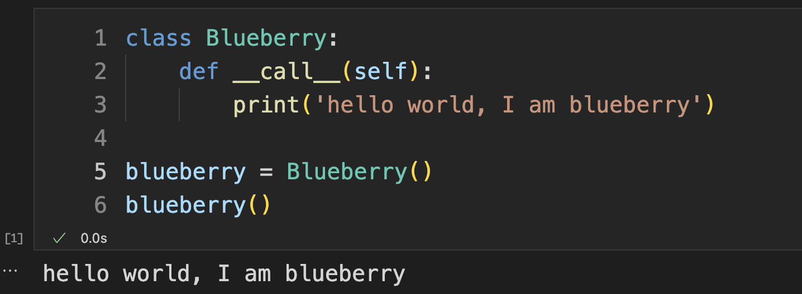
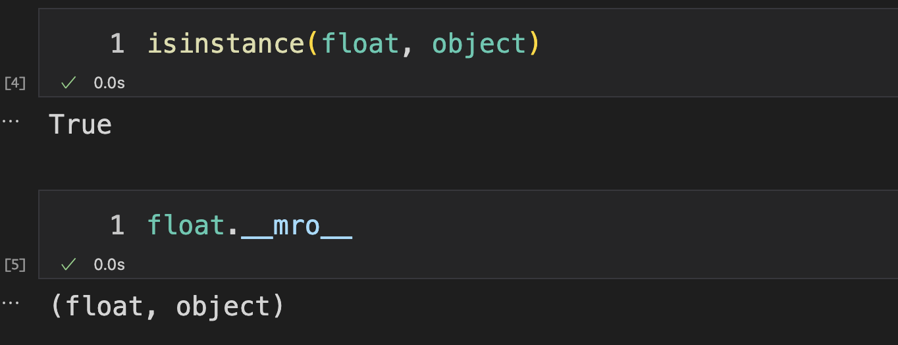

## 彻底理解 Python 万物皆对象

在 Python 中的一切内容都是以对象的形式存在的。

自定义的类本身是一个对象（类对象），通过类对象实例化的东西也是一个对象（实例对象）。甚至创建出的一个浮点数也是一个对象（浮点对象）。

当我们在 Python 中写出这样的代码时，你会不会感到奇怪？

```python
a = float(6.66)
```

如果你已经使用了很久一段时间 Python 的话，对这个操作是非常熟悉的。一直都在强调，万物皆对象，那么创建浮点类型实例对象的对象就是 `float` 对象，按理来说 `float` 是一个对象，可是它竟然可以被调用？一个对象竟然可以像函数一样被调用啊！

可以被调用的对象称为 `可调用对象`，对于内建对象 `float` 而言，在实现 `CPython` 的时候肯定是事先就被写好了这个被调用后所执行的逻辑了。那么对于我们自己创建类所生成的实例对象同样可以完成诸如这样的魔法操作。

在我的这篇文章中有提到过，这类看上去非常神奇的内容是如何实现的，如果希望一个对象可以被调用，那么我们就实现 `__call__` 魔法函数即可。

可参考这篇文章：

【遇见 Python 魔法函数】

在这儿，简单体会一下 `__call__` 魔法函数的使用

```python
class Blueberry:
    def __call__(self):
        print('hello world, I am blueberry')

blueberry = Blueberry()
blueberry()
```

我们只需要实现 `__call__` 方法，随后在调用 `blueberry` 对象的时候就会执行实现定义好的 `__call__` 函数里的代码了




## 考察浮点数值对象

我们就通过最简单的浮点类型的对象深入理解 Python 中万物皆对象是如何实现的。

在 `Python` 中有两个非常特别的 `对象` 分别是 `type` 和 `object`。其中 `type` 是类型对象，另外所有的对象的基类都是 `object`，也就是说在继承链的最顶端一定是 `object` 对象。

**内建对象的基类**

我们先看看内建对象 `float` 的基类是谁，通过如下的代码，我们可以发现 `float` 对象是继承自 `object` 对象的，证明了内建对象继承自 `object`。其中通过查看 `float` 的 `__mro__` 属性可以看到一个对象的继承链。两种方式都验证了这一点。

```python
isinstance(float, object)
```

```python
float.__mro__
```



**内建类型的类型**

查看 `float` 的类型，通过以下两种方式都是可以查看一个对象对应的 `type` 的。


