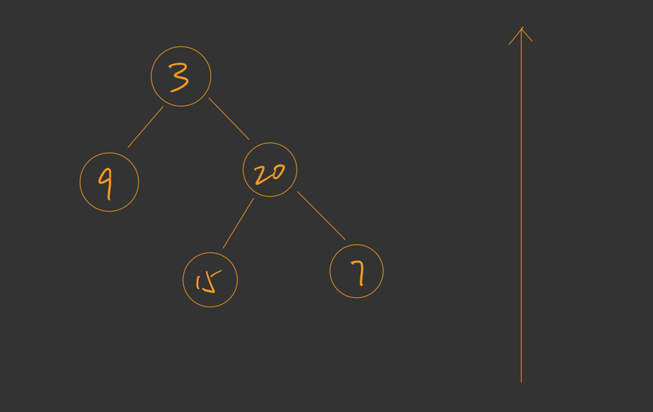
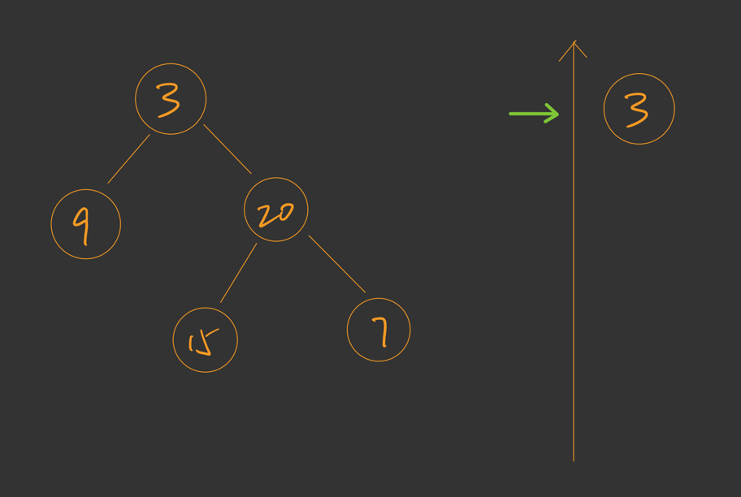
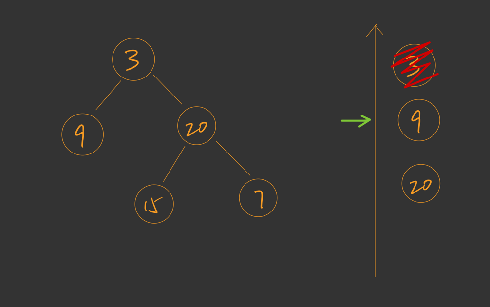
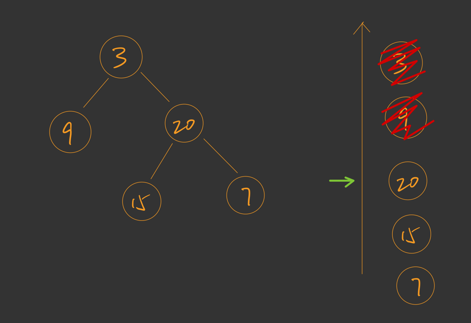
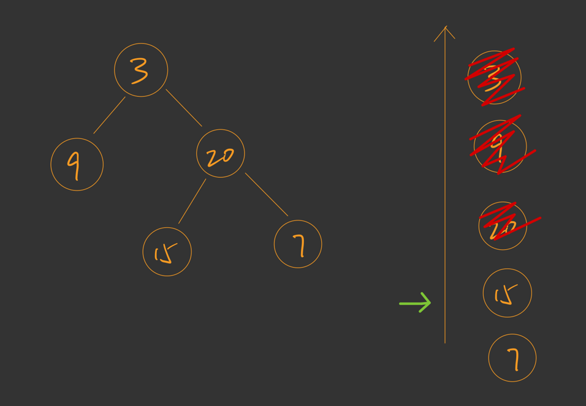
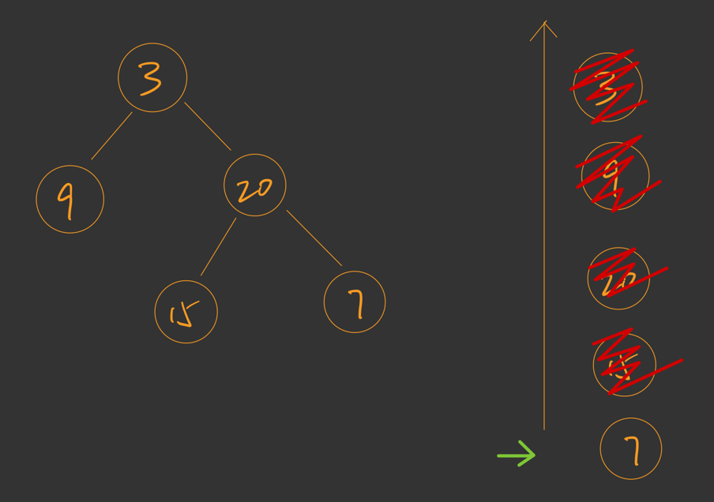
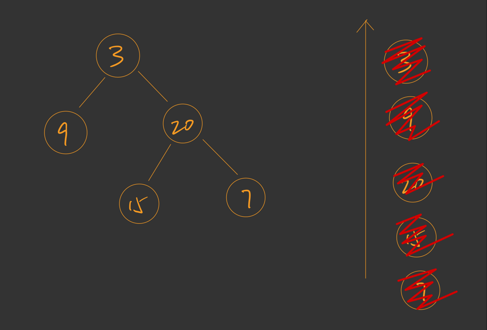

# 003-Minimum-Depth-of-Binary-Tree

这篇文章谈论下二分搜索树的 **广度优先遍历** 也叫 **层次遍历** 还有个英文名字叫 **BFS** (Breadth First Search) 就是 广度优先搜索。

在 LeetCode 上边儿有一个对应的问题是 **111** 号问题：二叉树的最小深度。

## 1 题目描述

> 给定一个二叉树，找出其最小深度。
>
> 最小深度是从根节点到最近叶子节点的最短路径上的节点数量。
>
> **说明：**叶子节点是指没有子节点的节点。
>
> 其实就是距离根节点最近的那个叶子节点所处的那一层的深度。

**举个例子**


**最小深度的定义**

这是一颗二叉树，那么这棵树对应的最小高度是多少呢 ？

答案是 2，你可以发现在第二层 [9, 20] 这两个节点就已经出现了叶子节点，所以节点 9 所在层的深度就是这个二叉树的最小深度。

**什么是层次遍历**

顾名思义，对于树而言，层次遍历就是一层一层的按照**自上而下**且**自左向右**的顺序访问每一个节点，这也被成为树的**广度优先遍历**。

对于上图而言，它的层次遍历的结果就是如下的节点访问顺序

[3, 9, 20, 15, 7]

**解题思路：如何寻找最小深度**

对于 9 号节点来说，用层次遍历就可以找到这个节点了，只要我们在遍历的过程中一边遍历一遍判断当前节点是否是叶子节点。这样，当我们第一次判断成功，也就是说，第一次寻找到的叶子节点所在的那一层的深度就是最终的答案了。这时，整个算法也就结束了。

**如何判断是否是叶子节点**

判断一个节点是否是叶子节点就等价于判断此节点是否满足左孩子和有孩子同时为空。

## 2 层次遍历代码实现思路

**初始状态**

层次遍历的过程需要一个队列作为辅助的数据结构，在以下的图中，我使用一个箭头代表队列的对头方向，初始情况下队列是空的。



**如何访问节点**

访问到的第一个节点，当然是位于二叉树的第一层的节点，而第一层也仅有一个节点。

但我们并不是直接访问它，为了代码的统一性，我们每次访问一个节点的时候都要从队列的队头取出一个节点然后访问它，并且在访问这个队头节点后还要把它的左孩子和右孩子依次入队。

**1 访问第 1 层的节点**



先让根节点入队，其中我用绿色箭头指向队列的头节点。接着，如果我们直接访问队头节点并且让此节点出队的话，那么后边就不知道该访问谁了，那么你发现了嘛，下一层的节点刚好就是队头节点的左孩子和右孩子，此时，当我们访问队头节点的时候顺便让它的左孩子和右孩子入队即可。

就像这样子：

并且这时候也可以放心地把头节点从队列中删除掉，然后头节点就变成了节点 9。



**到这里思考一个问题**

如果有一个需求，你想一行一行地把这些节点输出你该怎么办呢？如果按照刚才的策略进行的话，你每次都从队头取一个节点出来，可是你并不知道当前你取的这个队头的节点到底是位于树中的第几层呀？

其实：当你在访问第一个节点之前，队列的长度就是你即将访问的那一层的节点的数量，那么这时候你就可以在访问这一层之前使用一个变量记下这一层的节点数量，当你访问过这么多的节点后让输出换行。并且这时候你访问完了一层的节点，而且每访问一个节点那么它的左孩子和右孩子也会入队，所以此时队列中放满了下一层的节点，也就是说，这时候的队列的长度又成为了下一层节点的数量。如此，我们就知道了如何一层一层的输出每一层的节点了。

**2 访问第 2 层的节点**

现在队头指针已经指向了节点 9，那么还是刚才的过程，访问节点 9 并且将节点 9 的非空的孩子入队，而现在你可以发现，它的左孩子和有孩子都为空，所以不用入队任何节点。

这时，把节点 9 从队列中去除，接着访问新的队头节点：



依然是按照刚才的套路，访问节点 **20** 再将节点 **20** 的左孩子和右孩子入队。

**3 访问第 3 层节点**

访问节点 15



访问节点 7



**结束**

当我们访问完成所有的节点后，你会发现队列也变成了空。所以，判断层次遍历是否完成的条件就是判断队列是为空。若队列为空则遍历结束。




## 3 代码实现 C++

**LeetCode 给出的代码**

```c++
// 节点的定义
struct TreeNode {
      int val;
      TreeNode *left;
      TreeNode *right;
      TreeNode() : val(0), left(nullptr), right(nullptr) {}
      TreeNode(int x) : val(x), left(nullptr), right(nullptr) {}
      TreeNode(int x, TreeNode *left, TreeNode *right) : val(x), left(left), right(right) {}
 };


// Solution 在这里写算法的实现 
class Solution {
public:
    int minDepth(TreeNode* root) {
        
    }
};
```

对于 LeetCode 上边的这道题而言，并不需要遍历整个二叉树，而仅仅是找到第一个叶子节点的时候算法就可以结束了。因为我们是一层一层遍历的，所以访问到的第一个叶子节点所在的层一定是距离根节点最近的那一层，也就是题目中所叙述的那一层的最小深度。

**完整代码**

下边的代码只有一个函数，你可以对照这刚才所示的图片以及注释来理解这段代码。

```c++
class Solution {
public:
    int minDepth(TreeNode* root) {
        // 若根节点不存在则 depth 为 0 
        // 直接返回 0 即可
        if(root == nullptr) return 0;
        
        queue<TreeNode*> q;
        
        // 把根节点入队，让代码统一
        q.push(root);
        
        // 题目希望我们给出最小深度的值，
        // 所以需要一个变量记录最小深度的值是什么
        // depth 存储的是当前正在遍历的
        // 那一层的深度
        // 因为首先遍历的是根节点
        // 根节点为第 1 层
        // 则 depth 应初始化为 1
        int depth = 1;
        
        // 队列不为空则说明遍历没有结束
        while(!q.empty()) {
            // 在还没有开始遍历一层的时候
            // 队列 q 中存储了即将遍历的那一层的节点
            // 所以 q.size() 就是即将遍历的这一层的节点数量
            // 记录当前层的节点个数 sz
            int sz = q.size();
            
            
            // 一次 for 循环的完整执行
            // 就是完成了二叉树的一层的遍历
            for(int i = 0; i < sz; ++i){
                TreeNode* cur = q.front();
                q.pop();

                // 目标是找到第一个层次遍历中
                // 所遇到的那个叶子节点
                // 此时直接返回 depth
                if(cur->left == nullptr && cur->right == nullptr)
                    return depth;


                // 添加 cur 的相邻节点到队列中
                // 对于二叉树而言就是添加其不为空的孩子节点
                if(cur->left != nullptr)
                    q.push(cur->left);
                if(cur->right != nullptr)
                    q.push(cur->right);
            }

            // 此时完成了整个的 for 循环
            // 维护 depth 变量的定义
            // 继续遍历下一层的节点
            depth += 1;
        }

        // 对于这个题目来说
        // 它并不会执行
        // 因为一定可以在 while 循环中找到叶子节点
        // 但我不这么写， LeetCode 编译出错
        // 说存在没有返回值的情况
        // 尽管这个 return 语句没用
        // 为什么要减去 1 呢？
        // 因为每遍历完成一层后就会为 depth 加上 1
        // 而加上 1 后正准备要去遍历新的一层，
        // 但是已经遍历结束，所以新的一层并不存在则要减去 1
        return depth-1;
    }
};
```

