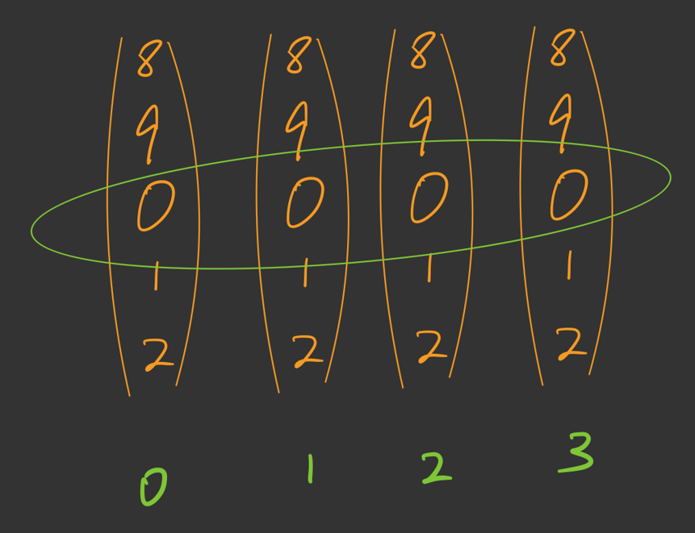
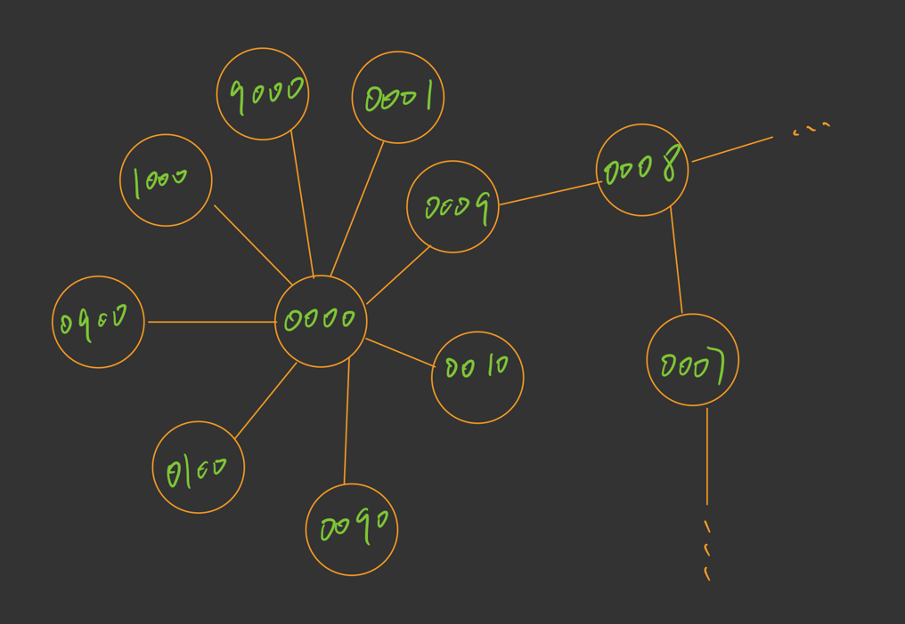
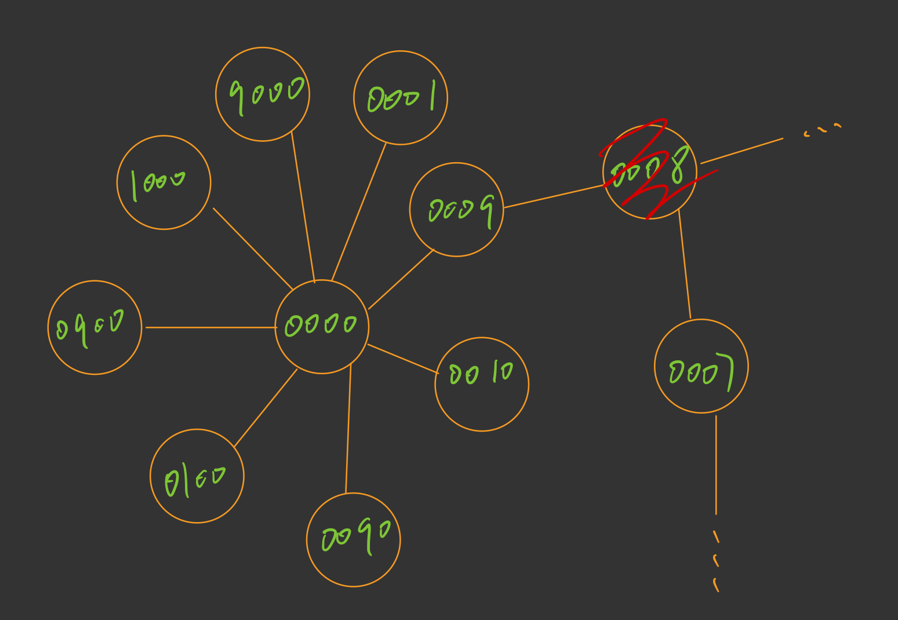

# 0752-Open-The-Lock

这篇文章讨论一个关于 **BFS** 应用的题目，LeetCode 上边儿的 **752** 号问题：**打开转盘锁**（0752-Open-The-Lock）

## 1 题目描述

> 你有一个带有四个圆形拨轮的转盘锁。每个拨轮都有10个数字： '0', '1', '2', '3', '4', '5', '6', '7', '8', '9' 。每个拨轮可以自由旋转：例如把 '9' 变为 '0'，'0' 变为 '9' 。每次旋转都只能旋转一个拨轮的一位数字。
>
> 锁的初始数字为 '0000' ，一个代表四个拨轮的数字的字符串。
>
> 列表 deadends 包含了一组死亡数字，一旦拨轮的数字和列表里的任何一个元素相同，这个锁将会被永久锁定，无法再被旋转。
>
> 字符串 target 代表可以解锁的数字，你需要给出解锁需要的最小旋转次数，如果无论如何不能解锁，返回 -1 。
>
> **示例**
>
> 输入：deadends = ["0201","0101","0102","1212","2002"], target = "0202"
> 输出：6
> 解释：
> 可能的移动序列为 "0000" -> "1000" -> "1100" -> "1200" -> "1201" -> "1202" -> "0202"。
> 注意 "0000" -> "0001" -> "0002" -> "0102" -> "0202" 这样的序列是不能解锁的，
> 因为当拨动到 "0102" 时这个锁就会被锁定。

那么先来理解下题目的意思，程序的输入是两个内容，一个是 **deadends ** 另外一个是 **target **

那么拨轮锁是什么东西呢，你可以脑补一下你行李箱上的那个锁子，可以拨动那个轮子然后转换成不同的数字。我简单画了一张图，可以参考下：



画图水平有限，只能画成这个样子了，绿色表示的是第几号波轮，再看绿色的圈圈中的数值就是指当前转到的密码是什么。如上图就是 **0000**

现在向上拨动 **0** 号波轮，那么这时候对应的密码就从 **0000** 变成了 **1000**

**deadends 是什么意思？**

在 **deadends ** 中存放了一组密码，指的就是在你拨动拨轮的过程中不能够在拨动的过程中拨出任意一个 **deadends ** 中存在的密码。

当前的 **target** = "0202", 按照正常情况来说，我们先把 0 号拨轮拨成 0，然后把 1 号拨轮拨成 2 再 把 2 号拨轮拨成 0，最后 3 号拨轮拨成 2。我们也就打开密码锁了，但是在 **deadends** 中有一项是 **0201**，如果前三个已经拨成了 **020** 而在你拨动最后一个轮子的时候如果你向上拨动，你会先触发 **0201** 然后再触发 **0202**。那么相信你也理解了 **deadends** 的作用了，最后，题目要求我们寻找的是最少的拨动次数，只要单个拨轮的数字产生一次变化就视为拨动了一次。

题目的拨轮的初始状态为 **0000**

## 2 解题思路

从题目，可以知道，要求：求得的值是一个最少的拨动次数。那么，广度优先搜索求解的就是最少的次数，我们可以从状态 **0000** 出发，然后遍历所有的密码状态，当然，我们要按照一定的顺序来遍历所有的密码，这个顺序就是按照广度优先的顺序遍历。其实，所有的密码状态可以被我们抽象称为数据结构中的 **图结构**。

为了简单，这里我直接说重要的地方，如果不太好理解，那么可以参考下边的这篇文章，先把这篇文章搞懂后，相信接下来的内容会更加好理解。

> **传送门**
>
> [BFS-求解二叉树的最小深度](https://mp.weixin.qq.com/s/W80drJvvcheJ2nTc3vx3pg)

**到底是什么意思？举个例子**

拨动次序，从第 0 号拨轮开始依次拨动到第 3 号拨轮，每个拨轮的拨动方向有上下两种选择。那么也就意味着每一个密码状态节点共有 8 个相邻节点，因为我们可以从一个密码状态通过 8 种不同的操作得到另外一个密码状态。如果你学习过图结构，是不是忽然就能够理解了呢？

按照广度优先的策略，每次我们从队列中取一个节点出来访问它，并且把它的相邻节点插入到队尾。然后接着循环刚才的过程就好了。

**注意一个问题**

假如当前我们访问到的密码节点是 **0001**，这时候我们选择把 3 号拨轮，向上拨动那么节点 **0002** 就会插入到队列，我们迟早也会访问到节点 **0002**。

那么思考一下，如果我们现在访问到的节点是 **0003** ，这时候把第 3 号拨轮向下拨动就变成了 **0002** 节点，这时候 **0002** 节点也会插入到队尾。

这就产生了一个问题，我们会形成一个死循环，因为被访问过的状态再今后还会访问，这样会一直持续下去。有没有什么好方法，来解决这个问题呢？那就是，可以对每一个访问过的状态标记一下，当我们要把一个密码状态插入到队尾之前就先判断一下当前这个状态是不是已经被放进过队列中了，如果已经放进过了，那么我们直接跳过当前状态即可。在后边的程序中，我会使用一个布尔类型的数组来完成这件事情，当然你也可以选择使用哈希表或者字典等等都可以。但是使用数组的画，或许会更加高效，因为数组对于元素是随机访问的而若使用其他的数据结构还需要先查找再访问。

我简单化了一张图，可以参过来理解：

其实整个求解过程就是图的广度优先遍历，每个节点都会有 8 个相邻的节点，我只画出了很小的一部分，



顺便再来理解一下题目中的 **deadends**

假设在 **deadends** 中有一个密码状态是 **0008**，而且现在的 target = **0007**。

其实它想表达的意思就是我们不能够通过节点 **0008** 来访问节点 **0007**



**初始化注意的问题**

那么我们又如何来判断是否能够通过一个节点访问到另外一个节点呢，在刚才我们提到了一个布尔类型的数组，只要我们在程序开始运行之前，我们就在布尔类型的数组中标记这个节点是不能够加入队列的，那么我们的程序自然也就不会访问到 **0008** 这个节点了。

## 3 代码实现 C++

**LeetCode 给出的代码**

```c++
class Solution {
public:
    int openLock(vector<string>& deadends, string target) {

    }
};

```


在文章最下边我给出了完整的代码，你可以对照文章末尾的完整代码和这里的部分片段来结合起来理解，而在这里我会拆解每一个部分详细阐述：

**布尔类型的数组**

因为共有 4 个拨轮，每个拨轮又有 10 种状态（0~9），所以用这样的一个数组刚好可以记录某一个密码状态是否被访问过。

比如 visited[1]\[2]\[3][4] 就是表示说，密码状态 **1234** 时已经被加入到过队列了吗？当我们要加入 **1234** 这个状态到队列之前，我们先判断这个条件是否是 **false**。

 visited[1]\[2]\[3][4] == true 表明已经已经被加入过了

 visited[1]\[2]\[3][4] == false 表明没有被加入过

```c++
// 用于标记某个节点是否被访问过
bool visited[10][10][10][10];
```


**isVisited 函数**

为了方便，我把对一个密码状态是否被访问过的这个操作封装成了一个函数。

在程序中使用字符串对象来存储一个密码状态，由于数组下标需要整型，所以要先把每个字符转换成对应的整型最后直接返回这个结果就好了。

```c++
    bool isVisted(string s) {
        unsigned int s0 = s[0] - '0';
        unsigned int s1 = s[1] - '0';
        unsigned int s2 = s[2] - '0';
        unsigned int s3 = s[3] - '0';
        
        return visited[s0][s1][s2][s3];
    }
```


**visite 函数**

每当我们把一个密码状态放入队列后，放了防止下次重复放入相同的密码状态，所以需要在 **visited** 数组种标记一下，那么，我把这个标记的功能封装在了 **visite** 函数中，非常简单。

```c++
    void visite(string s) {
        unsigned int s0 = s[0] - '0';
        unsigned int s1 = s[1] - '0';
        unsigned int s2 = s[2] - '0';
        unsigned int s3 = s[3] - '0';

        // cout << "visite : " << s << endl;

        visited[s0][s1][s2][s3] = true;
    }
```

**plusOne 函数**

当我们对密码状态 s 的第 j 号拨轮向上拨动一次那么就会产生一个新的密码状态，我把这个功能放在了 **plusOne** 函数中，这个函数会以字符串的形式返回拨动后的新的密码状态的字符串格式。

```c++
    // s[j] 向上拨动一次
    string plusOne(string s, int j) {
        if(s[j] == '9')
            s[j] = '0';
        else
            s[j] += 1;

        return s;
    }
```

**minusOne 函数**

当我们对密码状态 s 的第 j 号拨轮向下拨动一次那么就会产生一个新的密码状态，我把这个功能放在了 **minusOne** 函数中，这个函数会以字符串的形式返回拨动后的新的密码状态的字符串格式。

```c++
    // s[j] 向下拨动一次
    string minusOne(string s, int j) {
        if(s[j] == '0')
            s[j] = '9';
        else
            s[j] -= 1;

        return s;
    }
```

最后就只剩下 **openLock** 的核心逻辑了，那么可以直接在完整代码中结合其他的部分和代码中的注释来理解最后的逻辑。

**完整代码**

```c++
#include <iostream>
#include <vector>
#include <queue>
#include <cstring>
using namespace std;


class Solution {
public:

    // 用于标记某个节点是否被访问过
    bool visited[10][10][10][10];

    void visite(string s) {
        unsigned int s0 = s[0] - '0';
        unsigned int s1 = s[1] - '0';
        unsigned int s2 = s[2] - '0';
        unsigned int s3 = s[3] - '0';

        visited[s0][s1][s2][s3] = true;
    }

    bool isVisted(string s) {
        unsigned int s0 = s[0] - '0';
        unsigned int s1 = s[1] - '0';
        unsigned int s2 = s[2] - '0';
        unsigned int s3 = s[3] - '0';
        
        return visited[s0][s1][s2][s3];
    }

    // s[j] 向上拨动一次
    string plusOne(string s, int j) {
        if(s[j] == '9')
            s[j] = '0';
        else
            s[j] += 1;

        return s;
    }

    // s[j] 向下拨动一次
    string minusOne(string s, int j) {
        if(s[j] == '0')
            s[j] = '9';
        else
            s[j] -= 1;

        return s;
    }

    int openLock(vector<string>& deadends, string target) {
        // 每个节点的相邻节点有 8 个
    
        // 初始化为每个节点都没有访问过
        // 数组整个都初始化为 0 就代表了是 false
        memset(visited, 0, sizeof(visited));

        // 在 visited 中初始化不可达的顶点
        // 遍历 deadends 中的每一个密码状态
        // 把这些节点都标记为已经入队过
        // 其实就是在说，这些结果不能够再被访问了
        // 因为 BFS 每次都是从队列中取一个节点来访问
        // 不能够入队就代表了不会从队列中被访问
        for(auto s : deadends) {
            visite(s);
        }

        // 极端情况的考虑
        // 如果 deadends 中存在 0000
        // 又由于我们密码锁的初始状态就是 0000
        // 所以我们无法从 0000 访问到任何节点
        // 则程序返回 -1 表示无解
        if(isVisted(string("0000")))
            return -1;
            
        // step 记录的是
        // 当前正在遍历的这些节点
        // 从 0000 状态开始
        // 最少需要拨动几次才能够触达
        // 初始化为拨动 0 次
        // 因为 0000 状态不需要拨动
        // 0000 状态就是最初始的状态
        int step = 0;

        // 用 start 字符串记录初始状态 0000
        string start = "0000";
        
        // BFS 用到的辅助队列 q
        queue<string> q;

        // 让初始状态入队
        q.push(start);

        // 并且标记该状态已经入队过了
        visite(start);

        // 队列不为空则 BFS 未结束
        while(!q.empty()) {
            // 通过 size 可以知道当前遍历的那一层有多少个节点
            // 每遍历完成 size 个节点后
            // step 就应该增加 1 
            int sz = q.size();

            for(int i = 0 ; i < sz ; ++i) {
                // 从队头取一个节点出来
                string cur = q.front();
                // 并且删除队头节点
                q.pop();

                // 判断是否是目标 target
                if(cur == target)
                    return step;

                // BFS 的套路
                // 添加相邻节点
                // 只不过这里的相邻节点需要自己来构建
                // 共有 4 个拨轮
                // 每个拨轮可以向上或向下两种拨动方式
                for(int j = 0 ; j < 4 ; ++j) {
                    string plus_cur = plusOne(cur, j);
                    // 入队之前要保证此节点没有被入队过
                    if(!isVisted(plus_cur)) {
                        q.push(plus_cur);
                        // 入队后标记此节点已经入队过了
                        visite(plus_cur);
                    }

                    string minus_cur = minusOne(cur, j);
                    // 入队之前要保证此节点没有被入队过
                    if(!isVisted(minus_cur)) {
                        q.push(minus_cur);
                        // 入队后标记此节点已经入队过了
                        visite(minus_cur);
                    }
                }

            }

            // 维护 step 变量
            step += 1;
        }

        // 整个 BFS 结束后还没有找到解
        // 则不可达
        return -1;
    }
};


int main() {

    vector<string> deadends = {
        "0000"
    };

    string target = "8888";
    
    Solution solution;
    int res = solution.openLock(deadends, target);

    cout << "res : " << res << endl;


    return 0;
}
```

