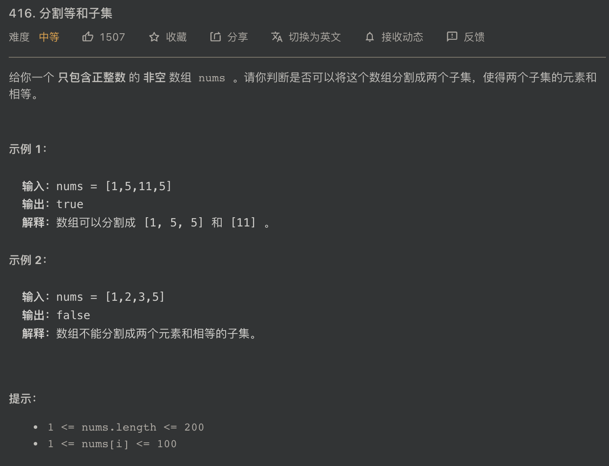

# 0-1 背包

哈喽 ~

你好啊，我是 蓝莓 ~


## 416 LeetCode




## 1 暴力搜索

理解题目是要把给定的 **nums** 数组中的元素拆分成集合 **A** 和 集合 **B**，使得 `sum(A)` 等于 `sum(B)`，也就是 `sum(A) = sum(B) = sum(nums)/2 ` 。

记 `sum(nums) / 2 = C`

最简单的方法就是遍历所有的子集，从中挑出一个满足要求的集合，那么剩下的另外一半元素也一定就是满足要求的另外一个集合了。

## 2 动态规划

这个题目可以用 **0-1 背包** 的思路解决，因为本质就是从中寻找出一组数值，然后看看这些数值能不能刚好装满容量 **C** 。

那么 **dp** 数组要如何设置呢？

`bool dp[nums.size()][C+1]`

1. `nums.size()` 是数值的个数
2. 取 `C+1` 是因为下标从 `0` 到 `C` 这么多种容量的情况

`dp[i][j]` 表示考虑 `[0...i]` 这些数值，且容量为 `j` 时，能否有一个数值的子集求和后刚好等于 **C**。

我们要求的 **结果** 就是 `dp[nums.size()-1][C]`，它代表了考虑所有的元素，并且容量为 `C` 的时候，能否从所有的元素中找到一个子集使得该集合的元素和等于 `C`。

1. 当 `dp[i][j] = true` 说明 考虑 `[0...i]` 这些编号的数值且容量为 `j` 的时候刚好可以装满容量 `j`，也就是说可以从 `[0...i]` 这些编号的数值中找到一个子集，使得该子集的数值和等于 `j`。
2. 当 `dp[i][j] = true` 说明 考虑 `[0...i]` 这些编号的数值且容量为 `j` 的时候不能装满容量 `j`。

那么`dp[i][j]` 的值取决于什么呢？

对于 **第i号** 数值可以选择 **要** 或 **不要**

1. 选择 **要** 那么就要判断一下容量 **j** 能否装入 **第i号** 数值。如果可以装入，这时候还剩下的容量为 `j-nums[i]`，再考察一下 `dp[i-1][j-nums[i]]` 的情况，如果 `dp[i-1][j-nums[i]] = true` 则 `dp[i][j] = true` 。 `dp[i-1][j-nums[i]] = true` 表达的意思是：当我装进去 **第i号** 数值后，那么考虑上前边的那些数值，也就是编号为 `[0...i-1]` 的这些数值并且使用剩下来的 `j-nums[i]` 这么大的容量能否被前 `[0...i-1]` 这些编号的数值装满。如果不能的话，就是说，虽然把 **第i号** 数值装进去了，同时也消耗了 `nums[i]` 这么大的容量，但是剩下的空间并不能被 `[0...i-1]` 这些编号的数值的子集装满，这样同样不符合题目要求，所以 `dp[i][j]` 的值一方面取决于 `dp[i-1][j-nums[i]]` 的值。
2. 如果选择 **不要** 那么 `dp[i][j] = dp[i-1][j]`，这个应该很好理解，如果你不要 **第i号** 数值，那么此时的结果其实和 `dp[i-1][j]` 是一样的。不要 **第i号** 数值的话，问题就变成了：考虑一下 `[0...i-1]` 这些编号的数值能否找到一个子集，并且这个子集的数值和能否刚好等于 `j`。

**最终**

`dp[i][j] `

`= dp[i-1][j-nums[i]] || dp[i-1][j]`

只要，**要** 或 **不要** 两种决策方案种有一个方案是可以使得背包的容量被装满的，那么 `dp[i][j]` 就可以满足被装满的要求。

**总结一下**

1. 只要两种方案中有一个可以满足要求 `dp[i][j] = true`
2. 两种方案都不满足要求 `dp[i][j] =false`

你可以发现更新 **第i号** 行需要 **第 i-1 号** 行的数据作为支撑

**处理特殊行和列**

当背包的容量为 `0` 的时候，一定存在一个子集可以把背包装满，只要我们什么数值都不选就好了呀，这个子集就是 **空集** 呀。所以 `dp` 数组的第 `0` 列也就是容量为 `0` 的那一列的值都为 `true`。

因为更新 **第i号** 行的数据需要 **第 i-1 号** 行的数据作为支持，所以我们先专门计算出 **第0号** 行的值。在计算 0 列的时候，已经计算出了 `dp[0][0]` 的值，所以只需要计算 `dp[0][1...C]` 的值就可以了。这些值中只有那个容量刚好等于 `nums[0]` 的位置才能被刚好装满，其余的位置都是不能被装满的。

那么特殊行的处理代码就很简单了：

```c++
// 容量为 0 的时候都能装满 ==> 可以都不装
for(int i = 0 ; i < nums.size() ; ++i)
  dp[i][0] = true;

// 当容量 >= 1 的时候只有 dp[0][nums[0]] 能装满
// 其他位置都装不满
for(int j = 1 ; j <= C ; ++j)
  dp[0][j] = false;

// dp[0][nums[0]] 能装满
if(nums[0] <= C) dp[0][nums[0]] = true;
```


**dp 数组更新**

接下来，就是其他行的数值更新了。其他行的每个位置的值都可以根据上一行的结果推算出来

我们只需要更新 `dp[1...nums.size()-1][1...C]` 这些值即可，也就是排除了第 0 行 和 第 0 列。

```c++
for(int i = 1 ; i < nums.size() ; ++i) {
  for(int j = 1 ; j <= C ; ++j) {
    // 容量不足以装入 i 号元素
		// 那么只能选择不装 i 号元素了
    if(nums[i] > j)
      dp[i][j] = dp[i-1][j];
    else {
      // 容量 j 能装入第 i 号元素
      // 结果取 装入 i 号 或 不装入 i 号元素
			// 只要其中一个方案成功即可
      dp[i][j] = dp[i-1][j] || dp[i-1][j-nums[i]];
    }
  }
}
```


## 3 完整代码

```c++
class Solution {
public:
    bool canPartition(vector<int>& nums) {
        int sum = 0;
        for(int num : nums)
            sum += num;

        // sum 是奇数的时候是不可能分割的
        if(sum % 2 != 0) return false;

        // [0...nums.size()-1] 数值
        // [0...C] 容量
        int C = sum / 2;
        // dp[i][j] 考虑 [0...i] 数值且容量为 j 时能否装满
        bool dp[nums.size()][C+1];

        // 容量为 0 的时候都能装满 ==> 可以都不装
        for(int i = 0 ; i < nums.size() ; ++i)
            dp[i][0] = true;

        // 当容量 >= 1 的时候只有 dp[0][nums[0]] 能装满
        // 其他位置都装不满
        for(int j = 1 ; j <= C ; ++j)
            dp[0][j] = false;

        // dp[0][nums[0]] 能装满
        if(nums[0] <= C) dp[0][nums[0]] = true;


        for(int i = 1 ; i < nums.size() ; ++i) {
            for(int j = 1 ; j <= C ; ++j) {
                // 容量不足以装入 i 号元素
                // 先减去了第 i 号元素所需要的空间
                // 然后才去装其他的元素的
                if(nums[i] > j)
                    dp[i][j] = dp[i-1][j];
                else {
                    // 容量 j 能装入第 i 号元素
                    // 结果取 装入 i 号 或 不装入 i 号元素
                    // 两者中能够正好装满的那个结果
                    // 不装入 i 号元素的时候是 j-0
                    // 装入 i 号元素的时候是 j-nums[i]
                    dp[i][j] = dp[i-1][j] || dp[i-1][j-nums[i]];
                }
            }
        }

        return dp[nums.size()-1][C];
    }
};
```


