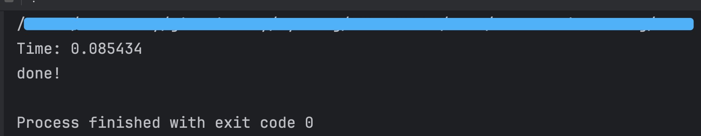

# 如何写出正确的代码

你好啊，我是蓝莓。

在这片文章中，通过二分查找来聊一聊如何写出正确的代码。


## 什么二分查找？

二分查找的思想不难理解，在一个有序数组中，我们要寻找 target，我们直接将该数组一分为二，直接去对比中间位置的那个值是不是我们要找的值。

1. 如果该数组正中间的值  `v`刚刚好就是我们要找的值的话，那么皆大欢喜，我们已经找到了这个值所在数组中的位置了。
2. 如果我们要找的值 `target > v` 那么我们就直接丢弃数组左边的那部分值，直接去数组的右边进行搜索。 
3. 如果我们要找的值 `target < v` 那么我们就直接丢弃数组的右边的那部分值，直接去数组的左边进行搜索。


我们只需要不断的重复刚才的过程，如果 `target` 存在于该数组中的话，我们一定是能查找到的，如果这个值不在数组中的话，随着我们搜索的推进，我们可搜索的范围会越来越小，直到没有内容可以搜索，这时候就说明 `target` 不存在于该数组中。


## 循环不变量

有一个很专业的名词叫 `循环不变量`，虽然某些变量的值是一直在改变的，但是这个变量的定义是一直保持不变的，那么我们来看看二分搜索中的循环不变量是什么？

在这里，我定义一个函数 `binarySearch` 并且传递三个参数

1. arr 这是我们要搜索的数组
2. arr 数组中包含 n 个元素，也就是 `arr[0]` 到 `arr[n-1]` 都是可以读取到的
3. target 是我们要搜索的目标值，判断 arr 中是否包含 target

```c++
// 在包含 n 个元素的数组 arr 中寻找目标值 target 的下标
int binarySearch(const int* arr, int n, int target) {
    // 在区间 [l...r] 这个区间内寻找 target
    int l = 0, r = n-1;

    // 在没有找到并且 [l...r] 区间内仍然是有元素的情况下继续查找
    while( l <= r ) {
        int mid = (l+r) / 2;
        if( arr[mid] == target ) {
            return mid;
        } else if( target > arr[mid] ) {
            l = mid+1;
        } else {
            // target < arr[mid]
            r = mid-1;
        }
    }

    return -1;  // 如果循环都结束了，说明还是没有找到，那么返回 -1 代表失败
}
```


接着让我们一点一点的来看：

这里的 `l` 和 `r` 分别代表我们要搜索的位于 `arr` 数组中的氛围，我们要在区间 `[l...r]` 这个范围内寻找 target；这里的 `l` 和 `r` 就是我们要维护的循环不变量，因为我们始终要在 `[l...r]` 这样一个闭区间内寻找 `target`

```c++
    // 在区间 [l...r] 这个区间内寻找 target
    int l = 0, r = n-1;
```


循环进行的条件：

什么情况下，循环要继续进行下去呢？那就是，我们依然没有寻找到 `target` 并且 `[l...r]` 这个区间内依然是有元素的，这种情况就要让循环继续下去。即使当 `l 等于 r` 的时候，`[l...r]` 这个区间内依然是拥有一个元素的，所以，我们依然还是可以继续让循环进行下去的，因此循环的条件应该是 `l <= r` 

```c++
    // 在没有找到并且 [l...r] 区间内仍然是有元素的情况下继续查找
	while( l <= r ) {

    }
```


接着，我们就来看循环内部的语句了，在本轮循环中共有三种情况，首先我们先计算出 `[l...r]` 这个范围内正中间的下标是什么，得到 `mid`，随后这三种情况分别是：

1. `arr[mid]` 就是我们要找的 `target`
2. 我们要找的 `target` 比 `arr[mid]` 还要大一些，这时候我们可以寻找右边的那部分
3. 我们要找的 `target` 比 `arr[mid]` 还要小一些，这时候我们可以寻找左边的那部分

后面的那两种情况，我们只需要简单的通过修改 `l或r` 的值就可以了，通过修改搜索区间的索引来维持这件事情。

在修改搜索区间的时候，你可以发现，我们都跳过了 `mid` 这个位置，也就是说，如果当前的 `arr[mid]` 不是我们要找的那个值，在下一次的搜索区间中将不会包含 `mid` 这个下标了，这里也恰到好处的维护了 `[l...r]` 这个区间就是我们将要搜索的范围这样一个循环不变量。就是说：`l` 和 `r` 这两个变量的值虽然在改变，但是它们的定义始终不变。

```c++
    while( l <= r ) {
        int mid = (l+r) / 2;
        if( arr[mid] == target ) {
            return mid;  // 如果找到了就直接返回
        } else if( target > arr[mid] ) {
            l = mid+1;
        } else {
            // target < arr[mid]
            r = mid-1;
        }
    }
```


## 测试

我们通过写一个简单的代码，来测试一下我们的算法

```c++
int main() {

    const int n = 1000000;
    int* arr = new int[n];

    // 生成一个包含 n 个元素的完全有序的数组 arr
    for(int i = 0; i < n; i++) {
        arr[i] = i;
    }

    // 对 arr 中的每一次元素都进行查找
    clock_t start_time = clock();
    for(int i = 0; i < n; i++) {
        assert(i == binarySearch(arr, n, i));
    }
    clock_t end_time = clock();

    // 计算查找 n 次所需要的时间
    cout << "Time: " << double(end_time - start_time) / CLOCKS_PER_SEC << endl;
    cout << "done!" << endl;
    return 0;
}
```


运行结果：

在包含 100w 个元素的数组中进行 100w 次二分查找，在我的计算机上共使用了 0.08秒的时间；




## 完整代码

本文采用了 `C++`

```c++
#include <iostream>
#include <cassert>
#include <ctime>
using namespace std;

// 在包含 n 个元素的数组 arr 中寻找目标值 target 的下标
int binarySearch(const int* arr, int n, int target) {
    // 在区间 [l...r] 这个区间内寻找 target
    int l = 0, r = n-1;

    // 在没有找到并且 [l...r] 区间内仍然是有元素的情况下继续查找
    while( l <= r ) {
        int mid = (l+r) / 2;
        if( arr[mid] == target ) {
            return mid;
        } else if( target > arr[mid] ) {
            l = mid+1;
        } else {
            // target < arr[mid]
            r = mid-1;
        }
    }

    return -1;
}

int main() {

    const int n = 1000000;
    int* arr = new int[n];

    // 生成一个包含 n 个元素的完全有序的数组 arr
    for(int i = 0; i < n; i++) {
        arr[i] = i;
    }

    // 对 arr 中的每一次元素都进行查找
    clock_t start_time = clock();
    for(int i = 0; i < n; i++) {
        assert(i == binarySearch(arr, n, i));
    }
    clock_t end_time = clock();

    // 计算查找 n 次所需要的时间
    cout << "Time: " << double(end_time - start_time) / CLOCKS_PER_SEC << endl;
    cout << "done!" << endl;
    return 0;
}

```

