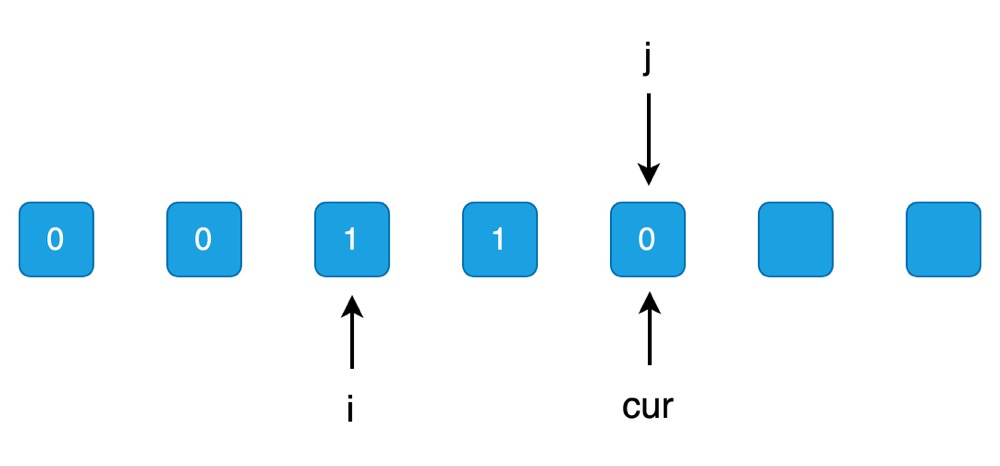
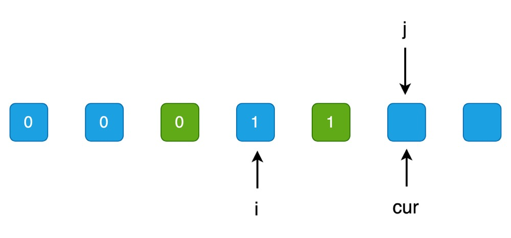
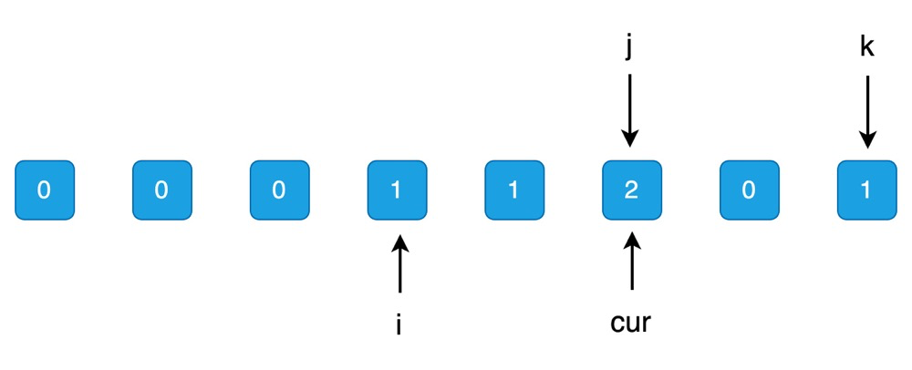
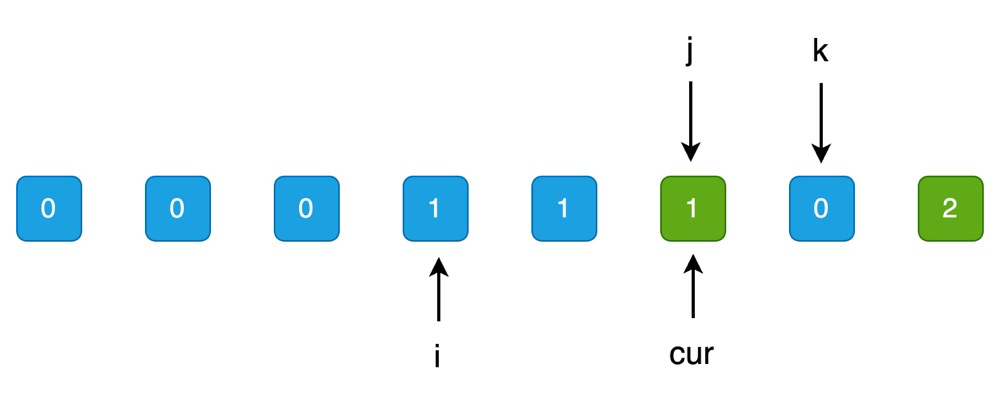

# 「每日一题」力扣 75 颜色分类

你好啊，我是蓝莓，今天是每日一题的第 5 天。

**题目清单**：https://blueberry-universe.cn/lc/index.html

**引用力扣题目**：https://leetcode.cn/problems/sort-colors/description/


## 题目描述

给定一个包含红色、白色和蓝色、共 `n` 个元素的数组 `nums` ，**[原地](https://baike.baidu.com/item/原地算法)** 对它们进行排序，使得相同颜色的元素相邻，并按照红色、白色、蓝色顺序排列。

我们使用整数 `0`、 `1` 和 `2` 分别表示红色、白色和蓝色。

必须在不使用库内置的 sort 函数的情况下解决这个问题。

**示例 1：**

```
输入：nums = [2,0,2,1,1,0]
输出：[0,0,1,1,2,2]
```

**示例 2：**

```
输入：nums = [2,0,1]
输出：[0,1,2]
```

 

**提示：**

- `n == nums.length`
- `1 <= n <= 300`
- `nums[i]` 为 `0`、`1` 或 `2`

 

**进阶：**

- 你能想出一个仅使用常数空间的一趟扫描算法吗？


## 方法一

**思路**

- 第一种方法，我们可以使用计数排序的思路
- 遍历 `nums` 数组，统计出 `0, 1, 2` 三个数值出现的次数分别是多少
- 然后按照统计出的出现的次数，依次填回到 `nums` 数组中即可


**Python 代码实现**

```python
class Solution:
    def sortColors(self, nums: List[int]) -> None:
        """
        Do not return anything, modify nums in-place instead.
        """
        # 使用 counter 记录 0 1 2 分别出现的次数
        counter = [0, 0, 0]

        # 统计 0 1 2 出现的次数
        for num in nums:
            counter[num] += 1

        i = 0
        for num in range(len(counter)):
            for _ in range(counter[num]):
                nums[i] = num
                i += 1
```


**C++ 代码实现**

```c++
class Solution {
public:
    void sortColors(vector<int>& nums) {
        // 使用 counter 记录 0 1 2 分别出现的次数
        vector<int> counter(3, 0);
		
        // 统计 0 1 2 出现的次数
        for( int i = 0 ; i < nums.size() ; i++ ) {
            counter[nums[i]]++;
        }
		
        // 记录当前填充到了 nums 数组的位置
        int i = 0;
        // num 从 0 取到 2
        for( int num = 0 ; num < counter.size() ; num++ ) {
            // 填充 counter[num] 次 num 数值
            for( int sz = 0 ; sz < counter[num] ; sz++ ) {
                // 每次填充一个数值之后就让 i 向后移动一下
                nums[i++] = num;
            }
        }
    }
};
```


**Java 代码实现**

```java
class Solution {
    public void sortColors(int[] nums) {
        // 使用 counter 记录 0 1 2 分别出现的次数
        int[] counter = new int[3];
		
        // 统计 0 1 2 出现的次数
        for( int i = 0 ; i < nums.length ; i++ ) {
            counter[nums[i]]++;
        }

        int i = 0;  // 记录当前填充到了 nums 数组的位置
        for( int num = 0 ; num < counter.length ; num++ ) {
            // 填充 counter[num] 次 num 数值
            for( int sz = 0 ; sz < counter[num] ; sz++ ) {
                // 每次填充一个数值之后就让 i 向后移动一下
                nums[i++] = num;
            }
        }
    }
}
```


**Golang 代码实现**

```go
func sortColors(nums []int)  {
    counter := [3]int{0, 0, 0};

    for _, num := range nums {
        counter[num] ++;
    }

    i := 0;
    for num, sz := range counter {
        for k := 0 ; k < sz ; k++ {
            nums[i] = num;
            i += 1;
        }
    }
}
```


## 方法二

**思路**

- 第二种方法就是使用 `快速排序` 的三路快排中的 partition 步骤来实现
- `partition` 这一步做了什么 ？ 在快速排序中，我们首先会选择一个值 `v` ， 然后把小于 `v` 的值全部放在数组的左侧，等于 `v` 的值放在数组的中间，大于 `v` 的值放在数组的右侧；观察这个题目，其实也是需要将所有的数组分成三个部分，每个部分装载了不同的值，分别是 `0 1 2`
- 那么，我们维护三个区间就可以了，每个区间装载不同的值
- 小于 `v` 的区间定义为：`nums[0...i)` ，这里 i 的初始值为 0
- 等于 `v` 的区间定义为：`nums[i...j)` ，这里 j 的初始值为 0
- 大于 `v` 的区间定义为：`nums(k...n-1]` ，这里的 k 初始化为 n-1； n 代表数组长度
- 使用索引 `cur` 遍历 `nums` 数组，每当我们遇到不同的值的时候，我们就将它放在不同的区间中，并对这三个区间进行维护即可


**nums[cur] 小于 v 的时候**

当我们遇到的 `nums[cur]` 小于 v 的时候，数据可能是这样的。



你可以发现，我们怎么才能让 `num[0...i)` 的区间扩大呢？显然我们这时候没办法扩大，一旦扩大，我们的数据就会覆盖掉 `nums[i...j)` 这个区间里面的数据，所以我们可以让 `nums[i...j)` 这个区间的第一个元素放到 `j` 所在的位置，其实就相当于移走了最开头的元素放到了 `nums[i...j)` 这个区间的尾巴上，然后为了维护 `nums[i...j)` 这个区间的定义，我们需要让 `j` 的值增加 1；好巧不巧，这个时候 `cur` 的值是等于 `j` 的值的，所以我们直接交换 `nums[i]` 和 `nums[j]` 的值就可以了，然后我们分别让 `i, j, cur` 的值分别都增加 1 即可，随后就变成了下面这样子。



思考一下，`j` 和 `cur` 是不是会一直保持着指向同一个元素呢？答案是：会的，他们两个在这个过程中会一直指向同一个元素。

到目前为止我们看到的是没有遇到 `nums[cur] > v` 的情况，那么我们接着看。


**nums[cur] > v 的时候** 

如果我们碰到了当前的值 `nums[cur]` 是大于 `v` 的，那么我们只需要让 `nums[cur]` 和 `nums[k]` 的值进行交换，然后只让索引 `k` 向左移动一下就可以了； 为什么所以 `cur` 不需要移动？这是因为，`nums[k]` 这个值本来是我们没有访问过的，所以相当于经过交换后， `nums[cur]` 正是我们可以访问的下一个元素。

假设数据一开始是这样的：



这时候我们交换 `nums[cur]` 和 `nums[k]`




**nums[cur] == v 的时候** 

当 `nums[cur]` 和 `v` 相等的时候，我们需要把这个值放在 `nums[i...j)` 这个区间中，这也太容易了，我们只需要让 `j, cur` 向右移动一下就可以了，这里就不做图演示了。


**算法什么时候停止？**

根据我们的定义，`nums(k...n-1]` 区间代表的是大于 `v` 的那部分，由于左侧是开区间，所以 `nums[k]` 是可以被继续访问的，那么就是说，当 `cur > k` 的时候算法结束，注意 `cur` 等于 `k` 的时候还是需要继续的。

从上述的分析过程可以发现 `cur` 的值是等于 `j` 的，所以在代码实现中我去掉了  `cur` 索引


**Python 代码实现**

```python
class Solution:
    def sortColors(self, nums: List[int]) -> None:
        """
        Do not return anything, modify nums in-place instead.
        """
        self.partition(nums, 1)

    def partition(self, nums: List[int], v: int) -> None:
        i = 0
        j = 0
        k = len(nums) - 1

        while j <= k:
            if nums[j] < v:
                nums[i], nums[j] = nums[j], nums[i]
                i += 1
                j += 1
            elif nums[j] > v:
                nums[j], nums[k] = nums[k], nums[j]
                k -= 1
            else:
                j += 1
```


**C++ 代码实现**

```c++
class Solution {
public:
    void sortColors(vector<int>& nums) {
       partition(nums, 1);
    }

    void partition(vector<int>& nums, int v) {
        // 维护 nums[0...i) 为小于 v 的数值所在区间
        // 维护 nums[i...j) 为等于 v 的数值所在区间
        // 维护 nums(k...n-1] 为大于 v 的数值所在区间

        int i = 0;
        int j = 0;
        int k = nums.size() - 1;

        while( j <= k ) {
            if( nums[j] < v ) {
                // 从 nums[i...j) 区间中 为 nums[0...i) 区间让出一个位置
                swap(nums[i++], nums[j++]);
            } else if( nums[j] > v ) {
                // nums[cur] > v
                swap(nums[k--], nums[j]);
            } else {
                j++;
            }
        }
    }
};
```


**Java 代码实现**

```java
class Solution {
    public void sortColors(int[] nums) {
        partition(nums, 1);
    }

    public void partition(int[] nums, int v) {
        int i = 0;
        int j = 0;
        int k = nums.length - 1;

        while( j <= k ) {
            if( nums[j] < v ) {
                int temp = nums[i];
                nums[i] = nums[j];
                nums[j] = temp;
                i++;
                j++;
            } else if( nums[j] > v ) {
                int temp = nums[j];
                nums[j] = nums[k];
                nums[k] = temp;
                k--;
            } else {
                j++;
            }
        }
    }
}
```


**Golang 代码实现**

```go
func sortColors(nums []int)  {
    partition(nums, 1);
}

func partition(nums []int, v int) {
    i := 0
    j := 0
    k := len(nums) - 1

    for j <= k {
        if nums[j] < v {
            nums[i], nums[j] = nums[j], nums[i]
            i++;
            j++;
        } else if nums[j] > v {
            nums[j], nums[k] = nums[k], nums[j]
            k--;
        } else {
            j++;
        }
    }
}
```

