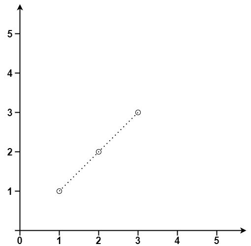

# 「每日一题」力扣 149 直线上最多的点数

你好啊，我是蓝莓，今天是每日一题的第 31 天。

**题目清单**：[一起刷力扣](https://blueberry-universe.cn/lc/index.html)

**引用力扣题目**：[149 直线上最多的点数](https://leetcode.cn/problems/max-points-on-a-line/description/)


## 题目描述

给你一个数组 `points` ，其中 `points[i] = [xi, yi]` 表示 **X-Y** 平面上的一个点。求最多有多少个点在同一条直线上。

 

**示例 1：**



```
输入：points = [[1,1],[2,2],[3,3]]
输出：3
```

**示例 2：**


```
输入：points = [[1,1],[3,2],[5,3],[4,1],[2,3],[1,4]]
输出：4
```

 

**提示：**

- `1 <= points.length <= 300`
- `points[i].length == 2`
- `-10^4 <= xi, yi <= 10^4`
- `points` 中的所有点 **互不相同**


## 实现

**思路**

- 我们都知道两点确定一条直线
- 先确定一个点，然后求该点和其他所有点构成直线的斜率，使用求得的斜率作为哈希表的 `key` ，使用落在该斜率上的点的数量作为哈希表的值
- 现在最大的问题是，斜率是一个小数，但是在计算机中只有浮点数，所以是有误差的，不太能作为哈希表的键
- 另一种斜率表示法：我们可以使用比值的方式存储斜率，只需要将该分数的分子和分母化为最简就可以了，这样一来，我们就可以使用两个整型精确的表示一个分数了
- 设 `a` 为该分数的分子，`b`为该分数的分母，为了统一，若该分数为负数，我们总是让负号出现在 `b` 中
- 根据题目提供的信息我们可以知道
- （1）表示斜率的分子被我们统一成了整数，结合每个点的坐标范围，我们可以计算出斜率的分子 `a` 的范围是 `0 到 2 × 10^4`
- （2）表示斜率的分母 `b` 可正可负，所以分母的取值范围是 `-2 × 10^4 到 2 × 10^4` 
- 最后，我们使用一个 32 位的整数来保存这两个内容，我们让 `b` 乘以 `2 × 10^4 + 1` 这样一来，我们就在数轴的中间部分空出了很大一部分的空间，我们让这个数值再加上 `a` ，这样一来，我们总是可以通过两个值的和得到唯一的 键


**C++ 代码实现**

```c++
class Solution {
public:

    int _gcd(int a, int b) {
        if( b == 0 ) {
            return a;
        }

        return _gcd(b, a%b);
    }

    int gcd(int a, int b) {
        if( a == b ) {
            return a;
        }

        return _gcd(max(a, b), min(a, b));
    }

    int maxPoints(vector<vector<int>>& points) {
        // 对每一个点 i;
        // record[i] 记录其他点到该点不同斜率收集的点的数量
        // record[i][斜率] = 数量
        int res = 0;

        for( int i = 0 ; i < points.size() ; i++ ) {

            unordered_map<int, int> record; 
            for( int j = 0 ; j < points.size() ; j++ ) {
                if( i == j ) continue;

                int a = points[i][0] - points[j][0];
                int b = points[i][1] - points[j][1];

                if( a == 0 ) {
                    b = 1;
                } else if( b == 0 ) {
                    a = 1;
                } else {
                    
                    if( a < 0 ) {
                        a = -a;
                        b = -b;
                    }
                    int ab_gcd = gcd(abs(a), abs(b));

                    a = a / ab_gcd;
                    b = b / ab_gcd;
                }

                // 从数轴上可以观察到这样不会产生冲突
                int key = 20001 * b + a;
                record[key] ++;
            }

            for( auto iter = record.begin() ; iter != record.end() ; iter++ ) {
                res = max(res, iter->second);
            }
        }

        return res+1;
    }
};
```

