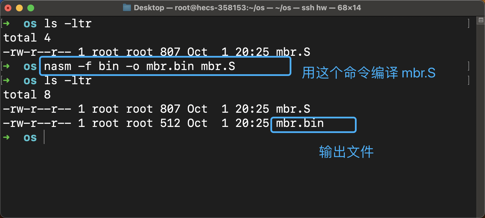
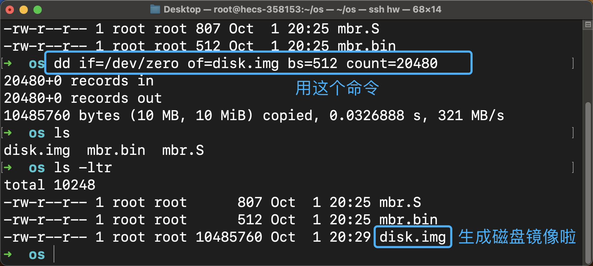
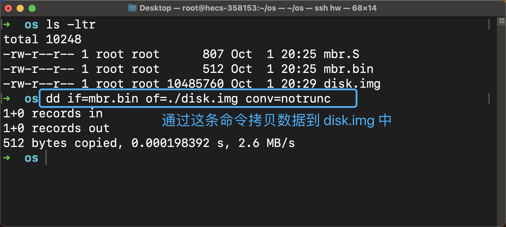
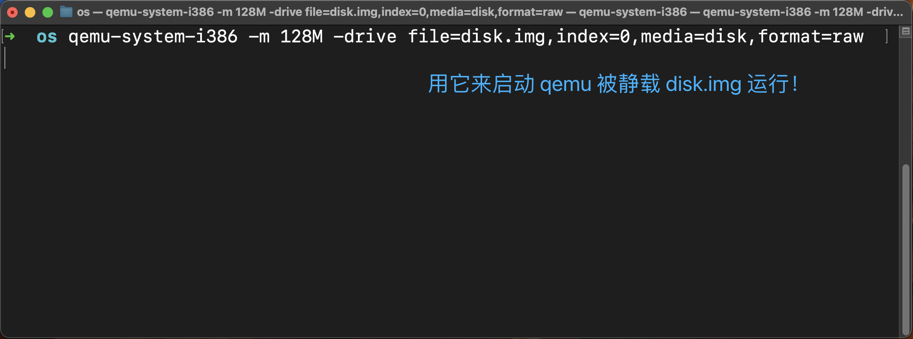
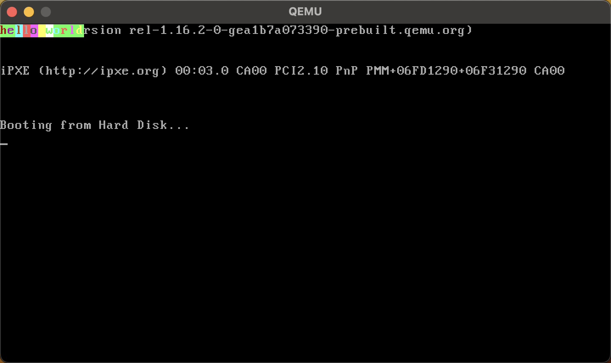

## 硬核：计算机是如何跑起来的

哈喽，在今天这篇文章中，我们一起来看看当计算机通电之后是怎么开始运行代码的？

从我们第一次开始学习写代码，大多数人应该都是学习的C语言吧，我们就直接在操作系统的基础上开始编译并且运行的，那么操作系统本身也是一个程序，操作系统这段代码是怎么开始运行的呢？

本文是基于 x86 架构的 cpu ，在实验中使用的宿主机操作系统是 Ubuntu，让我们体验一下掌控 CPU 执行大权的感觉

## 1 谋权篡位第一程

大家应该都听说过 BIOS 这个东西吧，它的全名叫做 Base Input Output System 也就是基本输入输出系统。BIOS 也是一段程序，只不过它是在硬件出厂的时候就已经被写死在存储器中了，CPU 会自动地去执行 BIOS 这段代码，也就是说这都是被事先设计好的，一开始就是会自动的去干这件事儿，这是被写死在硬件层面的。

当然，我们的计算机能做的事情很多，仅仅能执行 BIOS 这段代码肯定是不够的，为了能够让我们接任 CPU 的大权，BIOS 这段代码会先对计算机做一些检查，最终 BIOS 会自动地去加载磁盘上的第 1 个扇区的 512B 的内容到内存的 0x7c00 地址处，紧接着加载完成后，CPU 的 IP 寄存器就是指向 `0x7c00` 地址处开始执行被加载到内存中的那 512B 的代码啦。

另外 BIOS 还提供了一些功能，比如我们可以通过 BIOS 所提供的功能从硬盘的某个扇区开始读取数据，还可以向屏幕上输出一些最简单的字符。

**划重点**

总之，你现在知道啦，我们最早能够接任 CPU 大权的代码就必须要写在磁盘的第 1 个扇区那 512B 的地方。

你会不会有疑问？我们的操作系统可不止 512B，虽然说我们的操作系统不止 512B，但是我们可以在这 512B 内再写一个加载程序，然后让这个程序去加载一个更大的程序。

这里所说的加载，其实就是把磁盘上的数据复制到内存上的某个位置而已，因为CPU只能直接读取内存中的数据。

**操作系统的加载**

实际上操作系统的加载分为了三个步骤

1. BIOS 把MBR加载到 0x7c00 处的位置
2. MBR 将操作系统加载器加载到内存的某个位置
3. 操作系统的加载器再去加载操作系统的代码到内存

在这篇文章中，我们只关心磁盘的第一个扇区，我们会在磁盘的第一个扇区写入一些代码，然后使用 BIOS 的功能在屏幕上输出一些字符，这样就可以代表我们的这个代码顺利被夹在而且被 CPU 执行啦。


## 2 搭建实验环境

1. 安装汇编编译器

```shell
sudo apt-get install nasm
```

2. 安装 qemu 模拟器

```shell
sudo apt-get install qemu-system-x86
```

3. 制作一个磁盘镜像

这样我们就拥有了一个磁盘镜像，我么使用 disk.img 作为 qemu 虚拟机的硬盘

```
dd if=/dev/zero of=disk.img bs=512 count=20480
```


## 3 让我们运行一下

我们先来写一个汇编文件就叫 mbr.S

首先来看这段汇编代码的 `vstart=0x7c00` 的作用，当我们使用这个伪指令的时候，我们就是告诉汇编语言的编译器说，这段代码我以后肯定是要从内存地址的 `0x7c00` 处开始放的，所以在你编译这段代码的时候，有关内存的寻址操作也要按照 `0x7c00` 这个位置作为其实地址来编译代码。

在代码中你还会看到 `0xb800` 这样一个地址，因为 `0xb800`是被写入到段寄存器中的，所以真实的内存起始地址应该是 `0xb8000`。可以先不管这个内容，因为这个就涉及到了上古时代的 8086 CPU 的寻址方式了。

如果我们想要在屏幕上显示一些内容的话，我们只需要将数据写入从这个地址开始的内存单元即可。

从 `0xb8000` 开始每两个字节作为一组，其中低地址的那个字节用来存储写入的字符的值，其中高地址的那个字节用来存储这个字符显示时候的背景色这类东西。

比如说: `mov byte [gs:0x00],'h'` 和 `mov byte [gs:0x01],0xA4` 这两条指令，其中第一条指令就是在 `0xb8000`地址处写入了字符 `h` 的 `ASCII`值，在高地址的那个字节 `0xb8001` 地址处写入了字符 `h` 对应的颜色以及底色，其中高字节中的低4位控制底色，高4位控制字符的颜色，你可以动手修改它的值自己尝试一下。

在这段汇编代码的最后你还看到了 `   times 510-($-$$) db 0`和 `db 0x55,0xaa` 这两条指令，这两条指令达到的效果就是在第一个扇区的最后两个字节的位置写入了 `0x55` 和 `0xaa` 这两个内容。因为第一个扇区的内容被自动加载到 `0x7c00`处还有一个要求，那就是这个扇区的最后两个位置要填入 `0x55` 和 `0xaa` ，只有这样，这个扇区的数据才会被 BIOS 加载。这都是约定好的，不必在意，没有什么特殊的原因。

**编译汇编代码**

```assembly
SECTION MBR vstart=0x7c00         
   mov ax,cs      
   mov ds,ax
   mov es,ax
   mov ss,ax
   mov fs,ax
   mov sp,0x7c00
   mov ax,0xb800
   mov gs,ax     

   mov byte [gs:0x00],'h'
   mov byte [gs:0x01],0xA4

   mov byte [gs:0x02],'e'
   mov byte [gs:0x03],0xA5

   mov byte [gs:0x04],'l'
   mov byte [gs:0x05],0xB6	  

   mov byte [gs:0x06],'l'
   mov byte [gs:0x07],0xC7

   mov byte [gs:0x08],'o'
   mov byte [gs:0x09],0xD8

   mov byte [gs:0x0A],' '
   mov byte [gs:0x0B],0xE9

   mov byte [gs:0x0C],'w'
   mov byte [gs:0x0D],0xFA

   mov byte [gs:0x0E],'o'
   mov byte [gs:0x0F],0xA4

   mov byte [gs:0x10],'r'
   mov byte [gs:0x11],0xAC

   mov byte [gs:0x12],'l'
   mov byte [gs:0x13],0xAD

   mov byte [gs:0x14],'d'
   mov byte [gs:0x15],0xAE

   jmp $

   times 510-($-$$) db 0
   db 0x55,0xaa
```


好啦，接着我把 mbr.S 放在文件中进行编译，其中我们使用命令 `nasm -f bin -o mbr.bin mbr.S`

1. 参数 -f 就是 format ，就是说我们编译出来的代码需要是 二进制格式的
2. 参数 -o 就是 output，用来表示输出文件的文件名



**做个磁盘镜像**

那么我就在当前目录下制作一个磁盘镜像好啦

使用命令 `dd if=/dev/zero of=disk.img bs=512 count=20480`



当我们做好磁盘镜像后，我们需要把我们编译生成的二进制代码原封不动的拷贝到磁盘镜像 disk.img 的第 1 个扇区

我们可以通过命令 `dd if=mbr.bin of=./disk.img conv=notrunc`来把 mbr.bin 中的数据拷贝到 disk.img 中

1. 参数 if 是 input file 就是输入文件
2. 参数 of 是 output file 就是输出文件
3. conv = notrunc 代表的意思是，当拷贝 mbr.bin 的数据覆盖进 disk.img 的时候，不要清空覆盖不到的那些位置上的 disk.img 的数据，比如 mbr.bin 只有 512B，那么就原有的 disk.img 中的第 2 个扇区和后边的那些扇区的数据都不会受到影响。



**奔跑吧！**

最后，我们就让 qemu 工作起来，`hello world` 仪式感来咯！

使用命令 `qemu-system-i386 -m 128M -drive file=disk.img,index=0,media=disk,format=raw`

在这些参数中，我们使用 file 用来指定虚拟机启动时所使用的磁盘镜像，因为我执行这条命令的时候 `disk.img` 就在当前目录下，所以我直接这样写就可以啦。



当我们的 qemu 虚拟机跑起来之后，就有了下图的效果



哈哈哈，我第一次跑到这里的时候还是很兴奋的，这可是我们在计算机上能够接手的第一个程序嗷！

你会发现屏幕上还有一些其他的字，那是因为我们并没有清空屏幕上的内容，当我们在 `0xb8000` 处开始写入数据的时候，原来这个地方的数据就被我们覆盖啦，所以就变成了图中的这个样子。


