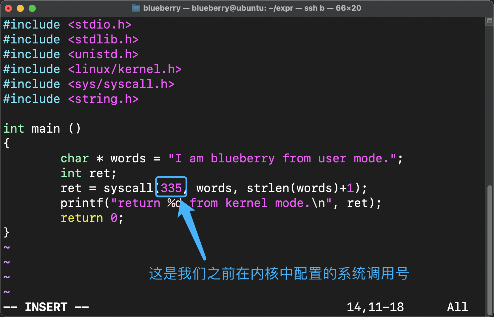

## 编译 Linux 内核 && 添加系统调用

在这篇文章中做一个小实验，先对 Linux 内核的源码做一些小改动，我们就只是在其中添加一个系统调用就好了，然后我们对内核进行编译并使用它

**目标：**

1. 添加系统调用
2. 编译 && 安装
3. 测试我们的系统调用

## 1 添加系统调用

**实验环境**

我这次是直接在安装了 Ubuntu 系统的虚拟机中进行实验的，当前系统的内核版本是 `ubuntu 6.8.0`

```bash
blueberry@ubuntu:~/expr/linux-6.8.9$ uname -a
Linux ubuntu 6.8.0-31-generic #31-Ubuntu SMP PREEMPT_DYNAMIC Sat Apr 20 00:40:06 UTC 2024 x86_64 x86_64 x86_64 GNU/Linux
```


**下载源码**

我们得先下载一个 Linux 的内核源码

传送门：https://kernel.org/

我们直接来到这里进行下载就可以了，你可以下载一个你感兴趣的版本，而我就直接下载 `6.8.9` 这个版本了


为了简单，我就不对下载后的内核源码进行正确性的验证了，通常来说是没有问题的，在文章的最后我给出了我参考的资料，这些资料里面会有更详细的内容

好啦，我已经把源码下载到了这个路径

```bash
blueberry@ubuntu:~/expr$ pwd
/home/blueberry/expr
blueberry@ubuntu:~/expr$ ls
linux-6.8.9.tar.xz
```


**解压**

对源码文件进行解压，解压后 `linux-6.8.9` 就是我们要的源码啦

```
blueberry@ubuntu:~/expr$ tar -xf linux-6.8.9.tar.xz 
blueberry@ubuntu:~/expr$ ls
linux-6.8.9  linux-6.8.9.tar.xz
```


**修改源码**

你只需要按照我接下来的操作进行就可以了，先不用特别在意为什么要这么做

`1. 修改 syscall_64.tbl` 

```bash
blueberry@ubuntu:~/expr/linux-6.8.9/arch/x86/entry/syscalls$ pwd
/home/blueberry/expr/linux-6.8.9/arch/x86/entry/syscalls
blueberry@ubuntu:~/expr/linux-6.8.9/arch/x86/entry/syscalls$ ls -ltr
total 40
-rw-rw-r-- 1 blueberry blueberry 15278 May  2 14:35 syscall_64.tbl
-rw-rw-r-- 1 blueberry blueberry 18346 May  2 14:35 syscall_32.tbl
-rw-rw-r-- 1 blueberry blueberry  2527 May  2 14:35 Makefile
blueberry@ubuntu:~/expr/linux-6.8.9/arch/x86/entry/syscalls$ vim syscall_64.tbl
```

来到这个文件的 346 行，在这里添加一行；这里的 335 是系统调用号，你可以根据你下载的内核版本，自己选择一个合适的系统调用号填上去就可以了，只要不和别的重复即可

```txt
 335     64      helloworld           sys_helloworld
```


`2. 修改 syscalls.h`

```
blueberry@ubuntu:~/expr/linux-6.8.9/include/linux$ pwd
/home/blueberry/expr/linux-6.8.9/include/linux
blueberry@ubuntu:~/expr/linux-6.8.9/include/linux$ vim syscalls.h
```

我们在 933 行添加一行如下的代码：

```c
asmlinkage long sys_helloworld(char * words, int count);
```


`3. 修改 sys.c`

```bash
blueberry@ubuntu:~/expr/linux-6.8.9/kernel$ pwd
/home/blueberry/expr/linux-6.8.9/kernel
blueberry@ubuntu:~/expr/linux-6.8.9/kernel$ vim sys.c
```

我们直接来到这个文件的末尾，添加如下代码：

```bash
asmlinkage int sys_helloworld(char * words, int count) {
        int ret;
        char buffer[512];
        if(count >= 512){
                return -1;
        }
        copy_from_user(buffer, words, count);
        ret = printk("User Mode says %s to the Kernel Mode!", buffer);
        return ret;
}

SYSCALL_DEFINE2(helloworld, char *, words, int, count) {
        return sys_helloworld(words, count);
}
```


## 2 编译 && 安装

接下来我们就来编译内核并将它进行安装

**安装所必要的工具**

```bash
blueberry@ubuntu:~/expr/linux-6.8.9$ sudo apt install bc binutils bison dwarves flex gcc git gnupg2 gzip libelf-dev libncurses5-dev libssl-dev make openssl pahole perl-base rsync tar xz-utils
```


**生成配置文件 .config**

Linux 内核的编译是受到这么一个文件进行控制的，比如哪些模块要被编译，哪些干脆不要了，这些内容都是在这样一个配置文件中的

既然我们编译好的内核最终是要安装到虚拟机这台机器本身的，那么最好的方式当然是参考虚拟机本身的内核所使用的配置文件啦，在我的机器上，这个默认的配置文件在这个位置：

```
blueberry@ubuntu:/boot$ pwd
/boot
blueberry@ubuntu:/boot$ ls -ltr
total 89272
-rw------- 1 root root  9047800 Apr 19 21:46 System.map-6.8.0-31-generic
-rw-r--r-- 1 root root   287473 Apr 19 21:46 config-6.8.0-31-generic
-rw------- 1 root root 14928264 Apr 19 21:48 vmlinuz-6.8.0-31-generic
drwx------ 2 root root    16384 May  8 11:40 lost+found
lrwxrwxrwx 1 root root       24 May  8 11:44 vmlinuz.old -> vmlinuz-6.8.0-31-generic
lrwxrwxrwx 1 root root       24 May  8 11:44 vmlinuz -> vmlinuz-6.8.0-31-generic
lrwxrwxrwx 1 root root       27 May  8 11:44 initrd.img.old -> initrd.img-6.8.0-31-generic
lrwxrwxrwx 1 root root       27 May  8 11:44 initrd.img -> initrd.img-6.8.0-31-generic
-rw-r--r-- 1 root root 67121483 May  8 11:45 initrd.img-6.8.0-31-generic
drwxr-xr-x 5 root root     4096 May  8 11:45 grub
```

在 `/boot` 目录中的 `config-6.8.0-31-generic` 文件就是这台虚拟机的 `Linux` 内核在编译的时候所使用的配置文件，那么我们直接把这个文件拷贝到我们的源码目录中并且把它命名为 `.config`，就像这样：

```bash
blueberry@ubuntu:~/expr/linux-6.8.9$ pwd
/home/blueberry/expr/linux-6.8.9
blueberry@ubuntu:~/expr/linux-6.8.9$ cp /boot/config-6.8.0-31-generic .config
```

既然我们所使用的内核相较于我本机的内核`ubuntu 6.8.0` 是更新的，所以很有可能会有一些新的配置项，那么我们可以通过 `make olddeconfig` 来将 `.config` 和那些有可能必须要添加上的新配置项进行一个合并，最终写入 `.config` 文件中，我们像这样执行就好：

```bash
blueberry@ubuntu:~/expr/linux-6.8.9$ pwd
/home/blueberry/expr/linux-6.8.9
blueberry@ubuntu:~/expr/linux-6.8.9$ make olddefconfig
  HOSTCC  scripts/kconfig/conf.o
  HOSTCC  scripts/kconfig/confdata.o
  HOSTCC  scripts/kconfig/expr.o
  LEX     scripts/kconfig/lexer.lex.c
  YACC    scripts/kconfig/parser.tab.[ch]
  HOSTCC  scripts/kconfig/lexer.lex.o
  HOSTCC  scripts/kconfig/menu.o
  HOSTCC  scripts/kconfig/parser.tab.o
  HOSTCC  scripts/kconfig/preprocess.o
  HOSTCC  scripts/kconfig/symbol.o
  HOSTCC  scripts/kconfig/util.o
  HOSTLD  scripts/kconfig/conf
.config:10817:warning: symbol value 'm' invalid for ANDROID_BINDER_IPC
.config:10818:warning: symbol value 'm' invalid for ANDROID_BINDERFS
#
# configuration written to .config
#
```


**编译**

接下来，我们就可以编译了，我们直接这样：

这里的 `nproc` 来查看当前的 CPU 有几个核心，然后 `sudo make -j8` 代表使用 8 个核心来进行编译，你可以使用 `tee log` 把编译过程中的输出内容记录在 `log` 文件中，时候你直接去里面搜索 `Error` 即可

```bash
blueberry@ubuntu:~/expr/linux-6.8.9$ pwd
/home/blueberry/expr/linux-6.8.9
blueberry@ubuntu:~/expr/linux-6.8.9$ nproc
8
blueberry@ubuntu:~/expr/linux-6.8.9$ sudo make -j8 | tee log
```

接下来就是漫长的编译过程了，让我们等待它完成编译 ~ 


**第一次出错**

好！不出意外的，我这里已经报错了，我们在 `log` 文件里面搜索一下 `Error` 关键字可以发现有三处都有 `Error`，其中一处是这样的：

```bash
make[3]: *** No rule to make target 'debian/canonical-certs.pem', needed by 'certs/x509_certificate_list'.  Stop.
make[2]: *** [scripts/Makefile.build:481: certs] Error 2
```

我们执行下面这条命令，关闭某条配置项来解决这个问题：

```bash
blueberry@ubuntu:~/expr/linux-6.8.9$ pwd
/home/blueberry/expr/linux-6.8.9
blueberry@ubuntu:~/expr/linux-6.8.9$ sudo scripts/config --disable SYSTEM_TRUSTED_KEYS
```

然后再次执行编译的命令：

```bash
blueberry@ubuntu:~/expr/linux-6.8.9$ sudo make -j8 | tee log
```

在编译的过程中可能会停顿下来，这时候按回车继续就可以了 ~ 


**第二次出错**

好！经过漫长的等待，又报错了！

```bash
make[3]: *** No rule to make target 'debian/canonical-revoked-certs.pem', needed by 'certs/x509_revocation_list'.  Stop.
make[3]: *** Waiting for unfinished jobs....
```

我们执行下面这条命令，关闭某条配置项来解决这个问题：

```bash
blueberry@ubuntu:~/expr/linux-6.8.9$ sudo scripts/config --disable SYSTEM_REVOCATION_KEYS
```

然后再次执行编译的命令：

```bash
blueberry@ubuntu:~/expr/linux-6.8.9$ sudo make -j8 | tee log
```

同样的，在编译的过程中可能会停顿下来，这时候按回车继续就可以了 ~ 


**安装 modules**

终于编译完成啦！

接下来我们先来安装模块，直接执行这条命令：

```bash
blueberry@ubuntu:~/expr/linux-6.8.9$ pwd
/home/blueberry/expr/linux-6.8.9
blueberry@ubuntu:~/expr/linux-6.8.9$ sudo make modules_install -j8
```

这个过程在我这里还算顺利，顺利完成！


**安装系统**

直接执行这条命令：

```bash
blueberry@ubuntu:~/expr/linux-6.8.9$ pwd
/home/blueberry/expr/linux-6.8.9
blueberry@ubuntu:~/expr/linux-6.8.9$ sudo make install
  INSTALL /boot
run-parts: executing /etc/kernel/postinst.d/initramfs-tools 6.8.9 /boot/vmlinuz-6.8.9
update-initramfs: Generating /boot/initrd.img-6.8.9
run-parts: executing /etc/kernel/postinst.d/unattended-upgrades 6.8.9 /boot/vmlinuz-6.8.9
run-parts: executing /etc/kernel/postinst.d/update-notifier 6.8.9 /boot/vmlinuz-6.8.9
run-parts: executing /etc/kernel/postinst.d/xx-update-initrd-links 6.8.9 /boot/vmlinuz-6.8.9
I: /boot/initrd.img is now a symlink to initrd.img-6.8.9
run-parts: executing /etc/kernel/postinst.d/zz-update-grub 6.8.9 /boot/vmlinuz-6.8.9
Sourcing file `/etc/default/grub'
Generating grub configuration file ...
Found linux image: /boot/vmlinuz-6.8.9
Found initrd image: /boot/initrd.img-6.8.9
Found linux image: /boot/vmlinuz-6.8.0-31-generic
Found initrd image: /boot/initrd.img-6.8.0-31-generic
Warning: os-prober will not be executed to detect other bootable partitions.
Systems on them will not be added to the GRUB boot configuration.
Check GRUB_DISABLE_OS_PROBER documentation entry.
Adding boot menu entry for UEFI Firmware Settings ...
done
```

好啦，到这里，我们不仅添加了一条系统调用，而且完成了源码的编译和安装，接下来我们只要重启虚拟机，进入 GRUB 的高级选项中，选择我们新的内核启动就可以啦！


**使用新的内核**

接下来只需要重新启动虚拟机，然后在虚拟机打开后会来到这个界面，我们就选择图中框出来的那个选项：


这时候，我们就看到了刚才编译好的那个版本的内核，我们选中它按回车：


好啦，现在我已经重启完成，那么让我们进入到系统中查看一下当前的系统内核版本叭

```bash
blueberry@ubuntu:~$ uname -a
Linux ubuntu 6.8.9 #5 SMP PREEMPT_DYNAMIC Thu May  9 02:24:38 UTC 2024 x86_64 x86_64 x86_64 GNU/Linux
```

真是太棒了！内核版本已经更新为 `6.8.9`，如果你坚持到了这里快给自己鼓个掌！


## 3 测试我们的系统调用

既然，我们已经添加了系统调用，总是要试用一下我们自己添加的系统调用能不能用呢，我们在新内核的系统中写一个简单的 C 程序来测试一下叭 ~ 

我们把代码放在 `hello.c` 文件中：

```bash
blueberry@ubuntu:~/expr$ pwd
/home/blueberry/expr
blueberry@ubuntu:~/expr$ ls
linux-6.8.9  linux-6.8.9.tar.xz
blueberry@ubuntu:~/expr$ vim hello.c
```

代码如下：

```bash
#include <stdio.h>
#include <stdlib.h>
#include <unistd.h>
#include <linux/kernel.h>
#include <sys/syscall.h>
#include <string.h>

int main ()
{
        char * words = "I am blueberry from user mode.";
        int ret;
        ret = syscall(335, words, strlen(words)+1);
        printf("return %d from kernel mode.\n", ret);
        return 0;
}
```



保存这个文件后，我们编译并执行它：

```bash
blueberry@ubuntu:~/expr$ ls
hello.c  linux-6.8.9  linux-6.8.9.tar.xz
blueberry@ubuntu:~/expr$ gcc hello.c -o hello.o
blueberry@ubuntu:~/expr$ ls
hello.c  hello.o  linux-6.8.9  linux-6.8.9.tar.xz
blueberry@ubuntu:~/expr$ ./hello.o
return 65 from kernel mode.
```

现在说明我们已经执行成功啦！

接着我们来看看系统日志中是不是出现了 `I am blueberry from user mode` 这段话呢

```bash
blueberry@ubuntu:~/expr$ cat /var/log/syslog | grep "I am blueberry from user mode"
2024-05-09T03:15:31.039730+00:00 ubuntu kernel: User Mode says I am blueberry from user mode. to the Kernel Mode!
```

太酷了！

恭喜你！

到这里为止，整个实验过程就完成啦！

真不容易！


「参考」

添加系统调用过程中遇到的坑，解决方案：

https://blog.csdn.net/HTLYing/article/details/131345735


内核编译过程的参考：

https://mp.weixin.qq.com/s/nXVsCJiN8lvgPEo-D5Zgig


编译过程中报错的解决方案：

https://askubuntu.com/questions/1329538/compiling-kernel-5-11-11-and-later

https://blog.csdn.net/m0_47696151/article/details/121574718


