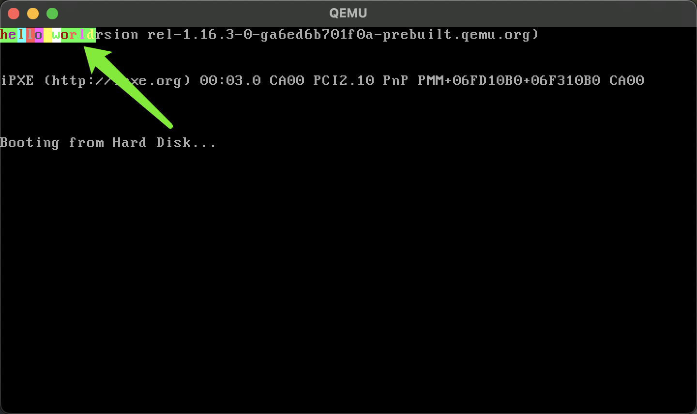

# 裸机程序也能调试？

你好啊，我是蓝莓 ；

如果你想自己动手写一个简单的操作系统内核，一定需要去调试这个程序，毕竟可能出现很多的 bug，可是这种不依赖于具体的操作系统的代码，我们该怎么去调试呢？

好在，我们已经有了 QEMU 虚拟机和 GDB 这样的调试工具，能够帮助我们来调试它。那么在这篇文章就使用一个非常简单的例子，来演示一下，如何调试一个裸机上运行的代码。

## 1、写一段代码

在我的这篇文章中介绍了什么是 MBR 并且介绍了，我们该如何在 QEMU 中启动一个不依赖于具体操作系统的代码。在阅读本文之前可以先去读这篇文章。

传送门：[硬核：计算机是如何跑起来的，MBR谋权篡位](https://mp.weixin.qq.com/s/R__LXz7OjXrhKn9lu_TsJA)

在 MBR 的那篇文章中我们使用的汇编语言格式是 intel 风格的。但是在本篇文章中，我们要使用 GCC 来对我们的文件进行编译，所以只好采用 AT&T 风格的汇编了。

所以，我们就有了下面的这段汇编代码，你直接复制就好啦；

```asm
.section .text
.global _start
.code16                # 使用 16 位代码模式

_start:
    jmp main           # 跳转到主程序

# 使用 0x7C00 作为程序加载基地址
main:
    movw %cs, %ax      
    movw %ax, %ds
    movw %ax, %es
    movw %ax, %ss
    movw %ax, %fs
    movw $0x7c00, %sp
    movw $0xb800, %ax
    movw %ax, %gs     

    movb $'h', %gs:(0x00)
    movb $0xA4, %gs:(0x01)

    movb $'e', %gs:(0x02)
    movb $0xA5, %gs:(0x03)

    movb $'l', %gs:(0x04)
    movb $0xB6, %gs:(0x05)

    movb $'l', %gs:(0x06)
    movb $0xC7, %gs:(0x07)

    movb $'o', %gs:(0x08)
    movb $0xD8, %gs:(0x09)

    movb $' ', %gs:(0x0A)
    movb $0xE9, %gs:(0x0B)

    movb $'w', %gs:(0x0C)
    movb $0xFA, %gs:(0x0D)

    movb $'o', %gs:(0x0E)
    movb $0xA4, %gs:(0x0F)

    movb $'r', %gs:(0x10)
    movb $0xAC, %gs:(0x11)

    movb $'l', %gs:(0x12)
    movb $0xAD, %gs:(0x13)

    movb $'d', %gs:(0x14)
    movb $0xAE, %gs:(0x15)


# 填充到 510 字节
.space 510 - (.-_start)

# MBR 标识符 0xAA55
.word 0xAA55
```

这段代码的作用其实就是在屏幕上输出 `hello world`；而且，这还是彩色的呢！哈哈哈




## 2、编译 && 链接 && 写入二进制程序

我们已经准备好了代码，那么就让我们编译一下叭

**创建虚拟磁盘**

可以看到，这样，我们的目录中就有了我们写好的代码 `mbr.S` 以及使用 `dd` 命令创建好的一个给 `QEMU` 使用的虚拟磁盘啦。

```shell
➜  mbr dd if=/dev/zero of=disk.img bs=512 count=20480
20480+0 records in
20480+0 records out
10485760 bytes (10 MB, 10 MiB) copied, 0.0675632 s, 155 MB/s
➜  mbr ls -ltr
total 10244
-rw-rw-r-- 1 blueberry blueberry     1029 Nov 13 20:01 mbr.S
-rw-rw-r-- 1 blueberry blueberry 10485760 Nov 13 20:06 disk.img
```


**生成二进制代码**

在这里经过编译和链接后生成的 `mbr.bin` 就是一个二进制代码，这里面放的就是 CPU 可以直接拿来执行的指令，不包含任何没有用的信息。

```
➜  mbr gcc -m32 -ffreestanding -c mbr.S -o mbr.o 
➜  mbr  ld -m elf_i386 -Ttext 0x7c00 --oformat binary mbr.o -o mbr.bin
➜  mbr ls -ltr
total 10252
-rw-rw-r-- 1 blueberry blueberry     1029 Nov 13 20:01 mbr.S
-rw-rw-r-- 1 blueberry blueberry 10485760 Nov 13 20:06 disk.img
-rw-rw-r-- 1 blueberry blueberry     1000 Nov 13 20:12 mbr.o
-rwxrwxr-x 1 blueberry blueberry      512 Nov 13 20:13 mbr.bin
```

我们把 `mbr.bin` 这个二进制代码直接写入到 `disk.img` 的第一个扇区上；这样，当 QEMU 启动的时候，BIOS 就会自动把这部分代码加载到内存的 `0x7c00` 处运行啦。


**写入二进制程序**

直接使用 `dd` 命令写入就好啦，现在 mbr.bin 就被我们写入到了 disk.img 中

```shell
➜  mbr dd if=mbr.bin of=disk.img bs=512 count=1
1+0 records in
1+0 records out
512 bytes copied, 0.000340003 s, 1.5 MB/s
➜  mbr ls -ltr
total 16
-rw-rw-r-- 1 blueberry blueberry 1029 Nov 13 20:01 mbr.S
-rw-rw-r-- 1 blueberry blueberry 1000 Nov 13 20:12 mbr.o
-rwxrwxr-x 1 blueberry blueberry  512 Nov 13 20:13 mbr.bin
-rw-rw-r-- 1 blueberry blueberry  512 Nov 13 20:16 disk.img
```


**编译生成带有符号的 ELF 文件**

在我们调试的过程中，我们希望能看到机器上正在执行的指令和我们编写的汇编源码之间的映射关系，每当机器代码之后之后能够对应到相应的汇编代码的某一行上。`ELF` 文件就是做这件事情用的，比如我们在 `mbr.S` 中有一个符号是 `main` 那么在 `ELF` 文件中就可以记录上 `main` 和具体的地址是一个怎样的映射关系，它又对应到了 `mbr.S` 这个文件中的第几行代码。所有的这些内容都可以记录在 `ELF` 文件中。

```shell
➜  mbr gcc -m32 -nostdlib -g -fdebug-prefix-map=$PWD=. -c -o mbr.o mbr.S
➜  mbr ld -m elf_i386 -Ttext 0x7c00 -o mbr.elf mbr.o
➜  mbr ls -ltr
total 24
-rw-rw-r-- 1 blueberry blueberry 1029 Nov 13 20:01 mbr.S
-rwxrwxr-x 1 blueberry blueberry  512 Nov 13 20:13 mbr.bin
-rw-rw-r-- 1 blueberry blueberry  512 Nov 13 20:16 disk.img
-rw-rw-r-- 1 blueberry blueberry 1748 Nov 13 20:21 mbr.o
-rwxrwxr-x 1 blueberry blueberry 4520 Nov 13 20:21 mbr.elf
```

1. -g : 这个参数就是在告诉 gcc 要把我们提及到的那些符号信息记录下来
2. -fdebug-prefix-map=$PWD=. : 用来告诉 gcc 我们的源码文件 `mbr.S` 是在 `ELF` 文件的同一个目录中的
3. -Ttext 0x7c00 : 因为我们的代码是要加载到 0x7c00 处运行的，所以我们需要告诉链接器，我们的代码未来要在哪儿执行

最后我们就有了 `mbr.elf` 这个中间人了。


## 3、调试裸机程序

**启动 QEMU**

```
qemu-system-i386 -m 128M -drive file=disk.img,index=0,media=disk,format=raw -s -S
```

1. -s：这是 -gdb tcp::1234 的简写，表示 QEMU 会在 TCP 端口 1234 上启动一个 GDB 服务器。这样就可以使用 GDB（或其他兼容的调试器）远程连接到这个端口，进行调试。

2. -S：启动虚拟机时会暂停 CPU，这样虚拟机不会立即运行。这个选项适用于调试时的初始化。使用这个选项后，虚拟机会在启动后暂停，直到使用调试器发送“继续”命令时才会运行。

如果你是使用终端连接的 Linux 系统，因此不能够显示 `QEMU` 创建的图形界面的话可以使用如下命令启动，这样就可以使用没有界面的形式启动了

```
qemu-system-i386 -m 128M -drive file=disk.img,index=0,media=disk,format=raw -s -S -nographic
```

好啦，我们先打开一个终端启动 `QEMU` 之后，我们再打开另外一个终端使用 `GDB` 连接 `QEMU` 进行远程调试。


**gdb 调试**

```shell
➜  mbr ls -ltr
total 24
-rw-rw-r-- 1 blueberry blueberry 1029 Nov 13 20:01 mbr.S
-rwxrwxr-x 1 blueberry blueberry  512 Nov 13 20:13 mbr.bin
-rw-rw-r-- 1 blueberry blueberry  512 Nov 13 20:16 disk.img
-rw-rw-r-- 1 blueberry blueberry 1748 Nov 13 20:21 mbr.o
-rwxrwxr-x 1 blueberry blueberry 4520 Nov 13 20:21 mbr.elf
➜  mbr gdb mbr.elf
GNU gdb (Ubuntu 9.2-0ubuntu1~20.04.2) 9.2
... 此处省略一大堆输出信息 ...
Reading symbols from mbr.elf...
(gdb) target remote :1234
Remote debugging using :1234
0x0000fff0 in ?? ()
(gdb) break _start
Breakpoint 1 at 0x7c00: file mbr.S, line 6.
(gdb) break main
Breakpoint 2 at 0x7c02: file mbr.S, line 10.
```

1. 首先输入 `gdb mbr.elf` 进入到 `gdb` 的调试界面中
2. `target remote :1234` : 进入到 gdb 的调试界面后输入这个命令，用来告诉 `gdb` 我们要连接哪个 `QEMU` 进行调试，那当然就是启动在 `localhost:1234` 这个位置上的 `QEMU` 进行调试啦
3. `break _start` : 在 `mbr.S` 的源码文件中 `_start` 这个位置上打一个断点，当然啦，你也可以直接指定某一条指令所处的内存地址进行打断点的。看到没有！你会发现它告诉你 `_start` 这个符号是在 `mbr.S` 的第 6 行。`Breakpoint 1 at 0x7c00: file mbr.S, line 6.`
4. `break main` : 这个和 3 是同理的


**让程序跑起来**

这时候我们在 `gdb` 调试界面输入 `c` 就可以让它运行到第一个断点处停下来啦。这时候，你还可以输入  `list` 命令，你就看到了对应的汇编源码啦。

```shell
(gdb) c
Continuing.

Breakpoint 1, _start () at mbr.S:6
6	    jmp main           # 跳转到主程序
(gdb) list
1	.section .text
2	.global _start
3	.code16                # 使用 16 位代码模式
4	
5	_start:
6	    jmp main           # 跳转到主程序
7	
8	# 使用 0x7C00 作为程序加载基地址
9	main:
10	    movw %cs, %ax      
```


**再跑一下子**

这次我们可以运行到 `main` 这个位置啦，或许你会好奇 `main` 难道不是位于 `mbr.S` 的第 9 行吗？另外，`_start` 是位于 `mbr.S` 的第 5 行，可是为什么显示的是第 6 行呢。

`Breakpoint 1, _start () at mbr.S:6`

`Breakpoint 2, main () at mbr.S:10`

这可能是因为 `main` 和 `_start` 只是一个符号，并不是真实要执行的指令，其实 `main` 和它下边的第一条指令 `movw %cs, %ax ` 对应的是同一个地址，`main`符号本身就只是 `movw %cs, %ax ` 指令所处的地址的一个别名而已。

```shell
(gdb) c
Continuing.

Breakpoint 2, main () at mbr.S:10
10	    movw %cs, %ax      
(gdb) list
5	_start:
6	    jmp main           # 跳转到主程序
7	
8	# 使用 0x7C00 作为程序加载基地址
9	main:
10	    movw %cs, %ax      
11	    movw %ax, %ds
12	    movw %ax, %es
13	    movw %ax, %ss
14	    movw %ax, %fs
```


好啦！太棒了！恭喜你完成了，你可以尝试着在每一次输出字符的位置都打上一个断点，然后看着字符一个一个的输出出来试试呢，完成这个测试，一定要使用 `QEMU` 的图形界面形式才可以嗷。