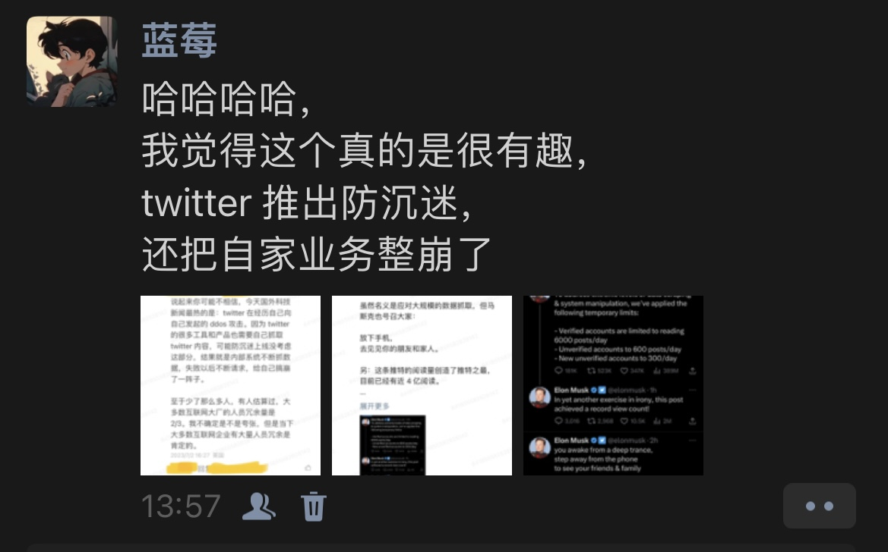
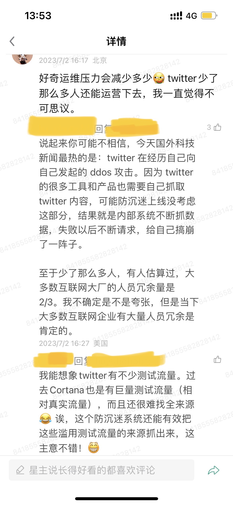
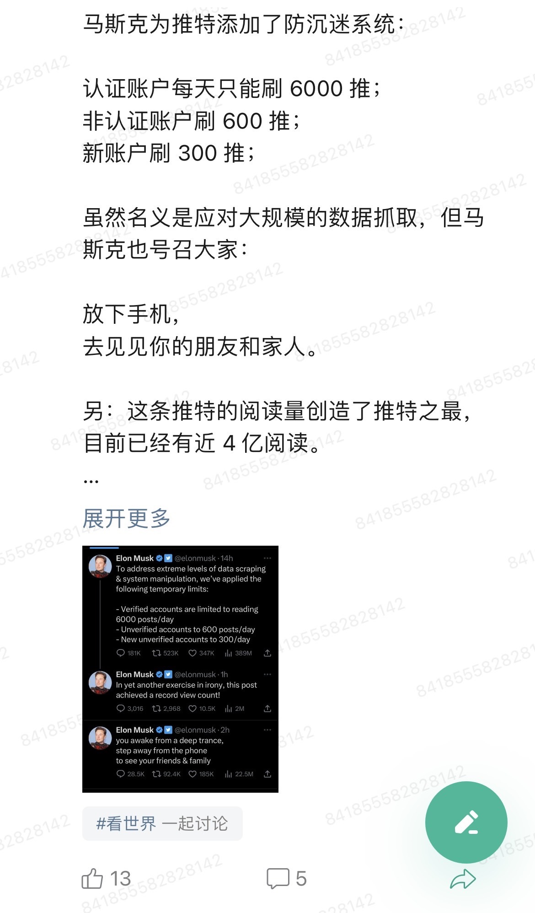
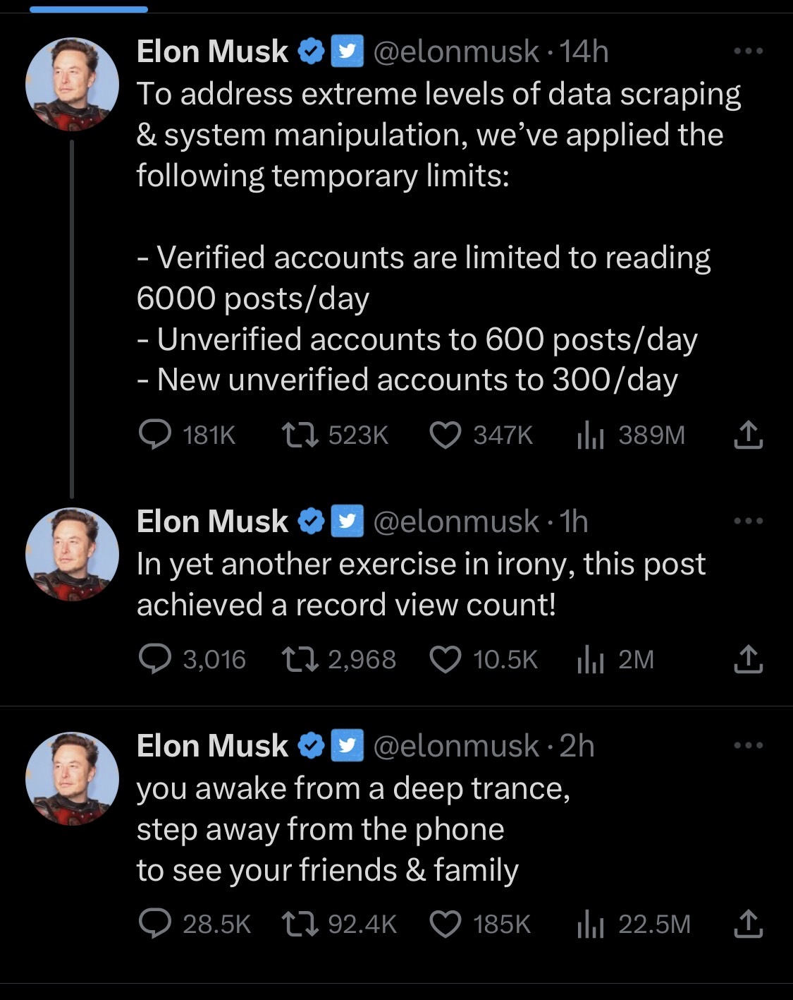
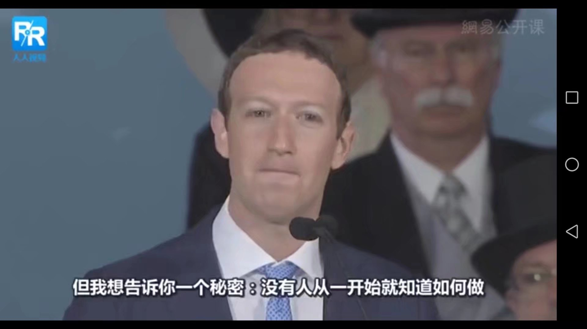
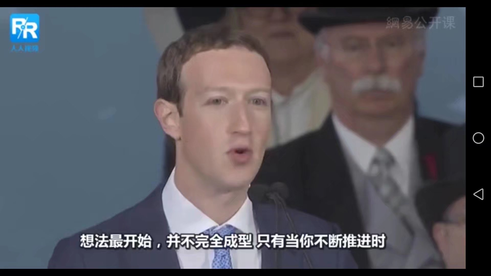

## 不确定性才是常态；我希望你无限可能

今天我在朋友圈发了一条消息；我的一个朋友看到了这条消息后，就突然来找到聊天，我觉得这段聊天内容很有趣，分享给大家。

**1、 我的朋友圈内容**

里面三张图的内容分别是：

**2、聊天内容**

> 小伙伴：在某种程度上，他还是很让人佩服的，只是他看不起大多数人。人都是这样，看来他也是凡人，欲望满身。

蓝莓：或许做个普通人 ~  然后才能放开枷锁，又不曾说过自己道德高尚，不曾说过自己是个圣人 ~ 没什么不好的，哈哈哈，而且，本来也就是个普通人。

> 小伙伴：对 ~ 他和秦始皇死前在寻找长生不老药是一种目的。只是借助了高新科技 更科学了。

蓝莓：我不清楚他是不是想一直活着。我记得乔布斯说过没有哪个人想要死去 ~ 不过我记得他说他想在生命结束前做什么事儿来着，是不是真的我也就不清楚了。不过从现在来看，人确实最终还是不能一直活着，那就尽可能尝试你想做的一切 ：）

> 小伙伴：脑机接口应该是可行，也给自己留好了退路

蓝莓：那就拭目以待叭 ~

> 小伙伴：如果不成就葬在火星，真苦啊

蓝莓：真不错 ~ 那就争取每个人都去追求 “酷”

> 小伙伴：你有没有觉得 科学技术 和艺术 魔术 的术字是一种解释；其实就像变戏法～ 作品还是人的信仰。有了戏剧性 就很酷；抖音作品也是 不管搞笑的还是技术的 就是反差感

蓝莓：这不太清楚了，我语文能力不怎么样，不过参考一下三体里面的想法，火鸡科学家 ~ 其实我觉得关于抖音作品这一点更应该去研究自媒体运营相关的内容。或许：自己的顿悟，只是别人的基本功。（或许这只是专业自媒体运营人的基本功）

**番外**  什么是火鸡科学家呢？这是一个农场主的故事，有一家农场，这个农场里面有一群火鸡，这些火鸡被关在一个密闭的看不到外面世界的棚子里面。每天按时按点，农场主都会去给这些火鸡喂食。然后有一个“聪明”的火鸡就发现了，嗷！原来每天的一个特定时间都会有食物从天而降，因此这个“聪明”的火鸡就宣布我发现了世界运转的规律，因此这个火鸡也就是火鸡科学家。事实上很多东西都只是我们发现的规律，例如万有引力（有质量的物体会彼此吸引，因此我们和地球会彼此吸引）。有一天！他们到了这个时间点怎么等也等不来食物，结果这些火鸡都被 kill 掉了。

> 小伙伴：做个不被定义的人吧 ~ 毕竟人生这么短，我也不是马斯克

蓝莓：马斯克已经在那里了，没有人说过只有马斯克才能发射火箭，只不过恰好他发射了，你或许能发射飞船 ：）

> 小伙伴：哈哈哈哈哈哈哈我只是callback人生很短 不像马斯克可以试图长生不老   \[玫瑰\]\[玫瑰\]

蓝莓：世界也不是线性发展的，人总是习惯性的用线性的方式推演未来，你未来或许无限可能 ~ 你或许能长生不老 ~ 哈哈哈 ~ 未来总是充满了不确定性 ~

> 小伙伴：3q\[玫瑰\]\[玫瑰\]

蓝莓：哈哈哈，行 ~ 那快去做好准备，迎接不确定性 ~

===================== 

不是鼓励大家反人性，而只是，不必道德绑架自己（又不是圣人，只是普通人）

希望你的未来无限可能，如果......如果说......你真的有你想去做的事情，那就屏蔽掉一些声音，专心去做叭。如果说，你还没有，或者还在寻找，又或者想法还没那么清晰。那就去慢慢寻找，那就一步一步推进下去，我相信想法会越来越清晰的。很多事情，或许只是想，是想不出来的，只有去做的时候，思路才逐渐变得明朗起来，加油！

就像扎克伯格曾经在一次演讲中说到：

> 但我想告诉你一个秘密：没有人从一开始就知道如何做，想法最开始，并不完全成型，只有当你不断推进时，它才变得逐渐清晰，你需要开始努力。

