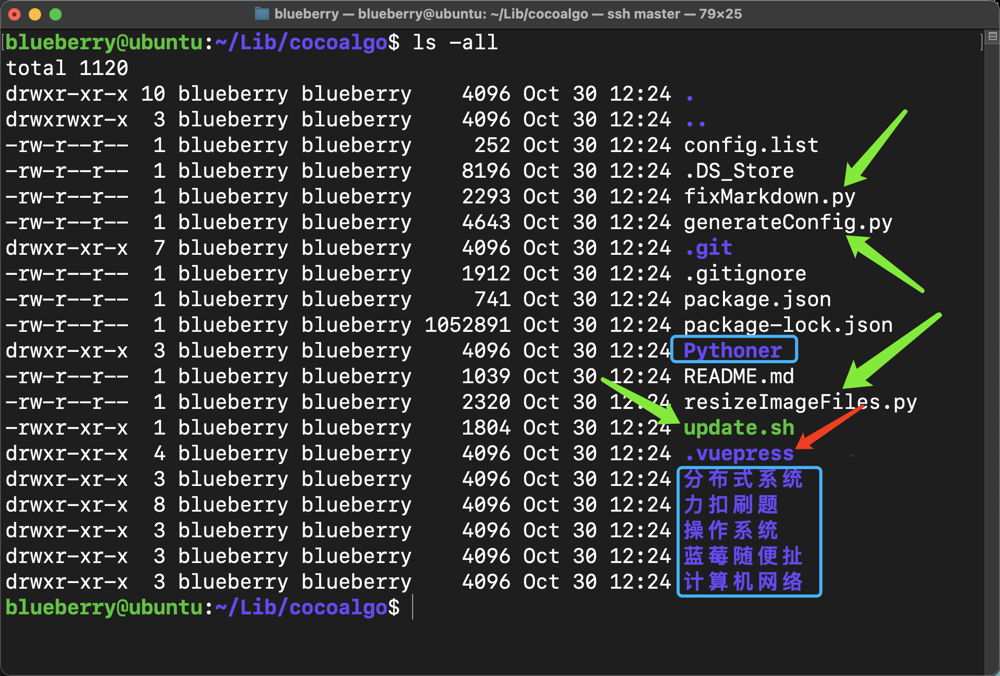
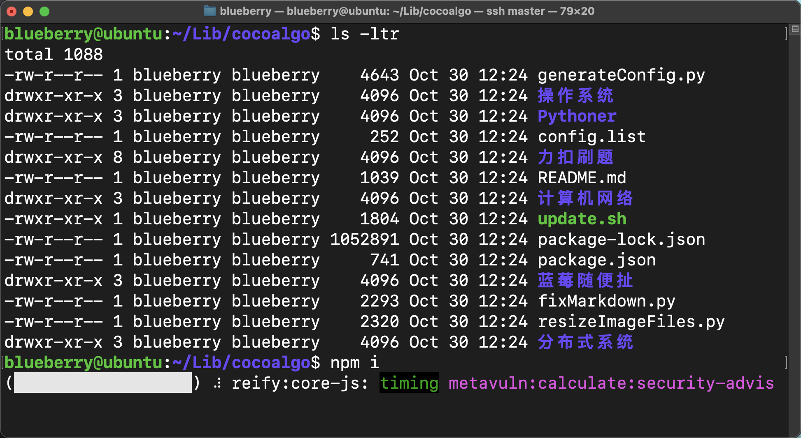

# 搭建一个全自动发布的超牛博客


前几天在公众号看到了 鱼皮 发的一篇文章，讲了他的文档博客是如何搭建的，建议看本文之前可以先看看他的文章，鱼皮文章的传送门：

https://mp.weixin.qq.com/s/xti5QUoh6UOuCs81uNfJHA

本着好奇的心，我就去折腾了一番，最后我发现，虽然已经很简化了！但还是太麻烦了，毕竟我是真的懒，我更希望，我在本地写好内容之后，我根本不需要去我的博客手动添加一篇文章就能让它自己显示出来。

为了，我做了一套自动化工具来完成这件事情，那么这篇文章就是在 鱼皮 给出的方法的基础上添加了一些自动化工具，实现博客的全自动发布。

## 1、蓝莓的博客已经上线了

我早在几个月前就已经使用 Typecho 做了一个博客，但总是感觉不太好用，没办法将所有的内容做成的更有体系化。文档类型的博客让我觉得是一个非常好的选择，所以最后采用了  vuepress 重新改造了蓝莓的小站。

传送门:https://blueberry-universe.cn

1. 购买域名
2. 完成 ICP 备案
3. 完成公安备案
4. 使用 vuepress 生成博客的静态文件
5. 采用 Nginx 对静态文件进行托管

在我部署的过程中，是采用了 Nginx 进行静态文件托管的，当然，你也可以采取别的方法。

## 2、获取博客的模板

可以直接访问我的 github 代码仓，获取这套模板

https://github.com/teenager-lijh/cocoalgo/tree/template

直接下载 cocoalgo 代码仓的 template 分支即可

接下来，你就直接把这个代码上传到你要部署的服务器上就可以了，在这里我使用虚拟机进行演示，我的虚拟机本地 ip 为 `10.211.55.100`

上传代码到虚拟机后，我们来看看 cocoalgo 里面都有什么

1. 所有的配置文件都在红色箭头所指向的 `.vuepress` 文件夹中
2. 蓝色框框所框出来的是我博客中的主题，目前我的在线博客中共有 6 个主题
3. 绿色箭头所指向的四个文件，是我做的 4 个自动化的处理工具



来看看绿色箭头所指向的 4 个自动化处理工具都是做什么的

1. fixMarkdown.py : 由于我是用的 markdown 编辑工具是 typora，每次当我粘贴图片到 markdown 的时候，我会让它自动为我创建一个 assets 资源文件夹，然后它采用的相对路径是例如 `assets/images.jpg` 这样的形式，但是 vuepress 很不巧的不识别这种相对路径，如果改成 `./assets/images.jpg` 的形式就能够被 vuepress 识别并且正确渲染，所以我做了一个 fixMarkdown.py 工具递归的对所有的 markdown 文件进行修改
2. resizeImageFiles.py : 这个工具是用来对图像进行缩放的，由于我的云服务器带宽特别小，而我的图片都太大啦，加载速度太慢。这个工具会对 `.vuepress/dist` 这个文件夹中所有的图像文件进行缩放并重新保存，缩放后的图像大小会保证在 400KB 以内
3. generateConfig.py : 这个文件是全自动化的核心秘密，看过鱼皮的视频之后，你应该会知道，每次我们发布一篇文章之后都要在 .vuepress 中对相应的配置文件进行修改，但是现在，全都不用了！在 `cocoalgo` 文件夹中还有一个文件叫做 `config.list` 。这里面存储了当前的博客有几个主题，以及这几个主题在 cocolgo 目录中的位置。这个文件的内容我放在了下面，你可以看看。每一行都由三个元素构成，每个元素之间使用空格隔开，第一个元素表示了你的一个主题所存储的文章相对于 `cocoalgo` 的位置，由于我都是直接放在了 `cocoalgo` 目录中，所以第一个直接就写目录的名称即可，第二项内容你应该很眼熟，这个是每个主题中想要展示出来的文章要进行配置的配置文件，现在你不需要进行配置了，你只需要给出这个配置文件的名称即可（名字可以随意写，但是一定要以 .ts 结尾），第三项内容直接和第一项内容保持一致即可 （这里设置的是配置文件中 title 对应的配置项，你可以根据需求进行修改，或者直接和第一项保持一致）

```
# config.list 文件
蓝莓随便扯 ideaSideBar.ts 蓝莓随便扯
操作系统 osSideBar.ts 操作系统
计算机网络 cnSideBar.ts 计算机网络
力扣刷题 lcSideBar.ts 力扣刷题
分布式系统 dsSideBar.ts 分布式系统
Pythoner pythonerSideBar.ts Pythoner
```

4. 最后就是 update.sh 这个工具了，`update.sh` 需要传递一个参数，这个参数是一个字符串，你需要告诉它，cocoalgo 本地代码仓所在的位置是哪里，然后 update.sh 会自动进入到该代码仓并且去拉取远程端的 main 分支到本地，如果发现远程端的 main 分支比本地更新了，那么 update.sh 会清除本地代码仓所有没有用的东西并恢复到最近的一条提交记录上，拉取远程端的内容覆盖本地。接着，update.sh 会调用 `npm docs:build` 命令生成静态文件到 `.vuepress` 目录中的 `dist` 目录中。

接着，我们什么都不需要做了，如果我们使用了 Nginx 来对静态文件进行代理，那么，我们只需要让 Nginx 代理的静态文件目录始终指向 `cocoalgo/.vuepress/dist` 目录即可

**最重要的一点**

我相信你的主题肯定不会天天变吧，你只需要配置一下 `config.list` 文件就可以了。

只要我们在本地提交了代码到远程端，服务器上开一个定时任务，定时的执行 update.sh 就可以了，这样就可以实现定时自动检查并且发布的功能了。


## 3、动手安装吧

这里演示的 cocoalgo 是我自己的仓库，你需要下载我的代码，并且自己新建一个代码仓到 main 分支中，然后把我这里面除了 `cocoalgo/.git` 目录的内容外，全部拷贝过去，然后进行实验

1. 安装所依赖的工具，在这里你要和我的 node 以及 npm 的版本保持一致，这两项的安装很简单，我就不详细说了

```
blueberry@ubuntu:~/Lib/cocoalgo$ node -v
v16.20.2
blueberry@ubuntu:~/Lib/cocoalgo$ npm -v
8.19.4
```


2. 安装依赖包

在这里下载的过程中可能很慢，你可以尝试使用国内的源进行安装，速度会快得多

```
# 进入到 cocoalgo 执行如下命令
npm i
```




3. 安装 Nginx 并配置

我这里使用的 Nginx 的版本是 `1.26.2`

首先去官网下载 Nginx 到服务器上，然后对它解压，解压之后我们可以看到这些内容

```shell
blueberry@ubuntu:~/Downloads/nginx-1.26.2$ ls -ltr
total 780
-rw-r--r-- 1 blueberry blueberry     49 Aug 13  2019 README
-rw-r--r-- 1 blueberry blueberry   1397 Aug 13  2019 LICENSE
-rwxr-xr-x 1 blueberry blueberry   2502 Aug 13  2019 configure
-rw-r--r-- 1 blueberry blueberry 452171 Aug 13  2019 CHANGES.ru
-rw-r--r-- 1 blueberry blueberry 296463 Aug 13  2019 CHANGES
drwxr-xr-x 2 blueberry blueberry   4096 Sep 28 08:25 man
drwxr-xr-x 2 blueberry blueberry   4096 Sep 28 08:25 html
drwxr-xr-x 9 blueberry blueberry   4096 Sep 28 08:25 src
drwxr-xr-x 4 blueberry blueberry   4096 Sep 28 08:25 contrib
drwxr-xr-x 2 blueberry blueberry   4096 Sep 28 08:25 conf
drwxr-xr-x 6 blueberry blueberry   4096 Sep 28 08:25 auto
drwxrwxr-x 3 blueberry blueberry   4096 Sep 30 10:36 objs
-rw-rw-r-- 1 blueberry blueberry    355 Sep 30 10:36 Makefile
```

**生成 Makefile**

```shell
blueberry@ubuntu:~/Downloads/nginx-1.26.2$ ./configure --prefix=/usr/local/nginx --pid-path=/var/run/nginx/nginx.pid --lock-path=/var/lock/nginx.lock --error-log-path=/var/log/nginx/error.log --http-log-path=/var/log/nginx/access.log --with-http_gzip_static_module --http-client-body-temp-path=/var/temp/nginx/proxy --http-fastcgi-temp-path=/var/temp/nginx/fastcgi --http-uwsgi-temp-path=/var/temp/nginx/uwsgi --http-scgi-temp-path=/var/temp/nginx/scgi --with-http_ssl_module --with-http_image_filter_module
```

**编译并安装**

```
blueberry@ubuntu:~/Downloads/nginx-1.26.2$ make
blueberry@ubuntu:~/Downloads/nginx-1.26.2$ make install
```

完成上述命令之后，我们就完成了 Nginx 的安装，根据 `./configure` 中的配置，我们可以知道 `Nginx` 被安装到了 `/usr/local/nginx` 这个位置。

**修改 Nginx 的配置文件** 

我们进入到 `/usr/local/nginx/conf` 并编辑 `nginx.conf` 文件（配置文件中的 user 这个后面写你的 cocoalgo 所在用户目录的用户名，这个很重要，不然会出现一些权限问题）

如果你不配置 https 的话 配置文件这么写

```

user  blueberry;
worker_processes  2;

#error_log  logs/error.log;
#error_log  logs/error.log  notice;
#error_log  logs/error.log  info;

#pid        logs/nginx.pid;


events {
    worker_connections  1024;
}


http {
    include       mime.types;
    default_type  application/octet-stream;
    sendfile        on;
    keepalive_timeout  65;

    gzip  on;

    # 小于 1B 的文件不会压缩
    gzip_min_length 1;

    # 压缩比 可以设置 1-9
    # 数值越大 压缩级别越大 占用的 CPU 越多
    gzip_comp_level 3;

    # 压缩文件的类型
    gzip_types text/plain application/javascript application/x-javascript text/css application/xml text/javascript application/x-httpd-php image/jpeg image/gif image/png application/json;

    server {
        listen       80;
        # 这里写你的博客的域名 没有域名就写虚拟机的 ip
        server_name  blueberry-universe.cn;

        #charset koi8-r;

        #access_log  logs/host.access.log  main;

        location / {
            root   /root/Library/cocoalgo/.vuepress/dist;
            index  index.html index.htm;
	}

        error_page   500 502 503 504  /50x.html;
        location = /50x.html {
            root   html;
        }
    }
}

```

如果你配置 https 的话，配置文件这样写

```
user  blueberry;
worker_processes  2;

#error_log  logs/error.log;
#error_log  logs/error.log  notice;
#error_log  logs/error.log  info;

#pid        logs/nginx.pid;


events {
    worker_connections  1024;
}


http {
    include       mime.types;
    default_type  application/octet-stream;
    sendfile        on;
    keepalive_timeout  65;

    gzip  on;

    # 小于 1B 的文件不会压缩
    gzip_min_length 1;

    # 压缩比 可以设置 1-9
    # 数值越大 压缩级别越大 占用的 CPU 越多
    gzip_comp_level 3;

    # 压缩文件的类型
    gzip_types text/plain application/javascript application/x-javascript text/css application/xml text/javascript application/x-httpd-php image/jpeg image/gif image/png application/json;

    server {
        listen       80;
        # 这里写你的博客的域名 没有域名就写虚拟机的 ip
        server_name  blueberry-universe.cn;

        #charset koi8-r;

        #access_log  logs/host.access.log  main;

        location / {
        	# 在这里配置你的 dist 文件夹的路径
            root   /home/blueberry/Lib/cocoalgo/.vuepress/dist;
            index  index.html index.htm;
	}

        error_page   500 502 503 504  /50x.html;
        location = /50x.html {
            root   html;
        }
    }

    server {
        listen 443 ssl;
        server_name blueberry-universe.cn; 

        # 配置 ssl 证书
        ssl_certificate	/usr/local/nginx/conf/blueberry-universe/blueberry-universe.cn_bundle.crt;
        # 配置证书秘钥
        ssl_certificate_key	/usr/local/nginx/conf/blueberry-universe/blueberry-universe.cn.key;
        # ssl 会话 cache
        ssl_session_cache	shared:SSL:1m;
        # ssl 会话超时时间
        ssl_session_timeout	5m;

        # 配置加密套件 写法遵循 openssl 标准
        ssl_protocols TLSv1 TLSv1.1 TLSv1.2;
        ssl_ciphers HIGH:!aNULL:!MD5:!RC4:!DHE;
	ssl_prefer_server_ciphers on;

        location / {
            proxy_pass http://blueberry-universe.cn;
        }
    }
}
```


## 4、让它跑起来

在 github 建你自己的仓库这些，就你自己来完成好啦，记得在你的服务器上配置上 github 代码仓的 ssh 对应的私钥，这样才能让 update.sh 有权限去拉取远程端的代码的。

**配置定时任务**

使用 `crontab` 配置定时任务，让 `update.sh` 每分钟执行一次，来看看远程端的代码是不是更新了，当然啦，你可以把执行的频率设置的更长一些

`crontab -l` 查看当前都有哪些定时任务

```
blueberry@ubuntu:~/Downloads/nginx-1.26.2$ crontab -l
*/1 * * * * /home/blueberry/Lib/cocoalgo/update.sh /home/blueberry/Lib/cocoalgo >> /home/blueberry/Lib/update.log 2>&1
```

这是我已经添加的定时任务，你可以使用 `crontab -e` 命令编辑这个定时任务的列表，然后把你的定时任务添加进去就可以了，添加的过程和使用 `vim` 操作文件是一样的，添加完成后使用 `:wq` 保存并退出即可

在定时任务重你可以看到 `update.sh` 后面传入的参数 `/home/blueberry/Lib/cocoalgo` 就是服务器上的本地代码仓的所在位置，我们需要把这个东西告诉 `update.sh` 才可以，在这里我把 `update.sh` 每次运行后输出的日志保存在了 `~/Lib` 目录中的 `update.log` 文件中

**启动 Nginx**

只需要这样，Nginx 就会默认使用 `nginx.conf` 启动啦！

```
blueberry@ubuntu:/usr/local/nginx/sbin$ pwd
/usr/local/nginx/sbin
blueberry@ubuntu:/usr/local/nginx/sbin$ ls
nginx
blueberry@ubuntu:/usr/local/nginx/sbin$ ./nginx
```

**注意事项**

当然啦，在第一次启动的时候，你可以先在 `cocoalgo` 目录下先手动的运行 `npm run docs:build` 命令生成一次配置文件，后续，每次远程端有新的文章上去之后，让它自己去拉取并且更新即可


