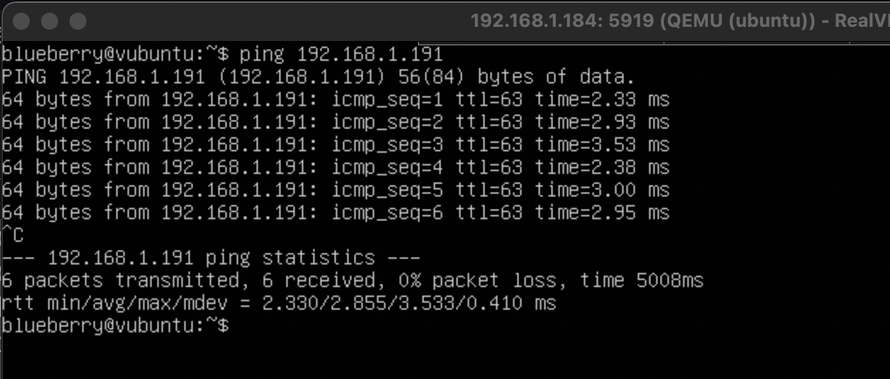
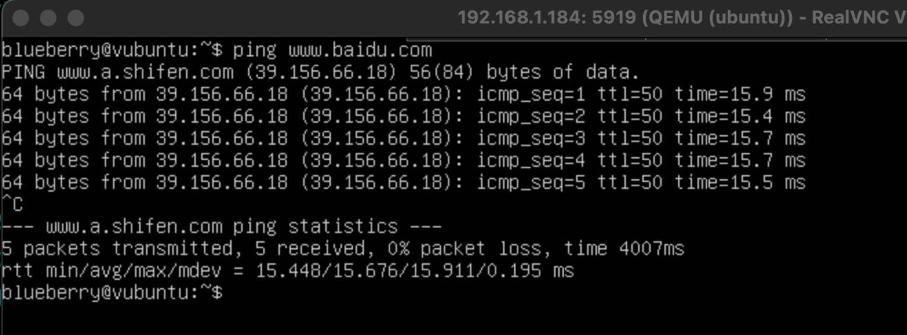

## 彻底搞懂虚拟网络搭建

你好啊，我是蓝莓，最近在研究和计算机网络的内容，就和大家分享一下

用过 docker 的小伙伴应该能领会到  docker 在部署一些应用时真的是十分方便啊，那么我们的侧重点在于 docker 在宿主机是如何访问外网的，这里所指的外网是指宿主机外部的网络。本文中所介绍的虚拟网络搭建方式与 docker 所应用的是非常相似的，但是本文并不涉及任何和 docker 相关的内容。

目标：

1. 使用 QEMU 创建虚拟机
2. 创建虚拟网桥，为虚拟网桥配置 ip
3. 为虚拟机创建虚拟网卡并配置 ip
4. 为虚拟机配置路由表
5. 使用Linux做数据转发
6. 使用 iptables 为宿主机提供 NAT 功能
7. 配置 DNS 服务器


## 1 QEMU 创建虚拟机

我的宿主机是一台真实的物理机器，安装了 `22.04.1-Ubuntu` 系统

安装 QEMU 的方法也是很简单的，在这里就不详细说明了，可以直接搜索 ubuntu 安装 QEMU 会有非常多的安装教程可供参考。

**下载系统镜像**

虽然我的物理机器是 `22.04.1-Ubuntu` ，但是我在创建虚拟机的时候采用了`ubuntu-18.04.6-live-server-amd64.iso`

镜像下载地址：https://releases.ubuntu.com/18.04.6/ubuntu-18.04.6-live-server-amd64.iso

下载好系统镜像后，我将该镜像放在如下位置

```bash
 /home/blueberry/Downloads/ubuntu-18.04.6-live-server-amd64.iso
```


**创建虚拟磁盘**

在这篇文章中一共需要使用 QEMU 创建两台虚拟机 `ubuntu` 和 `ubuntu2`，为此，也应该创建两个虚拟磁盘供它使用。先回到家目录，然后创建一个文件夹 `qemu` 用来存放稍后要创建的虚拟磁盘，随后我们分别创建两个大小为 `40G` 的虚拟磁盘 ubuntu.img 和 ubuntu2.img

```bash
cd ~
mkdir qemu
qemu-img create -f qcow2 ubuntu.img 40G
qemu-img create -f qcow2 ubuntu2.img 40G
```


**安装虚拟机 ubuntu**

接下来我们就分别安装两台虚拟机

安装 ubuntu 虚拟机，简单介绍下几个参数：

* -name: 指定虚拟机的名字
* -m: 指定虚拟机的 RAM 内存大小为 2048M
* -hda: 指定虚拟机所使用的虚拟磁盘所在路径
* -cdrom: 指定该虚拟机所使用的镜像所在路径
* -boot: 虚拟机启动方式，这里选择 d 则是从 cdrom 这里启动
* -vnc: 打开一个 vnc 服务，供我们安装虚拟机使用，这里的 19 代表的是 5919 端口，默认是从 5900 端口开始使用的

其他的参数就照着写就好了

```bash
qemu-system-x86_64 \
        -enable-kvm \
        -name ubuntu \
        -m 2048 \
        -hda /home/blueberry/qemu/ubuntu.img \
        -cdrom /home/blueberry/Downloads/ubuntu-18.04.6-live-server-amd64.iso \
        -boot d \
        -vnc :19 \
        -cpu host
```

接下来，你还需要一个 vnc 客户端作为你的虚拟机屏幕，可以直接使用 `vnc viewer` 作为客户端，官网传送门：

https://www.realvnc.com/en/connect/download/viewer/

**使用 vnc 连接虚拟机**

打开 `vnc viewer` 后，直接在地址栏输入宿主机的 `ip` 地址以及 `vnc` 服务对应的端口号之后连接即可


打开后，你只需要按照正常的操作系统安装流程进程安装就可以了


**安装虚拟机 ubuntu2**

好啦，安装 `ubuntu2` 的过程是一样的，那你只需要适当的调整参数之后，进行安装就可以了


## 2 创建虚拟网桥

接下来，我们在宿主机创建一个网桥 `br0` 并且为该网桥分配 ip 地址

我们先来查看一下宿主机中当前的网络接口情况，可以发现，我的物理网卡对应的名称是 `enp2s0`

```bash
➜  ~ ifconfig
enp2s0: flags=4163<UP,BROADCAST,RUNNING,MULTICAST>  mtu 1500
        inet 192.168.1.184  netmask 255.255.255.0  broadcast 192.168.1.255
        inet6 fe80::8a4:75b8:a07:2a83  prefixlen 64  scopeid 0x20<link>
        ether 94:c6:91:61:10:ec  txqueuelen 1000  (Ethernet)
        RX packets 354  bytes 79267 (79.2 KB)
        RX errors 0  dropped 0  overruns 0  frame 0
        TX packets 202  bytes 35860 (35.8 KB)
        TX errors 0  dropped 0 overruns 0  carrier 0  collisions 0

lo: flags=73<UP,LOOPBACK,RUNNING>  mtu 65536
        inet 127.0.0.1  netmask 255.0.0.0
        inet6 ::1  prefixlen 128  scopeid 0x10<host>
        loop  txqueuelen 1000  (Local Loopback)
        RX packets 154  bytes 14234 (14.2 KB)
        RX errors 0  dropped 0  overruns 0  frame 0
        TX packets 154  bytes 14234 (14.2 KB)
        TX errors 0  dropped 0 overruns 0  carrier 0  collisions 0
```

**创建网桥 br0**

```bash
➜  ~ sudo brctl addbr br0
```

**创建两个网桥上的接口**

使用命令 `tunctl -b` 创建 tap device，默认的名字分别为 `tap0` 和 `tap1`，我目前理解的是，我们创建 tap device 然后再把这个东西给绑在网桥 `br0` 上就好像是让这个网桥拥有了两个插口，这样，我们可以在这个 网桥上插两台计算机设备，这个理解可能有点牵强，欢迎大佬进行指正

```bash
➜  ~ sudo tunctl -b
tap0
➜  ~ sudo tunctl -b
tap1
```

**查看当前的网络接口**

我们可以通过 `ip link show` 来查看网络接口，然而使用 `ifconfig` 是没办法看到没有启动的网络接口的

```bash
➜  ~ ip link show
1: lo: <LOOPBACK,UP,LOWER_UP> mtu 65536 qdisc noqueue state UNKNOWN mode DEFAULT group default qlen 1000
    link/loopback 00:00:00:00:00:00 brd 00:00:00:00:00:00
2: enp2s0: <BROADCAST,MULTICAST,UP,LOWER_UP> mtu 1500 qdisc fq_codel state UP mode DEFAULT group default qlen 1000
    link/ether 94:c6:91:61:10:ec brd ff:ff:ff:ff:ff:ff
3: virbr0: <NO-CARRIER,BROADCAST,MULTICAST,UP> mtu 1500 qdisc noqueue state DOWN mode DEFAULT group default qlen 1000
    link/ether 52:54:00:10:65:68 brd ff:ff:ff:ff:ff:ff
4: br0: <BROADCAST,MULTICAST> mtu 1500 qdisc noop state DOWN mode DEFAULT group default qlen 1000
    link/ether e2:eb:19:ae:67:37 brd ff:ff:ff:ff:ff:ff
5: tap0: <BROADCAST,MULTICAST> mtu 1500 qdisc noop state DOWN mode DEFAULT group default qlen 1000
    link/ether 2a:34:1e:9f:42:d2 brd ff:ff:ff:ff:ff:ff
6: tap1: <BROADCAST,MULTICAST> mtu 1500 qdisc noop state DOWN mode DEFAULT group default qlen 1000
    link/ether d6:cd:ae:4c:b2:b8 brd ff:ff:ff:ff:ff:ff
```

**绑定 tap device 到 br0**

通过下面的方法进行绑定

`addif` 代表的是 `add interface`，添加接口

```bash
➜  ~ sudo brctl addif br0 tap0
➜  ~ sudo brctl addif br0 tap1
```

另外的你也可以通过 `ip` 命令中所提供的工具完成这个操作，这两种操作达到的效果都是一样的，这里的 `link` 代表的是 `link layer` 链路层

```bash
➜  ~ sudo ip link set tap0 master br0
➜  ~ sudo ip link set tap1 master br0
```

以上两种方式你选择其中一种就可以了

**查看网桥的接口情况**

这时候我们就可以看到 `tap0` 和 `tap1` 已经成功捆绑在 `br0` 网桥上了

```bash
➜  ~ brctl show
bridge name	bridge id		    STP enabled    interfaces
br0		8000.e2eb19ae6737	    no		       tap0
							                   tap1
virbr0		8000.525400106568	yes	
```

**启动网络接口**

我们分别启动刚才创建的三个虚拟设备，然后再使用 `ifconfig` 查看网络接口的情况，这时候我们查看到刚才创建好的网络设备全部都启动了

```bash
➜  ~ sudo ip link set br0 up
➜  ~ sudo ip link set tap0 up
➜  ~ sudo ip link set tap1 up
➜  ~ ifconfig
br0: flags=4099<UP,BROADCAST,MULTICAST>  mtu 1500
        ether e2:eb:19:ae:67:37  txqueuelen 1000  (Ethernet)
        RX packets 0  bytes 0 (0.0 B)
        RX errors 0  dropped 0  overruns 0  frame 0
        TX packets 0  bytes 0 (0.0 B)
        TX errors 0  dropped 0 overruns 0  carrier 0  collisions 0

enp2s0: flags=4163<UP,BROADCAST,RUNNING,MULTICAST>  mtu 1500
        inet 192.168.1.184  netmask 255.255.255.0  broadcast 192.168.1.255
        inet6 fe80::8a4:75b8:a07:2a83  prefixlen 64  scopeid 0x20<link>
        ether 94:c6:91:61:10:ec  txqueuelen 1000  (Ethernet)
        RX packets 3059  bytes 429509 (429.5 KB)
        RX errors 0  dropped 0  overruns 0  frame 0
        TX packets 1050  bytes 136524 (136.5 KB)
        TX errors 0  dropped 0 overruns 0  carrier 0  collisions 0

lo: flags=73<UP,LOOPBACK,RUNNING>  mtu 65536
        inet 127.0.0.1  netmask 255.0.0.0
        inet6 ::1  prefixlen 128  scopeid 0x10<host>
        loop  txqueuelen 1000  (Local Loopback)
        RX packets 213  bytes 19837 (19.8 KB)
        RX errors 0  dropped 0  overruns 0  frame 0
        TX packets 213  bytes 19837 (19.8 KB)
        TX errors 0  dropped 0 overruns 0  carrier 0  collisions 0

tap0: flags=4099<UP,BROADCAST,MULTICAST>  mtu 1500
        ether 2a:34:1e:9f:42:d2  txqueuelen 1000  (Ethernet)
        RX packets 0  bytes 0 (0.0 B)
        RX errors 0  dropped 0  overruns 0  frame 0
        TX packets 0  bytes 0 (0.0 B)
        TX errors 0  dropped 0 overruns 0  carrier 0  collisions 0

tap1: flags=4099<UP,BROADCAST,MULTICAST>  mtu 1500
        ether d6:cd:ae:4c:b2:b8  txqueuelen 1000  (Ethernet)
        RX packets 0  bytes 0 (0.0 B)
        RX errors 0  dropped 0  overruns 0  frame 0
        TX packets 0  bytes 0 (0.0 B)
        TX errors 0  dropped 0 overruns 0  carrier 0  collisions 0
```

**为网桥 br0 配置 ip**

在这里将 `br0` 的 ip 设置为 `192.168.166.1` 且其中的 24 就是代表设置子网掩码为 `255.255.255.0` 

```
➜  ~ sudo ifconfig br0 192.168.166.1/24 
➜  ~ ifconfig
br0: flags=4099<UP,BROADCAST,MULTICAST>  mtu 1500
        inet 192.168.166.1  netmask 255.255.255.0  broadcast 192.168.166.255
        ether e2:eb:19:ae:67:37  txqueuelen 1000  (Ethernet)
        RX packets 0  bytes 0 (0.0 B)
        RX errors 0  dropped 0  overruns 0  frame 0
        TX packets 0  bytes 0 (0.0 B)
        TX errors 0  dropped 0 overruns 0  carrier 0  collisions 0
```


## 3 为虚拟机创建虚拟网卡并配置 ip

刚才我们已经安装完成了虚拟机，那么再次启动的时候，你就不需要再挂在那个系统的镜像文件了，我们启动虚拟机的时候使用如下的命令进行启动

**启动 ubuntu**

之前没讲过的两行参数代表的是，我们要为这台虚拟机虚拟出来一张网卡，并且指定该虚拟网卡的 `mac` 地址为 `52:54:00:12:34:10`，另外我们要将该网卡插在 `br0` 网桥的 `tap0` 这个接口上

```bash
sudo qemu-system-x86_64 \
        -enable-kvm \
        -name ubuntu \
        -m 2048 \
        -hda /home/blueberry/qemu/ubuntu.img \
        -vnc :19 -cpu host \
        -net nic,macaddr=52:54:00:12:34:10,model=virtio \
        -net tap,ifname=tap0,script=no,downscript=no
```


**启动 ubuntu2**

类似的，我们通过如下命令启动 `ubuntu2` 虚拟机

```bash
sudo qemu-system-x86_64 \
        -enable-kvm \
        -name ubuntu \
        -m 2048 \
        -hda /home/blueberry/qemu/ubuntu2.img \
        -vnc :29 \
        -cpu host \
        -net nic,macaddr=52:54:00:12:34:20,model=virtio \
        -net tap,ifname=tap1,script=no,downscript=no
```

当我们启动了这两台虚拟机之后，我们就可以使用 `vnc` 客户端分别对两台虚拟机进行连接了

**为 ubuntu 的网卡配置 ip**

在为虚拟机的网卡配置 `ip` 的时候，一定要注意，该网卡的 `ip` 需要和我们的网桥所配置的 `ip` 处于同一个网段内

先试用 `ifconfig` 查看到这台虚拟机的网卡的名称是 `ens3`，然后为该网卡设置一个 `ip: 192.169.166.100`

```bash
sudo ifconfig ens3 192.169.166.100
```


这时候，我们使用 `ping` 命令来看一下能不能在虚拟机内部与网桥 `br0` 进行通信

```
ping 192.168.166.1
```


**为 ubuntu2 的网卡配置 ip**

类似的，我们再为 `ubuntu2` 的网卡配置 `ip`，经过检查后，说明该虚拟机 `ubuntu2` 也是可以与网桥 `br0` 进行通信的


到此位置，位于同一个网桥上的虚拟机已经可以相互通信了，我在 `ubuntu2` 虚拟机上 `ping` ubuntu 虚拟机，结果如下：


## 4 为虚拟机配置路由表

为什么还要为虚拟机配置路由表呢？现在两台虚拟机不是已经能通信了吗？先来看一下我所处的网络结构：


尽管两台虚拟机已经可以正常通信了，但是我们现在可以尝试 `ping` 一下宿主机的 `ip` 以及与宿主机在同一个网段上的其他的机器

在 `ubuntu` 虚拟机上进行尝试，我们可以发现 `192.168.1.191` 是不可达的。我们从网络结构的拓扑图中可以看出虚拟网桥和外部的网络根本就是断开的嘛。这怎么可能让他们相互通信呢，这只是其中一个原因。另外一个原因是，路由表还需要进行配。


**查看路由表**

通过如下命令查看路由表：

```bash
route -n
```


我们可以发现，路由表里面只有网段为 `192.168.166/24` 的路由规则，而网段为 `192.168.1.0/24` 的路由规则根本就不存在嘛，那我们不如直接配置一个默认的路由，其他的所有 `ip` 的寻址都通过虚拟机的网卡 `ens3` 将数据发出并且是发送到网桥那里，网桥的 ip 为 `192.168.166.1` 

**添加默认路由**

通过如下命令，我们添加一条默认路由到虚拟机 `ubuntu` 的路由表中

```bash
sudo route add default gw 192.168.166.1
```


这时候我们再次使用 `ping` 命令进行测试，与上次不同的是，这次并没有直接显示网络不可达而是在等待网络返回响应，由于网桥那边和外界的网络是断开的，所以仅仅是添加了路由还不够

```
ping 192.168.1.191
```


## 5 使用 Linux 做数据转发

对于 linux 系统而言，它是能够收到虚拟网桥 `br0` 的数据包的，因此，我们可以通过 `linux` 操作系统作为桥梁，将 `br0` 网桥的数据包转发到宿主机的网卡 `enp2s0` 上，这样一来，我们就可以将虚拟机内部的数据包真实的发送出去了

我们通过下面两个命令来打开 `linux` 的这个功能

```bash
➜  ~ sudo sysctl net.ipv4.conf.all.forwarding=1
net.ipv4.conf.all.forwarding = 1
➜  ~ sudo iptables -P FORWARD ACCEPT
```

好啦，现在我们是把网桥 `br0` 上的数据原封不动的直接通过宿主机的网卡转发出去，但是别忘了，我们的数据包中的源地址相对于宿主机所处的网络环境可是一个内网地址，所以我们还需要使用 `NAT` 技术做一个源地址转换，好在 `iptables` 已经提供了非常好用的功能为我们所用

## 6 使用 iptables 为宿主机提供 NAT 功能

先看看宿主机的 `iptables` 中已经配置的规则

```bash
➜  ~ sudo iptables -t nat -L --line-numbers
Chain PREROUTING (policy ACCEPT)
num  target     prot opt source               destination         

Chain INPUT (policy ACCEPT)
num  target     prot opt source               destination         

Chain OUTPUT (policy ACCEPT)
num  target     prot opt source               destination         

Chain POSTROUTING (policy ACCEPT)
num  target     prot opt source               destination 
```

可以看到我这里都是空的，所以我可以放心的去添加一条规则来做 `NAT` 了

```bash
➜  ~ sudo iptables -t nat -A POSTROUTING -s 192.168.166.0/24 ! -o br0 -j MASQUERADE
➜  ~ sudo iptables -t nat -L --line-numbers
Chain PREROUTING (policy ACCEPT)
num  target     prot opt source               destination         

Chain INPUT (policy ACCEPT)
num  target     prot opt source               destination         

Chain OUTPUT (policy ACCEPT)
num  target     prot opt source               destination         

Chain POSTROUTING (policy ACCEPT)
num  target     prot opt source               destination         
1    MASQUERADE  all  --  192.168.166.0/24     anywhere 
```

那么刚才我们用到的这条命令，大致意思就是说：把 linux 收到的属于 `192.168.166.0/24` 这个网段的数据包全都使用源地址转换的方式交给宿主机的物理网卡转发出去

```bash
sudo iptables -t nat -A POSTROUTING -s 192.168.166.0/24 ! -o br0 -j MASQUERADE
```

来让我们看看，现在我们的虚拟机与外部的网络环境是否打通了，我在虚拟机 `ubuntu` 上尝试了一下，真是太棒了，已经能够和我的计算机进行通信了！




## 7 配置 DNS 服务器

好啦，截止目前为止，只要我们的宿主机的网络是可以连接互联网的，那么虚拟机也是同样可以连同互联网的，不过我们尝试 `ping www.baidu.com` 会发现不行，那是因为我们还没有配置域名服务器，让我们配置一下

我们只需要编辑这个文件就可以了，但是这种方式只能是临时配置，重启之后就没有咯

```bash
sudo vim /etc/resolv.conf
```


再让我们试一下！哇塞，这次可以了！！！

